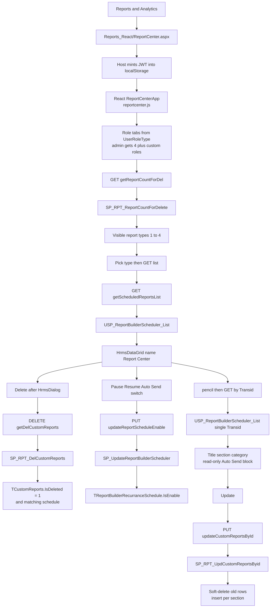
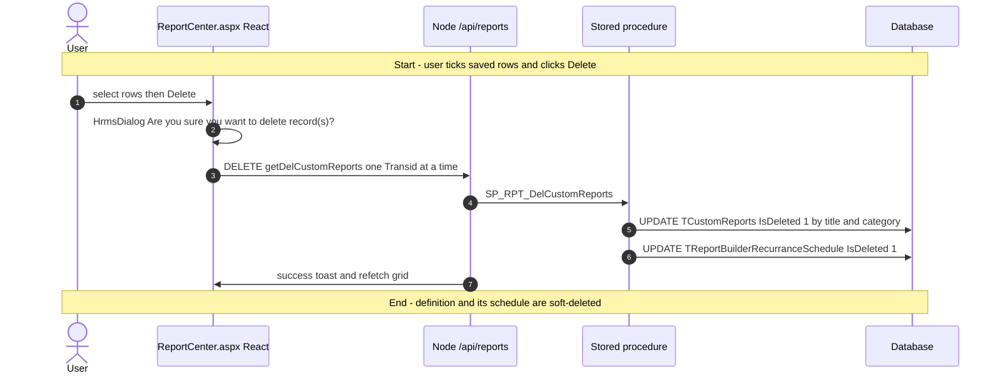
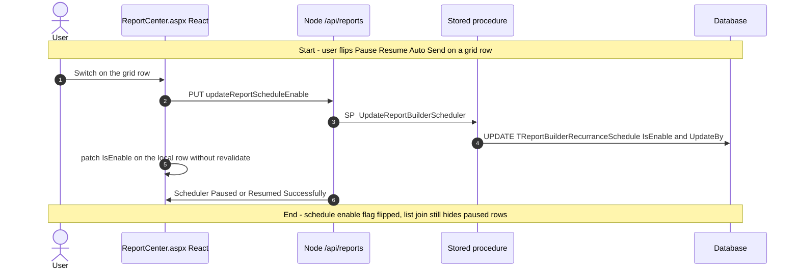
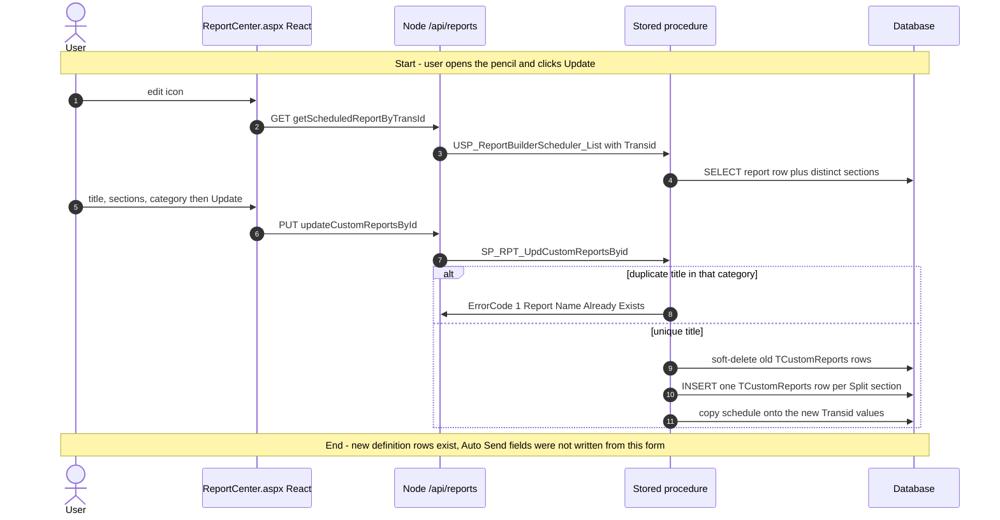
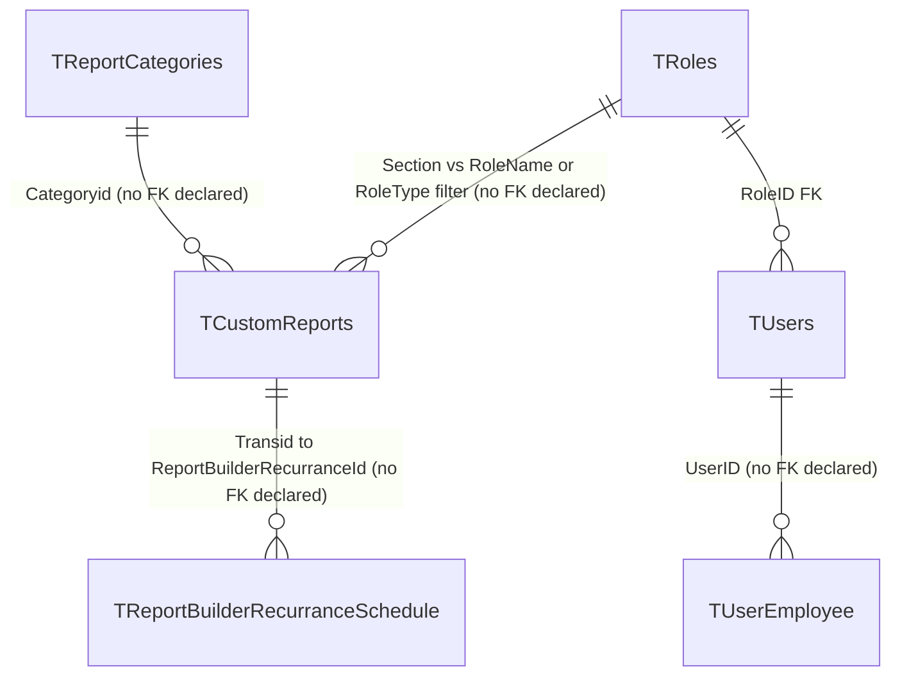

# Report Center

## Overview

Someone already saved a custom extract from **Report Builder** or **Report Designer** — a leave ledger, a recruitment dump, a Time & Attendance grid. An HR user (or an administrator reporting across organisations) now needs to retire it, rename it, move it to another role section or category, or pause the auto-email schedule that fires from that save. They open **Reports & Analytics → Report Center**. Role tabs appear first: an administrator sees Employee, Manager, Administrator, HR, plus any extra defined roles; everyone else sees only their own role type. They pick a report type (Recruitment, Employee Information, Time & Attendance, Leave — only types that already have at least one saved row), and the grid lists those definitions. From there they tick rows and delete (after a confirm), flip Pause/Resume Auto Send, or open edit to change the title, sections, and category. The Auto Send block on edit is a **read-only display** of a schedule that was created on the builder, not a place to rewrite recurrence.

Nothing on this page runs the extract. Running lives on **Static Reports** / **Traditional Reports**. Creating the definition and turning Auto Send on lives on **Report Builder** / **Report Designer**. This page owns the saved-row lifecycle after that.

**Who's involved:**

- **HR user / administrator** — lists, deletes, edits name/section/category, pauses or resumes auto-send. Row visibility is scoped by `LoggedInEmployee.UserRoleType` (the session **role type**, not the tenant role name), `employerid`, and, for non-administrators, `CreatedBy` through `TUsers` / `TUserEmployee`.
- **Report author** — whoever inserted the `TCustomReports` row on the builder. Not this screen.
- **Global-access user** — can switch organisation in the page header (`HeaderAside` + `getOrganizations`). Changing org re-queries count and list for that employer; unlike WebForms Manage Reports, it does not redirect the page.
- **Scheduler process** — `ReportBuilderEmailSender` emails due schedules; Pause here sets `TReportBuilderRecurranceSchedule.IsEnable = 0` so that job skips the row.

The left-nav item **Report Center** maps in `tMenuDetails` to `~/HRM/Reports_React/ReportCenter.aspx` — that is the page this guide documents. The ASPX title, React `PageHeader`, last breadcrumb, and grid `name` are all **"Report Center"**. A sibling item **Manage Reports** (MenuId **57**) opens the WebForms page `~/HRM/Reports/DeleteReports.aspx`, which is the same operations in postback form. That WebForms file is **not** this menu item.

There is **no** `llm-wiki/domain` lifecycle page for Report Center. Table catalog rows live in `llm-wiki/reference/tables/hrms.md`. SourceCode `migration.md` is the canonical note that both menu entries stay live, and that this React host names itself **Report Center**, not Manage Reports. `docs/SystemModels/SystemModel-2/` is empty in this SourceCode checkout.

## Workflow

This page is a React SPA hosted in WebForms. List, delete, pause, and edit are Axios calls to Node `/api/reports/*` with `Authorization` from `localStorage`. The WebForms code-behind only seeds session identity and the JWT; it does not bind the grid.

## Request journey

Three writes live on this screen. Listing is a SELECT. Delete, pause/resume, and edit are the terminal writes.

### HR user — delete a saved report

### HR user — pause or resume auto-send

### HR user — edit name, section, or category

## Entry points

`tMenuDetails` (verified in SourceCode `migration.md`): MenuName **Report Center** → `~/HRM/Reports_React/ReportCenter.aspx`. The page title is `"Report Center"`. Do not follow `HRM/Reports/DeleteReports.aspx` for this sidebar item — that URL is the sibling **Manage Reports** entry (MenuId 57). `ReportCenter.aspx.cs` still comments that Manage Reports "should be repointed" to this URL; the live nav was **not** repointed. Both entries stay in the menu.

This page has **no** tab-permission logic and does **not** call `GET /api/reports/getMenuTabsByMenuName`. Role tabs come from `buildRoleTabs` / `UserRoleType`, not from `TTabDetails`.

| UI page / API | Purpose |
|---|---|
| `HRMS.Web/HRMS.Web/HRM/Reports_React/ReportCenter.aspx` | **This feature.** WebForms host. Seeds hidden identity fields and JWT into `localStorage`. Loads `BuildJS/reportcenter.js`. Compiled in `HRMS.Web.csproj`. |
| `HRMS.Web/HRMS.Web/HRM/Reports_React/ReportCenter.aspx.cs` | Code-behind: session → hidden fields, `getSecureJWTToken`, pick `reportcenter.js`. |
| `HRMS.Web/HRMS.Web/HRM/Reports_React/src/main-reportcenter.tsx` | React entry. `PageHeader` title and crumbs **"Report Center"**. |
| `HRMS.Web/HRMS.Web/HRM/Reports_React/src/components/ReportCenter/ReportCenterApp.tsx` | Role tabs, type picker, grid, delete dialog, edit panel, read-only Auto Send. |
| `HRMS.Web/HRMS.Web/HRM/Reports_React/src/hooks/useReportCenter.ts` | SWR queries and write actions. |
| `HRMS.CoreAPI/HRMS.Core.WebAPI.Node/Routes/Reports.js` | `/api/reports/*` for this page. |
| `HRMS.Web/HRMS.Web/HRM/Reports/DeleteReports.aspx` | **Not this menu item.** Sibling **Manage Reports**. Same SPs via WebForms postback. |

## Code → database call chain

This page is Axios (`http.ts`) → Node `mssql` `.execute` from `reportsDAL` — no Enterprise Library and no C# Web API controller. Pause writes `EmployerId = credentials.employeeId` (the logged-in **employee** id) into `SP_UpdateReportBuilderScheduler.@P_EmployerId`, which the procedure stores in `UpdateBy`.

`useReportCenter` keys every query on `credentials.userRoleType` (fallback `userRoleName`). That matches legacy `UserRoles.GetUserRole()` = `LoggedInEmployee.UserRoleType`. Traditional Reports is the opposite — it keys tabs on the role **name**. Do not unify the two.

### Shared manager (`ReportCenter.aspx` React)

| Entry | React / Node | Stored procedure |
|---|---|---|
| `Page_Load` `ReportCenter.aspx.cs:30` | seeds JWT; no SP | — |
| Org picker `useReportCenter.ts:44` | `getOrganizations` `lookups.ts:68` → `GET /api/dashBoard/GetGlobalAccessEmployerList` `DashBoardRoutes.js:59` `dashBoardDAL.js:825` | `SP_GetGlobalAccessEmployerList` |
| Section dropdown / extra admin tabs `useReportCenter.ts:49` | `getReportSections` `save-report.ts:30` → `GET /api/entity/getRoles` `EntityRoutes.js:8` `GetRolesParamters.js:11` | `SP_AdminRoleM_GetRoles` |
| Category dropdown `useReportCenter.ts:52` | `getReportCategories` `save-report.ts:47` → `GET /api/reports/getReportCategories` `reportsController.js:353` → `reportsDAL.getReportCategories` `reportsDAL.js:2616` | `SP_GetReportCategories` |
| Type visibility `useReportCenter.ts:54` | `getReportCountForDelete` `report-center.ts:31` → `GET /api/reports/getReportCountForDel` `reportsController.js:906` → `reportsDAL.getReportCountForDel` `reportsDAL.js:2252` | `SP_RPT_ReportCountForDelete` |
| Grid `useReportCenter.ts:74` | `getScheduledReportsList` `report-center.ts:13` → `GET /api/reports/getScheduledReportsList` `reportsController.js:363` → `reportsDAL.getScheduledReportsList` `reportsDAL.js:1915` | `USP_ReportBuilderScheduler_List` (list mode: `Section`, `Categoryid`, `EmployerId`, `UserRole`; `Transid` null) |
| Delete `useReportCenter.ts:111` | `deleteScheduledReport` `report-center.ts:80` → `DELETE /api/reports/getDelCustomReports` `reportsController.js:570` → `reportsDAL.getDelCustomReports` `reportsDAL.js:1749` | `SP_RPT_DelCustomReports` |
| Pause / resume `useReportCenter.ts:136` | `toggleReportScheduleEnable` `report-center.ts:61` → `PUT /api/reports/updateReportScheduleEnable` `reportsController.js:381` → `reportsDAL.updateReportScheduleEnable` `reportsDAL.js:1960` | `SP_UpdateReportBuilderScheduler` |
| Edit-load `useReportCenter.ts:170` | `getScheduledReportConfig` `report-center.ts:42` → `GET /api/reports/getScheduledReportByTransId` `reportsController.js:372` → `reportsDAL.getScheduledReportByTransId` `reportsDAL.js:1937` | `USP_ReportBuilderScheduler_List` (single-record mode: `EmployerId`, `Transid`, `UserRole`) |
| Update `useReportCenter.ts:193` | `updateScheduledReport` `report-center.ts:103` → `PUT /api/reports/updateCustomReportsById` `reportsController.js:922` → `reportsDAL.updateCustomReportsById` `reportsDAL.js:2268` | `SP_RPT_UpdCustomReportsByid` |

`GET /api/reports/getCustomReportsForDelete` (`Reports.js:107`, `SP_RPT_GetCustomReportsForDelete`) is **not** the live list call. The React client never imports it. `GET /api/reports/getRoles` is `SP_RPT_GetRoles` (report-builder role tabs) — `getReportSections` uses `/entity/getRoles` instead.

Grid export (Excel / PDF / Word) is client-side `HrmsDataGrid` of the already-fetched table. No extra SP. `saveExportConfig` is **false**; the grid `name` `"Report Center"` is still the default export filename and the `TDataGridConfiguration.Page` key.

After pause/resume, `useReportCenter.ts:150` patches `IsEnable` on the SWR cache with `revalidate: false`. A refetch of `USP_ReportBuilderScheduler_List` cannot show a paused schedule (LEFT JOIN requires `RS.IsEnable = 1`).

### Sibling page only — Manage Reports (`DeleteReports.aspx`)

Not reached from **Report Center** in the sidebar. `DeleteReports.aspx.cs` hits the same procedures through `ReportBLL` / `ReportDAL` (Enterprise Library). Keep that mapping if you are on Manage Reports; it does not run when the URL is `/HRM/Reports_React/ReportCenter.aspx`.

## API endpoints

Mounted at `app.use("/api")` → `router.use('/reports', …)` (`app.js:31`, `routeIndex.js:95`). Report routes below require `Authorize` unless noted. Success is HTTP 200 with a raw recordset (or `{ report, sections }` for edit-load), not `ActionResult`.

`http.ts` attaches `Authorization` from `localStorage` (the JWT minted by `ReportCenter.aspx.cs`) and sets `withCredentials: true`. `Content-Type` is Axios JSON for PUT/DELETE bodies.

| Verb | Route | Parameters | Purpose | Source |
|---|---|---|---|---|
| GET | `/api/reports/getReportCountForDel` | `Employerid` int **required**, `UserRole` string **required** (query) | Category visibility per section | `Reports.js:122`, `validateRequestData.js:360`, `reportsDAL.js:2252` |
| GET | `/api/reports/getScheduledReportsList` | `Section`, `Categoryid`, `EmployerId`, `UserRole` (query; **no** express-validator case) | Grid rows + schedule columns | `Reports.js:134`, `reportsController.js:363`, `reportsDAL.js:1915` |
| GET | `/api/reports/getScheduledReportByTransId` | `EmployerId`, `Transid`, `UserRole` (query; **no** express-validator case) | Edit-load report + sections | `Reports.js:135`, `reportsController.js:372`, `reportsDAL.js:1937` |
| DELETE | `/api/reports/getDelCustomReports` | `Transid` **required**, `LastModifyby` **required**, `EmployerId` **required** (body) | Soft-delete one `Transid` (SP then fans out by title) | `Reports.js:130`, `validateRequestData.js:108`, `reportsDAL.js:1749` |
| PUT | `/api/reports/updateReportScheduleEnable` | `ReportBuilderRecurranceId` (the report `Transid`), `EmployerId` (modifier employee id), `IsEnable` boolean (body; **no** express-validator on this route) | Pause/resume | `Reports.js:136`, `reportsController.js:381`, `reportsDAL.js:1960` |
| PUT | `/api/reports/updateCustomReportsById` | `Reportorigin`, `ReportTitle`, `Section`, `Categoryid`, `Query`, `Employerid`, `CreatedBy`, `Transid` all **required** (body) | Replace definition | `Reports.js:131`, `validateRequestData.js:372`, `reportsDAL.js:2268` |
| GET | `/api/reports/getReportCategories` | none | Category dropdown | `Reports.js:142`, `reportsController.js:353`, `reportsDAL.js:2616` |
| GET | `/api/entity/getRoles` | `employerId` (query) | Section dropdown = defined roles | `EntityRoutes.js:8`, `EntityController.js:24`. **No** `Authorize` on this router. |
| GET | `/api/dashBoard/GetGlobalAccessEmployerList` | `employeeId` **required** (query) | Organization picker | React `lookups.ts:76`. Node route is `/getGlobalAccessEmployerList` `DashBoardRoutes.js:59` (`Authorize`). |

Client validation on edit (`validateEditForm` `report-center.ts:70`) is local only: `"Enter Report Name."`, `"Select Report Section."`, `"Select Report Category."`. Report name is sliced to 100 characters in the text field.

## Stored procedures & tables involved

No domain wiki page covers this feature. Catalog one-liners below cite `llm-wiki/reference/tables/hrms.md` where a row exists. Scheduler tables are **absent** from that catalog.

The live list/edit-load procedure is `USP_ReportBuilderScheduler_List`. `SP_RPT_GetCustomReportsForDelete.sql` still exists on disk and is still mounted as `GET /api/reports/getCustomReportsForDelete`, but `useReportCenter` does not call it.

| Object | File path | Purpose | Wiki |
|---|---|---|---|
| `TCustomReports` | `HRMS-DATABASE/HRMS/TABLES/TCustomReports.sql` | Saved report definition. Soft-deleted (`IsDeleted=1`). No FK declared. | `llm-wiki/reference/tables/hrms.md` |
| `TReportCategories` | `…/TABLES/TReportCategories.sql` | Category lookup (1 Recruitment, 2 Employee Information, 3 Time & Attendance, 4 Leave). No FK declared. | same |
| `TReportBuilderRecurranceSchedule` | `…/DDL/TReportBuilderRecurranceSchedule.sql` | Auto-send recurrence keyed on `ReportBuilderRecurranceId` = report `Transid`. No FK declared. | — |
| `TRoles` | `…/TABLES/TRoles.sql` | Role master. `RoleType` added later (`DDL/70985_RoleType Add.sql`). PK `RoleID`. | `hrms.md` |
| `TUsers` | `…/TABLES/TUsers.sql` | User accounts. Declared FK `RoleID` → `TRoles`. | `hrms.md` |
| `TUserEmployee` | `…/TABLES/TUserEmployee.sql` | Maps `UserID` to `EmployeeID` for the `CreatedBy` filter. No FK declared. | `hrms.md` |
| `TDataGridConfiguration` | `…/DDL/97202/TDataGridConfiguration.sql` | Per-user grid layout keyed on `Page` = grid `name`. No FK declared. | — |
| `tMenuDetails` / `TDynamicMenuHierarchy` | `…/TABLES/` + DML | Sidebar: Report Center vs Manage Reports 57. | `hrms.md` (`TDynamicMenuHierarchy`) |
| `SP_RPT_ReportCountForDelete` | `…/STOREPROCEDURE/SP_RPT_ReportCountForDelete.sql` | `GROUP BY Section, Categoryid` of live `TCustomReports` | — |
| `USP_ReportBuilderScheduler_List` | `…/STOREPROCEDURE/USP_ReportBuilderScheduler_List.sql` | List and single-record SELECT joining report + **enabled** schedule + categories | — |
| `SP_RPT_DelCustomReports` | `…/STOREPROCEDURE/SP_RPT_DelCustomReports.sql` | Soft-delete matching title/category/employer reports and the schedule for that `Transid` | — |
| `SP_RPT_UpdCustomReportsByid` | `…/STOREPROCEDURE/SP_RPT_UpdCustomReportsByid.sql` | Duplicate-title check, then replace rows via `Split(Section)` and copy schedule | — |
| `SP_UpdateReportBuilderScheduler` | `…/STOREPROCEDURE/SP_UpdateReportBuilderScheduler.sql` | Pause path writes `IsEnable` + `UpdateBy` only | — |
| `SP_GetReportCategories` | `…/STOREPROCEDURE/SP_GetReportCategories.sql` | Enabled categories | — |
| `SP_AdminRoleM_GetRoles` | `…/STOREPROCEDURE/SP_AdminRoleM_GetRoles.sql` | Defined roles for section dropdown / admin extra tabs | — |
| `SP_GetGlobalAccessEmployerList` | `…/STOREPROCEDURE/` | Organisations the global-access user may switch to | — |
| `SP_RPT_GetCustomReportsForDelete` | `…/STOREPROCEDURE/SP_RPT_GetCustomReportsForDelete.sql` | **Not live** from this page. Predecessor of the list USP. | — |

`llm-wiki/architecture/module-catalog.md` documents a **different** reporting engine (`OV_Rule_*` dashboard cards), not this manager.

## Table relationships

No domain `erDiagram` exists. Edges below are either declared FKs on `CREATE TABLE` or logical keys with **no FK declared** (same convention as other feature guides).

`TUserEmployee.EmployeeID` is the `TCustomReports.CreatedBy` used by `SP_RPT_ReportCountForDelete` (via `RoleName`) and by `USP_ReportBuilderScheduler_List` (via `RoleType`). Those two procedures do **not** resolve role the same way. `TReportBuilderRecurranceSchedule` has no declared FK to `TCustomReports`. Columns `CustomReportFromDate` / `CustomReportToDate` were added later (`HRMS-DATABASE/HRMS/DML/64176/DML - TReportBuilderRecurranceSchedule.sql`) and are selected by the list USP.

## Known gaps

- **Two live menu entries.** Sidebar **Report Center** opens `Reports_React/ReportCenter.aspx`. Sidebar **Manage Reports** still opens `DeleteReports.aspx`. `ReportCenter.aspx.cs` comments that Manage Reports should be repointed; `migration.md` says both stay. Same SPs, two UIs.
- **Paused schedules disappear from the list.** `USP_ReportBuilderScheduler_List` LEFT JOINs the schedule with `AND RS.IsEnable = 1`, so a paused row comes back with every schedule column NULL — same as "never scheduled". Next Run Date vanishes; the Auto Send block on edit vanishes. React patches `IsEnable` locally after toggle so the switch still works. `migration.md` §10.16 — no SP patch written.
- **Role filter mismatch between count and list.** `SP_RPT_ReportCountForDelete` matches `TRoles.RoleName` for non-admins. `USP_ReportBuilderScheduler_List` matches `TRoles.RoleType`. A tenant whose role **name** differs from its **type** can see a type tab with an empty grid, or the reverse.
- **Edit does not save the scheduler.** `saveEdit` writes only `TCustomReports` (via `SP_RPT_UpdCustomReportsByid`). Recurrence fields shown in `RecurrenceScheduler` are display-only (`pointerEvents: 'none'`).
- **Duplicate-title result is not surfaced.** `SP_RPT_UpdCustomReportsByid` returns `ErrorCode 1` / `'Report Name Already Exists.'` on HTTP 200. `saveEdit` treats any non-throwing response as `'Report Updated Successfully'`.
- **Delete fans out by title.** `SP_RPT_DelCustomReports` soft-deletes every live `TCustomReports` row with the same title + category + employer, not only the ticked `Transid`. The schedule update is keyed on that one `Transid`. React loops one DELETE per selected id.
- **List/edit-load routes have no express-validator.** `getScheduledReportsList`, `getScheduledReportByTransId`, and `updateReportScheduleEnable` skip `validateRequestData`. `GET /api/entity/getRoles` has no `Authorize` middleware in `EntityRoutes.js`.
- **No llm-wiki domain page.** Scheduler tables and `TDataGridConfiguration` are missing from `llm-wiki/reference/tables/hrms.md`. `module-catalog.md` "Reporting rule engine" is the dashboard `OV_Rule_*` family, not this manager.
- **SystemModel-2 reporting context** is cited by sibling feature guides but is not present in this SourceCode checkout (`docs/SystemModels/SystemModel-2/` empty here). `migration.md` is the live-URL authority used instead.
- **DEV menu query not re-run.** `tMenuDetails` URL above comes from SourceCode `migration.md` (verified against DEV/QA in that file and `verify-page-titles.js`). Sequelize was not installed in `HRMS.Core.WebAPI.Node` on this machine, so this pass did not re-SELECT the numeric MenuId.
- **`GET /api/reports/getCustomReportsForDelete`** remains mounted and still executes `SP_RPT_GetCustomReportsForDelete`. Report Center does not call it.

## Reference

Confidence is **high** for the menu URL and the React delete/pause/edit call chain (`ReportCenter.aspx` → `useReportCenter` → Node `/api/reports/*` → SPs). Wiki catalog rows were reused, not rewritten. Manage Reports WebForms mappings were read as the sibling rewrite of the same SPs.

### SourceCode

- `HRMS.Web/HRMS.Web/HRM/Reports_React/ReportCenter.aspx` (+ `.cs`)
- `HRMS.Web/HRMS.Web/HRM/Reports_React/src/main-reportcenter.tsx`
- `HRMS.Web/HRMS.Web/HRM/Reports_React/src/components/ReportCenter/ReportCenterApp.tsx`
- `HRMS.Web/HRMS.Web/HRM/Reports_React/src/hooks/useReportCenter.ts`
- `HRMS.Web/HRMS.Web/HRM/Reports_React/src/apis/report-center.ts`
- `HRMS.Web/HRMS.Web/HRM/Reports_React/src/logic/report-center.ts`
- `HRMS.Web/HRMS.Web/HRM/Reports_React/src/logic/report-scheduler.ts`
- `HRMS.Web/HRMS.Web/HRM/Reports_React/src/models/report-center.ts`
- `HRMS.Web/HRMS.Web/HRM/Reports_React/src/apis/save-report.ts`
- `HRMS.Web/HRMS.Web/HRM/Reports_React/src/apis/lookups.ts`
- `HRMS.Web/HRMS.Web/HRM/Reports_React/src/core/http.ts`
- `HRMS.Web/HRMS.Web/HRM/Reports_React/vite.config.ts` (`reportcenter` → `BuildJS/reportcenter.js`)
- `HRMS.Web/HRMS.Web/HRM/Reports/DeleteReports.aspx` (+ `.cs`) — sibling Manage Reports
- `HRMS.CoreAPI/HRMS.Core.WebAPI.Node/Routes/Reports.js`
- `HRMS.CoreAPI/HRMS.Core.WebAPI.Node/Controllers/reportsController.js`
- `HRMS.CoreAPI/HRMS.Core.WebAPI.Node/Core/DataAccessLayer/reportsDAL.js`
- `HRMS.CoreAPI/HRMS.Core.WebAPI.Node/Routes/EntityRoutes.js`
- `HRMS.CoreAPI/HRMS.Core.WebAPI.Node/Core/Parameters/GetRolesParamters.js`
- `HRMS.CoreAPI/HRMS.Core.WebAPI.Node/Routes/DashBoardRoutes.js`
- `migration.md` (`tMenuDetails` Report Center → Reports_React/ReportCenter, Manage Reports → DeleteReports)

### TDG HRMS DB

- `llm-wiki/reference/tables/hrms.md` (`TCustomReports`, `TReportCategories`, `TRoles`, `TUsers`, `TUserEmployee`)
- `llm-wiki/architecture/module-catalog.md` (does **not** cover this manager)
- `HRMS-DATABASE/HRMS/TABLES/TCustomReports.sql`
- `HRMS-DATABASE/HRMS/TABLES/TReportCategories.sql`
- `HRMS-DATABASE/HRMS/TABLES/TRoles.sql`
- `HRMS-DATABASE/HRMS/TABLES/TUsers.sql`
- `HRMS-DATABASE/HRMS/TABLES/TUserEmployee.sql`
- `HRMS-DATABASE/HRMS/DDL/70985_RoleType Add.sql`
- `HRMS-DATABASE/HRMS/DDL/TReportBuilderRecurranceSchedule.sql`
- `HRMS-DATABASE/HRMS/DDL/97202/TDataGridConfiguration.sql`
- `HRMS-DATABASE/HRMS/DML/64176/DML - TReportBuilderRecurranceSchedule.sql`
- `HRMS-DATABASE/HRMS/STOREPROCEDURE/SP_RPT_ReportCountForDelete.sql`
- `HRMS-DATABASE/HRMS/STOREPROCEDURE/USP_ReportBuilderScheduler_List.sql`
- `HRMS-DATABASE/HRMS/STOREPROCEDURE/SP_RPT_DelCustomReports.sql`
- `HRMS-DATABASE/HRMS/STOREPROCEDURE/SP_RPT_UpdCustomReportsByid.sql`
- `HRMS-DATABASE/HRMS/STOREPROCEDURE/SP_UpdateReportBuilderScheduler.sql`
- `HRMS-DATABASE/HRMS/STOREPROCEDURE/SP_GetReportCategories.sql`
- `HRMS-DATABASE/HRMS/STOREPROCEDURE/SP_AdminRoleM_GetRoles.sql`
- `HRMS-DATABASE/HRMS/STOREPROCEDURE/SP_RPT_GetCustomReportsForDelete.sql` (not live from this page)
- `HRMS-DATABASE/HRMS/DML/Tmenudetails DML.sql` (Reports & Analytics → Manage Reports Value 57; Report Center is a later `tMenuDetails` row not in that XML snapshot)
