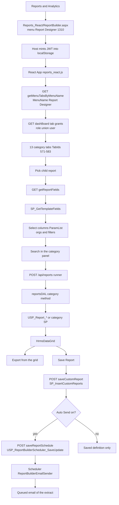
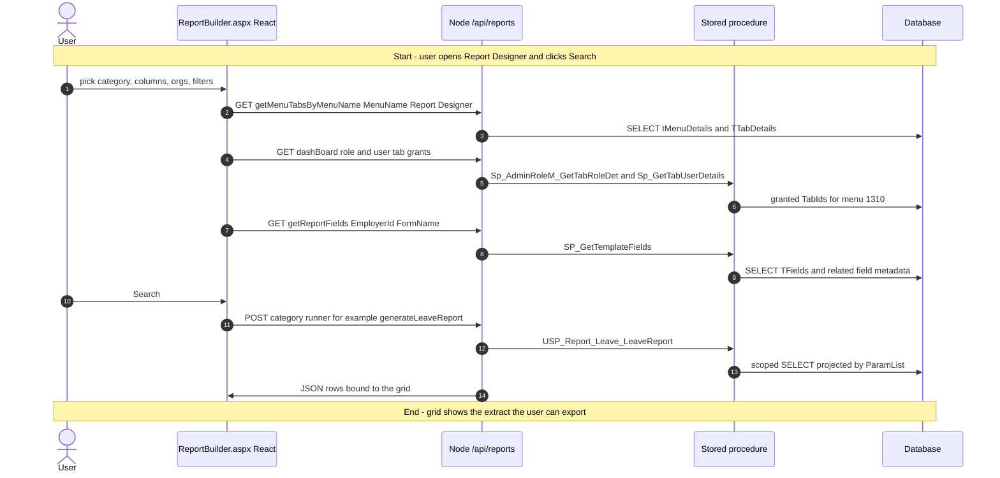
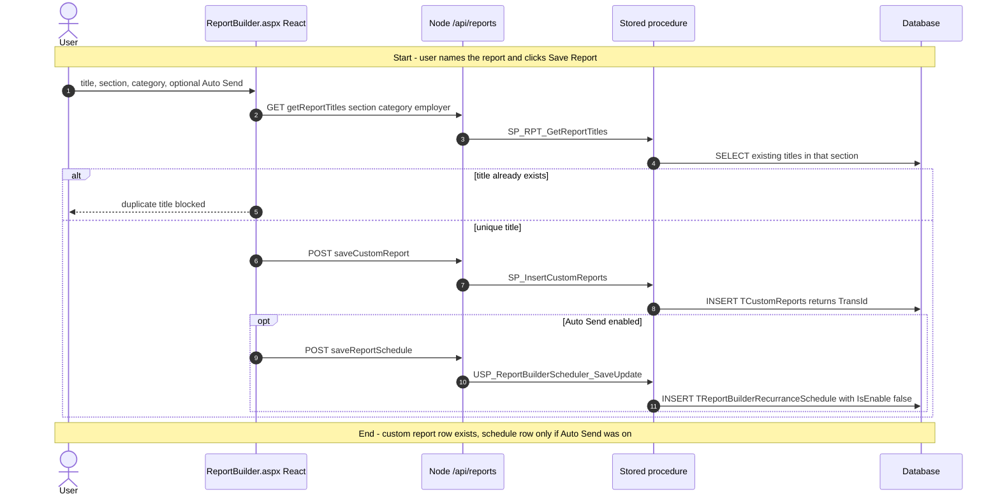
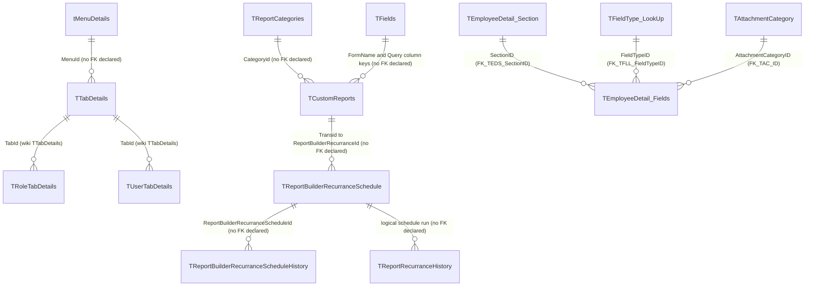

# Report Designer

## Overview

An HR user (or a global-access user reporting across organisations) needs a tabular extract that is not one of the canned Static/Traditional reports: "show me leave ledger for these business units, these columns, this date range." They open **Reports & Analytics → Report Designer**. Category tabs appear according to their role and user tab grants. They pick a category (Leave, Employee Information, Time & Attendance, …), pick the child report, choose organisations and columns, set filters, and run it. Rows land in a grid they can sort, search, and export. If the selection is useful again, they save it as a named custom report — optionally with an auto-send schedule so the same extract is emailed on a recurrence.

Nothing on this page creates an employee or changes a leave balance. Run is a scoped SELECT. The writes are **Save Report** (`TCustomReports`) and **Enable Auto Send Report** (`TReportBuilderRecurranceSchedule`). A Windows scheduler later executes due schedules and queues email; that job is not this screen. Pause, rename, and delete of saved rows live on **Manage Reports** / **Report Center**. Running a saved definition lives on **Static Reports** / **Traditional Reports**.

**Who's involved:**

- **HR user / report consumer** — picks category, columns, filters; runs, exports, saves, schedules. Row visibility is scoped by `IsGlobalAccess`, `LoginEmployeeId` (JWT `req.EID` on the Node side), and reporting type (the host page defaults to `EMPLOYEE` when neither user nor role reporting type is set).
- **Role/user grant admin** — decides which category tabs appear, via tab grants on the **Report Designer** menu (not the WebForms Report Builder menu).
- **Scheduler process** — `ReportBuilderEmailSender` runs saved queries and emails recipients; the user only sees that a schedule was saved. React inserts the schedule with `IsEnable=false` / `IsDeleted=true`; Manage Reports / Report Center later enables it.

The left-nav item **Report Designer** is MenuId **1310** on DEV. Its `tMenuDetails.NavigateURL` is `~/HRM/Reports_React/ReportBuilder.aspx` — that is the page this guide documents. The ASPX `Page Title` and the React `PageHeader` both say **"Report Builder"**, which is why the filenames collide with the sibling sidebar item.

The sibling item **Report Builder** (MenuId **55**) opens the WebForms page `~/HRM/Reports/AdminReports.aspx`. That page is documented separately; it does not call Node `/api/reports`.

There is **no** `llm-wiki/domain` lifecycle page for Report Designer. Table catalog rows live in `llm-wiki/reference/tables/hrms.md`. SourceCode `migration.md` is the canonical note that the two menu entries stay live and that this React host names itself Report Builder. `docs/SystemModels/SystemModel-2/domain/contexts/reporting.md` correctly lists all 13 categories as migrated; its access-control paragraph and `behavior/workflows/report-generation.md` are behind the live code (see Known gaps).

## Workflow

This page is a React SPA hosted in WebForms. Search, field load, save, and schedule are Axios calls to Node `/api/reports/*` with `Authorization` from `localStorage`. The WebForms code-behind only seeds session identity and the JWT; it does not bind the grid.

## Request journey

Two requests live on this screen. Running a report ends as a SELECT result in the grid. Saving a report is the write.

### HR user — run a report

Leave is the example. Other categories follow the same UI → `/api/reports/<runner>` → named SP (or allow-listed view SQL) shape; the runner names are in the call-chain table.

### HR user — save a custom report (optional auto-send)

Pause/resume and delete of saved reports are **Report Center** / **Manage Reports**, not this page. Save is hidden entirely for Background Verification, Asset Management, and Compensation (same three omissions as WebForms `hideTabControls`).

## Entry points

`tMenuDetails` (verified in SourceCode `migration.md` against DEV): MenuId **1310** `'Report Designer'` → `~/HRM/Reports_React/ReportBuilder.aspx`. The filename `ReportBuilder.aspx` is the live Report Designer URL; the page title is `"Report Builder"`. Do not follow `HRM/Reports/AdminReports.aspx` for this sidebar item.

| UI page / API | Purpose |
|---|---|
| `HRMS.Web/HRMS.Web/HRM/Reports_React/ReportBuilder.aspx` | **This feature.** React host. MenuId 1310, `REPORT_DESIGNER_MENU_NAME`. Seeds hidden identity fields and JWT. |
| `HRMS.Web/HRMS.Web/HRM/Reports_React/ReportBuilder.aspx.cs` | Code-behind: session → hidden fields, mint `Authorization` into `localStorage`, load `BuildJS/reports_react.js`. |
| `HRMS.Web/HRMS.Web/HRM/Reports_React/src/App.tsx` | React root. Header title is still "Report Builder". Renders `ReportCategories`. |
| `HRMS.Web/HRMS.Web/HRM/Reports_React/src/logic/tab-permissions.ts` | Resolves MenuId and TabIds **by name** (`Report Designer`); never hardcodes 55. |
| `HRMS.CoreAPI/HRMS.Core.WebAPI.Node/Routes/Reports.js` | Express router mounted at `/api/reports`. |
| `HRMS.CoreAPI/HRMS.Core.WebAPI.Node/Controllers/reportsController.js` | HTTP handlers. Many POSTs stamp `req.body.LoginEmployeeId = req.EID`. |
| `HRMS.CoreAPI/HRMS.Core.WebAPI.Node/Core/DataAccessLayer/reportsDAL.js` | Stored-procedure / allow-listed SQL calls (`mssql`, 600s timeout). |
| `HRMS.Web/HRMS.Web/HRM/Reports/AdminReports.aspx` | **Not this menu item.** Sibling **Report Builder** (MenuId 55). WebForms postback, same SPs, no Node. |
| `HRM/Reports/ReportBuilder.aspx` | Older Telerik wizard on disk, **not** in `HRMS.Web.csproj`. Not in the sidebar. |

Tab grants on this page are resolved at runtime for menu name **Report Designer**. On DEV that is MenuId **1310** with `TTabDetails` TabIds **571–583** (`HRMS-DATABASE/HRMS/DML/152229/TTabDetails.sql`). Filtering those grants against WebForms ids 88–311 matches nothing and would hide every tab.

`ReportCategories.tsx` still comments "menu 55"; the live lookup is `useTabPermissions()` → `'Report Designer'`.

## Code → database call chain

Axios `baseURL` is `{API_BASE_URL}/api` (`src/core/http.ts`). Every reports call is therefore `/api/reports/...`. Auth is the `Authorization` header from `localStorage` (`authMiddleware`). There is no C# Web API controller for this page.

### Shared builder

| Entry | BLL / DAL | Stored procedure |
|---|---|---|
| Host `Page_Load` `ReportBuilder.aspx.cs:28` | `WebCommon.getSecureJWTToken` | — (Auth Web API; seeds `localStorage`) |
| `useTabPermissions` `useTabPermissions.ts:31` | `GET /api/reports/getMenuTabsByMenuName` → `reportsDAL.getMenuTabsByMenuName` | parameterized `SELECT` on `tMenuDetails` + `TTabDetails` (no SP) |
| same hook | `GET /api/dashBoard/GetPermissionRoleTabDetails` → `dashBoardDAL.GetPermissionRoleTabDetails` `dashBoardDAL.js:854` | `Sp_AdminRoleM_GetTabRoleDet` |
| same hook | `GET /api/dashBoard/GetPermissionUserTabDetailsByuserId` → `dashBoardDAL.GetPermissionUserTabDetailsByuserId` `dashBoardDAL.js:839` | `Sp_GetTabUserDetails` |
| `getReportFields` `get-report-fields.ts:9` | `GET /api/reports/getReportFields` → `reportsDAL.getReportFields` | `SP_GetTemplateFields` (`RequestType=REPORTS`) |
| `getReportNamesForModule` `lookups.ts:36` | `GET /api/reports/getReportNames` | `SP_RPT_GetReportNames` |
| `getOrganizations` `lookups.ts:68` | `GET /api/dashBoard/GetGlobalAccessEmployerList` | `SP_GetGlobalAccessEmployerList` |
| `getBusinessUnitLabel` `lookups.ts:56` | `GET /api/dashBoard/GetEmployerBusinessUnitLabel` | `SP_GetBusinessUnitByEmployerId` |
| `getEmployeeListForReports` `lookups.ts:313` | `GET /api/reports/getEmployeeListForReports` | `SP_RPT_GetEmployeeDetails` |
| `getRecipientListForReports` `lookups.ts:290` | `GET /api/reports/getRecipientListForReports` | `SP_RPT_GetAllEmployeeDetails` |
| manager data scope `tab-permissions.ts:84` | `GET /api/reports/getOrgHierarchyEmployeeIds` | `fn_getorghierarchybyemployeeid(@EmployeeId, -2)` (TVF, not an SP) |
| `getReportSections` `save-report.ts:30` | `GET /api/entity/getRoles` → `EntityDAL.getRoles` | `SP_AdminRoleM_GetRoles` (do **not** use `/reports/getRoles` / `SP_RPT_GetRoles`) |
| `getReportCategories` `save-report.ts:47` | `GET /api/reports/getReportCategories` | `SP_GetReportCategories` |
| duplicate-title check `useSaveReport.ts:78` | `GET /api/reports/getReportTitles` → `reportsDAL.getReportTitles` | `SP_RPT_GetReportTitles` |
| `saveCustomReport` `save-report.ts:8` | `POST /api/reports/saveCustomReport` → `reportsDAL.saveCustomReport` | `SP_InsertCustomReports` |
| `saveReportSchedule` `save-report.ts:16` | `POST /api/reports/saveReportSchedule` → `reportsDAL.saveReportSchedule` | `USP_ReportBuilderScheduler_SaveUpdate` |

### Leave Reports (`LEAVE_REPORTS` in `leave-reports.ts`)

| Entry | Node | Stored procedure |
|---|---|---|
| Leave | `POST /api/reports/generateLeaveReport` `leave-reports.ts:44` | `USP_Report_Leave_LeaveReport` |
| Leave Summary | `POST .../generateLeaveSummaryReport` | `USP_Report_Leave_LeaveSummary` |
| Leave Ledger | `POST .../generateLeaveLedgerReport` | `USP_Report_Leave_LeaveLedger` |
| Leave Range | `POST .../generateLeaveRangeReport` | `USP_Report_Leave_LeaveRange` |
| Pending Approvals | `POST .../generatePendingApprovalsReport` | `USP_Report_Leave_PendingApprovals` |
| Leave Encashment | `POST .../generateLeaveEncashmentReport` | `USP_Report_Leave_LeaveEncashmment` |

`generateReport` (`generate-report.ts:13`) POSTs `GenerateReportPayload` (`ParamList`, orgs, dates, `LeaveStatus`). Controller copies `req.EID` onto `LoginEmployeeId`.

### Other categories

Same pattern: category `logic/*-reports.ts` names the runner; `apis/*-report.ts` POSTs (a few T&A / Employee Information paths are GET). `reportsDAL` executes the SP.

| Category | Typical runners | Stored procedures / notes |
|---|---|---|
| Employee Information | `POST getEmployeeDetails`, `getEmployeeFullInfoDetails`, `getFamilyDetailsReport`, …; `GET getEmployeeCompetency`, `getWorkLocationReport` | `USp_GetEmployeeReports`, `USp_GetEmployeeFullInfoReports`, `USP_Report_EmployeeInfo_*`, `SP_RPT_EmpCompetency`, `SP_RPT_vw_WorkLocationReport`. `generateViewReport` remains as a fallback for `path:'view'`; current defs use `employeeDetails` / `fullInfo` / `competency` / `workLocation` / `infoSp`. |
| Time & Attendance | `POST getDailyAttendanceReport`, `generateDayWiseAttendanceReport`, …; some GET (`getCheckinCheckoutDetails`, `getEmployeeDailyAbsentRpt`, `getEmpCheckinCheckout`, `getHalfFullDayAttendanceDetails`) | `Hrms_Sp_DailyAttendanceReport`, `USP_Report_TimeAttendance_*`, `USP_GetAttendanceForPayroll`, `sp_vw_AttendanceRegularizationSummaryReports`, `USP_ClaimOT_*`, `USP_ClaimCompOff_Report`, `USP_OT_*`, `USP_ClaimLocum_Report`, `USP_ClaimPH_Report`, `SP_GetCheckinCheckoutTimeForAllEmployee`, `Sp_GetEmpDailyAbsentRpt`, `SP_RPT_EmpCheckInCheckOut`, `Sp_GetEmpAttendanceDetails`, `SP_Report_TimeAndAttendance_LateInEarlyOutReport` |
| Performance Assessment | `POST getAppraisalRatingReport`, `getCompetencyCategoryReport`, `getEmployeeAppraisalReport`; `GET getAppraisalCycleList` | `USP_Report_PerfAssessment_*`, `SP_PMS_GetEmployeeAppraisalReport`, `sp_GetPMSAppraisalCycles` |
| Separation | `POST getSeparationsReport`, `getExitInterviewReport`, `getSeparationClearanceReport` | `USP_Report_Separation_Separations`, `USP_Report_Separation_ExitInterview`, `Usp_SeparationClearanceReport` |
| Confirmation | `POST getConfirmationStatusReport` | `USP_Report_Confirmation_ConfirmationStatus` |
| Custom Reports | `POST getRoleWiseAccessReport`, `getWorkFlowGroupReport` | Role-wise access is **dynamic SQL** over `vw_RoleWiseMenuReport` / `vw_RoleWiseStaticReport` (no SP). Workflow group → `USP_Report_Custom_WorkFlowGroup` |
| Admin Reports | `POST getAuditLogHistoryReport`, `getEmployeeSearchPurposeReport`, `getDeletedPersonalInfoAuditLogReport`, `getUserAccessRightsReport`, `getDataPrivacyAcknowledgmentReport` | `USP_Report_Admin_*`, `Sp_UserAccessRights_Rpt`, `USP_DataPrivacyAcknowledgement_Report` |
| ESS | `POST getBenefitVouchersEssReport`, `getHelpDeskReport`; `GET getVoucherTypes` | `USP_Report_EmployeeInfo_BenefitVouchers`, `USP_Report_ESS_HelpDesk`, `SP_AdminESS_GetVoucherTypes` |
| BGV | `POST getPreEmploymentReport`, `getPostEmploymentReport` | `USP_Report_BGV_PreEmployment`, `USP_Report_BGV_PostEmployment` |
| Asset | `POST getAssetMappingReport` | `SP_RPT_GetAssetMappingDetails` |
| Compensation | `POST getEmployeeCompensationReport`, `getCandidateCompensationReport`; `GET getCandidateListForReports` | `SP_RPT_GetEmployeeCompensation`, `SP_RPT_GetCandidateCompensation`, `SP_RPT_GetAllCandidateDetails` |
| Recruitment | `POST getRRSFieldsReport`, `getCandidateFieldsReport`, `getRRSCandidateNames`; lookup GETs | `USP_Report_Recruitment_RRSFields`, `USP_Vw_RRSCandidateFieldsReport`, `SP_RPT_GetTechnology`, `SP_RPT_GetRRSCreators`, `Sp_RRS_GetJobLocation`, `Sp_Getbillingtype`, `SP_GetRRSRecruiterNames`, `SP_RPT_GetRRSCandidateStatus`, `SP_RPT_GetRRSInterviewPanelName`, `SP_RPT_GetCandidateInterviewStatus`, `SP_RPT_GetRRSCandidateNames` |

`HRMS.Shared/HRMS.ReportBuilder/AdminReportBuilder.cs` is the Telerik **Reporting** class used by Static Reports, not this page.

Report Center routes on the same `Reports.js` router (`getScheduledReportsList`, `getDelCustomReports`, `updateCustomReportsById`, …) are **not** called from this host. Traditional Reports reuses many of the same runners from `main-traditional.tsx`.

## API endpoints

All of the following require `Authorize` (JWT). Success is typically HTTP 200 with a raw recordset array (not `ActionResult`). Validation failures on the Leave save/run family return HTTP 400 from `validateRequestData`. `LoginEmployeeId` on POSTs that use `taEndpointWithLogin` / the Leave generators is overwritten from the token (`req.EID`), not trusted from the client.

### Shared (this page always uses these)

| Verb | Route | Parameters | Purpose | Source |
|---|---|---|---|---|
| GET | `/api/reports/getMenuTabsByMenuName` | `MenuName` string **required** (query). This page sends `Report Designer`. | MenuId + TabName→TabId registry. Returns `{ MenuId: null, Tabs: [] }` unless exactly one distinct MenuId. | `Reports.js:112`, `reportsController.js:764` |
| GET | `/api/dashBoard/GetPermissionRoleTabDetails` | `EmployerId` int **required**, `RoleId` int **required** | Role tab grants | `DashBoardRoutes.js:61`, `dashBoardDAL.js:854` |
| GET | `/api/dashBoard/GetPermissionUserTabDetailsByuserId` | `EmployerId` int **required**, `UserId` int **required** | User tab grants | `DashBoardRoutes.js:60`, `dashBoardDAL.js:839` |
| GET | `/api/reports/getReportFields` | `EmployerId` string **required** (query). `FormName` string optional (DAL defaults `LEAVEREPORTS`). | Available fields | `Reports.js:139`, `validateRequestData.js:6`, `get-report-fields.ts:9` |
| GET | `/api/reports/getReportNames` | `ReportName` string **required** (module name) | Child-tab intersection with configured names | `Reports.js:114`, `validateRequestData.js:283` |
| GET | `/api/reports/getReportCategories` | none | Save-dialog categories | `Reports.js:142`, `reportsController.js:353` |
| GET | `/api/reports/getReportTitles` | `EmployerId` **required**, `ReportCategory` numeric **required**, `ReportSection` string **required** | Duplicate-title check | `Reports.js:115`, `validateRequestData.js:292` |
| GET | `/api/entity/getRoles` | `employerId` (Entity controller; React sends `employerId`) | Save-dialog Report Section = defined role names | `EntityRoutes.js:8`, `GetRolesParamters.js:11` |
| GET | `/api/reports/getEmployeeListForReports` | `EmployerId` **required**, `LoginEmployeeId` **required** | Criteria employee picker | `Reports.js:12` |
| GET | `/api/reports/getRecipientListForReports` | `EmployerId` **required** | Auto-send recipients (`SP_RPT_GetAllEmployeeDetails`, employer only — not the same list as the criteria picker) | `Reports.js:15` |
| GET | `/api/reports/getOrgHierarchyEmployeeIds` | `EmployeeId` string **required** | Manager section scope | `Reports.js:113`, `reportsController.js:749` |
| GET | `/api/dashBoard/GetGlobalAccessEmployerList` | `employeeId` **required** | Organization picker | `DashBoardRoutes.js:59` |
| GET | `/api/dashBoard/GetEmployerBusinessUnitLabel` | `employerId` **required** | Tenant BU label | `DashBoardRoutes.js:288` |
| POST | `/api/reports/saveCustomReport` | Body **required**: `ReportOrigin`, `ReportTitle`, `Section` strings; `Categoryid` numeric; `Query` string; `CreatedBy` numeric; `EmployerId`. Optional: `GroupBy`, `IsAggreagateApplied` (`Y`/`N`), `ReportFilters`, `IsAllowGlobalAccess` (`Y`/`N`), `ReportEmployerIds` | Insert `TCustomReports`, return `TransId` | `Reports.js:150`, `validateRequestData.js:73`, `leave-reports.ts` `SaveCustomReportPayload` |
| POST | `/api/reports/saveReportSchedule` | Body **required**: `ReportBuilderRecurranceId` numeric, `EmployerId`. Optional recurrence/email fields (`IsDaily`, `StartDate`, `Recipents`, `Subject`, …). React sends `IsEnable: false`, `IsDeleted: true` | Insert/update schedule | `Reports.js:151`, `validateRequestData.js:98`, `scheduler.ts:112` |

Deprecated alias: `GET /api/reports/getLeaveReportFields` is the same handler as `getReportFields`.

### Leave runners (validated bodies)

| Verb | Route | Parameters | Purpose | Source |
|---|---|---|---|---|
| POST | `/api/reports/generateLeaveReport` | Body **required**: `EmployerId`, `ParamList`, and either `FromDate`+`ToDate` **or** `LeaveInitiatedFromDate`+`LeaveInitiatedToDate`. Optional: `IsActive`, `EmpIds`, `Organizationunitid`, `Employmentstatusid`, `Locationid`, `Fromdateofjoining`, `Todateofjoining`, `LeaveStatus` (`boolean \| null`). `LoginEmployeeId` set from JWT. | Leave extract | `Reports.js:143`, `validateRequestData.js:17`, `GenerateReportPayload` in `leave-reports.ts:125` |
| POST | `/api/reports/generateLeaveRangeReport` | same as Leave | Leave Range | `Reports.js:147` |
| POST | `/api/reports/generatePendingApprovalsReport` | same as Leave | Pending Approvals | `Reports.js:148` |
| POST | `/api/reports/generateLeaveLedgerReport` | Body **required**: `EmployerId`, `FromDate`, `ToDate` (non-empty), `ParamList`. Optional filters as above. | Leave Ledger | `Reports.js:145`, `validateRequestData.js:44` |
| POST | `/api/reports/generateLeaveEncashmentReport` | same as Ledger | Leave Encashment | `Reports.js:149` |
| POST | `/api/reports/generateLeaveSummaryReport` | Body **required**: `EmployerId`, `ParamList`. No date pair. | Leave Summary | `Reports.js:146`, `validateRequestData.js:62` |

### Other category runners

These are mounted in `Reports.js` and called from `src/apis/*-report.ts`. Most POSTs take a filter body (`EmployerId` / `EmployerIds`, `ParamList` or `ColumnList`/`WhereClause`, date and org csv fields). They do **not** go through `validateRequestData` except where noted above. Representative required fields:

| Verb | Route | Key parameters | Purpose | Source |
|---|---|---|---|---|
| POST | `/api/reports/getEmployeeDetails` | `EmployerId`, `columnsToFetch`, `WhereClause`, `groupByClause`; `LoginEmployeeId` from JWT | Employee Details | `Reports.js:11`, `employee-info-report.ts:38` |
| POST | `/api/reports/getEmployeeFullInfoDetails` | `ColumnList`, `WhereClause`, `EmployerId`, `EmployerIds`; `LoginEmployeeId` from JWT | Employee Full Information | `Reports.js:16`, `employee-info-report.ts:48` |
| POST | `/api/reports/getFamilyDetailsReport` (and Education/Policy/Passport/Statutory/BenefitVouchers) | `LoginEmployeeId` (JWT on family), `EmployerIds`, `ParamList`, status/emp/BU/location/DOJ csv | Employee Info `infoSp` family | `Reports.js:22-27`, `employee-info-report.ts:78` |
| GET | `/api/reports/getEmployeeCompetency` | query: `EmployerId`, `LoginEmployeeId`, `IsActive`, `EmpIds`, org/location/DOJ | Competency | `Reports.js:85`, `validateRequestData` `getEmployeeCompetency` |
| GET | `/api/reports/getWorkLocationReport` | query: `LoginEmployeeId`, `EmployerId`, `Status`, dates, ids | Work Location | `Reports.js:17` |
| POST | `/api/reports/generateViewReport` | `ReportKey`, `Columns`, org/emp csv, `LoginEmployeeId` from JWT | Allow-listed view SQL; unused by current Employee Info defs | `Reports.js:18`, `employee-info-report.ts:109` |
| POST | `/api/reports/getDailyAttendanceReport` and sibling T&A POSTs in `Reports.js:30-43` | filter body (`EmployerId`, `FromDate`, `ToDate`, `ParamList`, …); some stamp JWT | Time & Attendance | `time-attendance-report.ts`, `time-attendance-reports.ts:71` |
| GET | `/api/reports/getCheckinCheckoutDetails`, `getEmployeeDailyAbsentRpt`, `getEmpCheckinCheckout`, `getHalfFullDayAttendanceDetails` | query dates + `EmployerId` + `IsActive` (see `empCheckinCheckout` validator) | T&A GET leftovers matching legacy | `Reports.js:88-101`, `time-attendance-report.ts:69-122` |
| POST | `/api/reports/getAppraisalRatingReport`, `getCompetencyCategoryReport`, `getEmployeeAppraisalReport` | org + appraisal cycle; Competency also dates; Employee Appraisal single `EmployerId` + `ColumnList` | Performance Assessment | `Reports.js:46-48`, `performance-assessment-report.ts` |
| GET | `/api/reports/getAppraisalCycleList` | `EmployerId` | Cycle dropdown | `Reports.js:49` |
| POST | `/api/reports/getSeparationsReport`, `getExitInterviewReport`, `getSeparationClearanceReport` | standard criteria + LWD/report-data dates (`ReportFromDate`/`ReportToDate` on clearance) | Separation | `Reports.js:52-54`, `separation-report.ts` |
| POST | `/api/reports/getConfirmationStatusReport` | standard criteria, no report-data range | Confirmation | `Reports.js:57` |
| POST | `/api/reports/getRoleWiseAccessReport` | `EmployerId`, `ReportKey` (`roleWiseMenuAccess` / `roleWiseReportAccess`) | Custom role-wise pivot (dynamic SQL) | `Reports.js:59`, `custom-report.ts` |
| POST | `/api/reports/getWorkFlowGroupReport` | standard criteria + `ParamList` | Workflow group | `Reports.js:58` |
| POST | `/api/reports/getAuditLogHistoryReport` and sibling Admin POSTs | criteria + date range; User Access Rights uses as-on date; Data Privacy uses acknowledgment dates | Admin Reports | `Reports.js:60-64`, `admin-report.ts` |
| POST | `/api/reports/getBenefitVouchersEssReport`, `getHelpDeskReport` | voucher type/month or initiated-on range | ESS | `Reports.js:67-68` |
| GET | `/api/reports/getVoucherTypes` | `EmployerId` | ESS voucher dropdown | `Reports.js:74` |
| POST | `/api/reports/getPreEmploymentReport`, `getPostEmploymentReport` | Pre: dates + employer only. Post: standard criteria | BGV | `Reports.js:69-70` |
| POST | `/api/reports/getAssetMappingReport` | `LoginEmployeeid`, `FromDate`, `ToDate`, `Employerid` (four SP params) | Asset | `Reports.js:71`, `asset-reports.ts:7` |
| POST | `/api/reports/getEmployeeCompensationReport`, `getCandidateCompensationReport` | employee vs candidate picker | Compensation | `Reports.js:72-73` |
| GET | `/api/reports/getCandidateListForReports` | `EmployerId` | Candidate picker | `Reports.js:75` |
| POST | `/api/reports/getRRSFieldsReport`, `getCandidateFieldsReport`, `getRRSCandidateNames` | recruitment criteria (skills, creator, billing, dates, …) | Recruitment | `Reports.js:78-83` |
| GET | `/api/reports/getTechnology`, `getRRSCreators`, `getRRSJobLocations`, `getRRSBillingTypes`, `getRRSRecruiterNames`, `getRRSCandidateStatus`, `getRRSInterviewPanelName`, `getCndInterviewStatus` | typically `EmployerId` / `Employerid`; job locations also `LoginEmployeeId` | Recruitment lookups | `lookups.ts:171-205` |

Not used by this host (same router, other pages): `GET /api/reports/getScheduledReportsList`, `getScheduledReportByTransId`, `getCustomReports`, `getCustomReportsForDelete`, `getReportCountForDel`; `PUT updateCustomReportsById`, `updateReportScheduleEnable`; `DELETE getDelCustomReports`; `POST executeCustomReport`. Those belong to Report Center / Traditional Reports.

## Stored procedures & tables involved

No domain wiki page covers this feature. Catalog one-liners below cite `llm-wiki/reference/tables/hrms.md` where a row exists. Scheduler tables are **absent** from that catalog. `llm-wiki/architecture/module-catalog.md` documents a **different** reporting engine (`OV_Rule_*` dashboard cards), not this builder.

Builder persistence, field metadata, and this page's own tab registry:

| Object | File path | Purpose | Wiki |
|---|---|---|---|
| `TCustomReports` | `HRMS-DATABASE/HRMS/TABLES/TCustomReports.sql` | Saved report definition (query, filters, section, category). No FK declared. | `llm-wiki/reference/tables/hrms.md` |
| `TReportCategories` | `…/TABLES/TReportCategories.sql` | Enabled category lookup for the save dialog. No FK declared. | same |
| `TFields` | `…/TABLES/TFields.sql` | Form field registry (`FormName` / `DisplayName` / `DBColumnname`). No FK declared. | same |
| `TEmployeeDetail_Fields` | `…/TABLES/TEmployeeDetail_Fields.sql` | Centralised employee-detail fields joined by `SP_GetTemplateFields` for some forms. FKs to `TEmployeeDetail_Section`, `TFieldType_LookUp`, `TAttachmentCategory`. | same |
| `TReportBuilderRecurranceSchedule` | `…/DDL/TReportBuilderRecurranceSchedule.sql` | Recurrence + recipients keyed on `ReportBuilderRecurranceId`. No FK declared. | — |
| `TReportBuilderRecurranceScheduleHistory` | `…/DDL/64176/DDL - TReportBuilderRecurranceScheduleHistory.sql` | Snapshot of a schedule. No FK declared. | — |
| `TReportBuilderSchedulerLog` | `…/DDL/64176/DDL - TReportBuilderSchedulerLog.sql` | Scheduler run log. No FK declared. | — |
| `TReportRecurranceHistory` | `…/DDL/64176/DDL - TReportRecurranceHistory.sql` | Per-run history / email queue hook. No FK declared. | — |
| `tMenuDetails` / `TTabDetails` / `TRoleTabDetails` / `TUserTabDetails` / `TDynamicMenuHierarchy` | `…/TABLES/` + `DML/152229/TTabDetails.sql` | Sidebar item 1310 and category-tab grants 571–583. | `hrms.md` |
| `SP_GetTemplateFields` | `…/STOREPROCEDURE/SP_GetTemplateFields.sql` | SELECT field templates for `RequestType=REPORTS` | — |
| `SP_GetReportCategories` | `…/SP_GetReportCategories.sql` | SELECT enabled `TReportCategories` | — |
| `SP_InsertCustomReports` | `…/SP_InsertCustomReports.sql` | INSERT `TCustomReports`, return `TransId` | — |
| `SP_RPT_GetReportTitles` | `…/STOREPROCEDURE/` | Titles for duplicate check | — |
| `USP_ReportBuilderScheduler_SaveUpdate` | `…/USP_ReportBuilderScheduler_SaveUpdate.sql` | INSERT/UPDATE schedule | — |
| `SP_AdminRoleM_GetRoles` | `…/STOREPROCEDURE/` | Section dropdown = defined roles | — |
| `SP_RPT_GetEmployeeDetails` / `SP_RPT_GetAllEmployeeDetails` | same | Criteria employees / schedule recipients | — |
| `Sp_AdminRoleM_GetTabRoleDet` / `Sp_GetTabUserDetails` | same | Tab grants | — |
| `SP_GetGlobalAccessEmployerList` | same | Organization picker | — |
| `fn_getorghierarchybyemployeeid` | `…/FUNCTIONS/` | Manager employee-id scope | — |

Category runners (read-only extracts; sources are the owning domain tables, not the builder schema). All under `HRMS-DATABASE/HRMS/STOREPROCEDURE/` unless noted:

| Object | Purpose |
|---|---|
| `USP_Report_Leave_LeaveReport` / `_LeaveSummary` / `_LeaveLedger` / `_LeaveRange` / `_PendingApprovals` / `_LeaveEncashmment` | Leave category |
| `USp_GetEmployeeReports` / `USp_GetEmployeeFullInfoReports` / `USP_Report_EmployeeInfo_*` / `SP_RPT_EmpCompetency` / `SP_RPT_vw_WorkLocationReport` | Employee Information |
| `Hrms_Sp_DailyAttendanceReport`, `USP_Report_TimeAttendance_*`, `USP_GetAttendanceForPayroll`, `sp_vw_AttendanceRegularizationSummaryReports`, `USP_ClaimOT_*`, `USP_ClaimCompOff_Report`, `USP_OT_*`, `USP_ClaimLocum_Report`, `USP_ClaimPH_Report`, `SP_GetCheckinCheckoutTimeForAllEmployee`, `Sp_GetEmpDailyAbsentRpt`, `SP_RPT_EmpCheckInCheckOut`, `Sp_GetEmpAttendanceDetails`, `SP_Report_TimeAndAttendance_LateInEarlyOutReport` | Time & Attendance |
| `USP_Report_PerfAssessment_*`, `SP_PMS_GetEmployeeAppraisalReport`, `sp_GetPMSAppraisalCycles` | Performance Assessment |
| `USP_Report_Separation_*`, `Usp_SeparationClearanceReport` | Separation |
| `USP_Report_Confirmation_ConfirmationStatus` | Confirmation |
| `USP_Report_Custom_WorkFlowGroup` | Custom Reports (workflow group). Role-wise access is view SQL, not this SP. |
| `USP_Report_Admin_*`, `Sp_UserAccessRights_Rpt`, `USP_DataPrivacyAcknowledgement_Report` | Admin Reports |
| `USP_Report_ESS_HelpDesk`, `SP_AdminESS_GetVoucherTypes` | ESS |
| `USP_Report_BGV_PreEmployment` / `_PostEmployment` | BGV |
| `SP_RPT_GetAssetMappingDetails` | Asset |
| `SP_RPT_GetEmployeeCompensation` / `SP_RPT_GetCandidateCompensation` | Compensation |
| `USP_Report_Recruitment_RRSFields`, `USP_Vw_RRSCandidateFieldsReport` | Recruitment |

## Table relationships

No domain `erDiagram` exists. Edges below are either declared FKs on `CREATE TABLE` or logical keys with **no FK declared** (same convention as other feature guides). Category-runner source tables (leave request, attendance, RRS, …) are omitted — they belong to those domains. This is the same persistence model as WebForms Report Builder; the extra objects are this page's tab registry.

`TFields` and `TEmployeeDetail_Fields` are SELECT sources for `SP_GetTemplateFields`, not children of `TCustomReports`. `TReportBuilderSchedulerLog` has no declared FK to the schedule table.

## Known gaps

- **Filename vs menu name.** Sidebar **Report Designer** opens `Reports_React/ReportBuilder.aspx`, which titles itself "Report Builder" (`ReportBuilder.aspx` `Page Title`, `App.tsx` `PageHeader` crumbs). Sidebar **Report Builder** is the WebForms `AdminReports.aspx`. `migration.md` records both.
- **Dead file.** `HRM/Reports/ReportBuilder.aspx` (older Telerik wizard) is on disk and **not** compiled in `HRMS.Web.csproj`.
- **SystemModel-2 drift.** `domain/contexts/reporting.md` (2026-07-24) still says Reports_React does not enforce category-level permission; `useTabPermissions` now filters on DB grants for menu name Report Designer. The same page lists `AdminReports.aspx` under the Telerik engine; that page is ReportDAL/SP, not `AdminReportBuilder`. `behavior/workflows/report-generation.md` (2026-07-10) still says only Leave is migrated; `report-categories.ts` has all 13 `implemented: true`.
- **Stale comment.** `ReportCategories.tsx` still mentions menu 55; runtime uses `'Report Designer'`.
- **No llm-wiki domain page.** Scheduler tables are missing from `llm-wiki/reference/tables/hrms.md`. `module-catalog.md` "Reporting rule engine" is the dashboard `OV_Rule_*` family, not this builder.
- **Role-wise Custom Reports** run dynamic SQL over views inside `reportsDAL.getRoleWiseAccessReport`, not a named `USP_Report_*`.
- **`generateViewReport`** still allow-lists several Employee Information views, but current `EMPLOYEE_INFO_REPORTS` defs no longer set `path: 'view'`.
- **Save exclusions.** BGV, Asset, and Compensation cannot save (legacy `hideTabControls`); Auto Send on this page inserts a disabled schedule (`IsEnable=false`, `IsDeleted=true`) until Manage Reports / Report Center enables it.
- **Report Center / Manage Reports / Traditional Reports overlap.** List/edit/pause/delete and running a saved definition are not this page, even though they share `/api/reports` and `TCustomReports`.
- **Scheduler job** `ReportBuilderEmailSender.cs` emails due schedules; it is not invoked from this host.
- **Live DEV menu query** was not re-run in this pass (`sequelize` unresolved from the explorer script). MenuId 1310 / tabs 571–583 come from `migration.md` plus `DML/152229/TTabDetails.sql`, matching the 2026-07-30 DEV check cited in `tab-permissions.ts`.

## Reference

Confidence is **high** for the menu URL, the React host, and the Node save/run call chain (`ReportBuilder.aspx` → `Reports_React` → `/api/reports` → `reportsDAL` → SPs). Category-runner source tables were not re-derived line-by-line from every `USP_Report_*` body. Wiki catalog rows were reused, not rewritten.

### SourceCode

- `HRMS.Web/HRMS.Web/HRM/Reports_React/ReportBuilder.aspx` (+ `.cs`)
- `HRMS.Web/HRMS.Web/HRM/Reports_React/src/App.tsx`
- `HRMS.Web/HRMS.Web/HRM/Reports_React/src/components/ReportCategories.tsx`
- `HRMS.Web/HRMS.Web/HRM/Reports_React/src/logic/tab-permissions.ts`
- `HRMS.Web/HRMS.Web/HRM/Reports_React/src/logic/report-categories.ts`
- `HRMS.Web/HRMS.Web/HRM/Reports_React/src/logic/leave-reports.ts` (and sibling `*-reports.ts`)
- `HRMS.Web/HRMS.Web/HRM/Reports_React/src/logic/save-report.ts`
- `HRMS.Web/HRMS.Web/HRM/Reports_React/src/logic/scheduler.ts`
- `HRMS.Web/HRMS.Web/HRM/Reports_React/src/hooks/useSaveReport.ts`
- `HRMS.Web/HRMS.Web/HRM/Reports_React/src/core/http.ts`
- `HRMS.CoreAPI/HRMS.Core.WebAPI.Node/Routes/Reports.js`
- `HRMS.CoreAPI/HRMS.Core.WebAPI.Node/Controllers/reportsController.js`
- `HRMS.CoreAPI/HRMS.Core.WebAPI.Node/Core/DataAccessLayer/reportsDAL.js`
- `HRMS.CoreAPI/HRMS.Core.WebAPI.Node/Middlewares/validateRequestData.js`
- `HRMS.CoreAPI/HRMS.Core.WebAPI.Node/Core/Parameters/GetRolesParamters.js`
- `migration.md` (`tMenuDetails` 55 → AdminReports, 1310 → Reports_React/ReportBuilder)
- `docs/SystemModels/SystemModel-2/domain/contexts/reporting.md`
- `docs/SystemModels/SystemModel-2/behavior/workflows/report-generation.md`
- `HRMS.Scheduler/HRMS.BusinessLayer.Scheduler/ReportBuilderEmailSender.cs`

### TDG HRMS DB

- `llm-wiki/reference/tables/hrms.md` (`TCustomReports`, `TReportCategories`, `TFields`, `TEmployeeDetail_Fields`, `TTabDetails`, `TRoleTabDetails`, `TUserTabDetails`)
- `llm-wiki/architecture/module-catalog.md` (does **not** cover this builder)
- `HRMS-DATABASE/HRMS/TABLES/TCustomReports.sql`
- `HRMS-DATABASE/HRMS/TABLES/TReportCategories.sql`
- `HRMS-DATABASE/HRMS/TABLES/TFields.sql`
- `HRMS-DATABASE/HRMS/TABLES/TEmployeeDetail_Fields.sql`
- `HRMS-DATABASE/HRMS/DDL/TReportBuilderRecurranceSchedule.sql`
- `HRMS-DATABASE/HRMS/STOREPROCEDURE/SP_GetTemplateFields.sql`
- `HRMS-DATABASE/HRMS/STOREPROCEDURE/SP_GetReportCategories.sql`
- `HRMS-DATABASE/HRMS/STOREPROCEDURE/SP_InsertCustomReports.sql`
- `HRMS-DATABASE/HRMS/STOREPROCEDURE/USP_ReportBuilderScheduler_SaveUpdate.sql`
- `HRMS-DATABASE/HRMS/STOREPROCEDURE/USP_Report_Leave_LeaveReport.sql` (and sibling `USP_Report_*`)
- `HRMS-DATABASE/HRMS/DML/152229/TTabDetails.sql` (Report Designer tabs 571–583)
