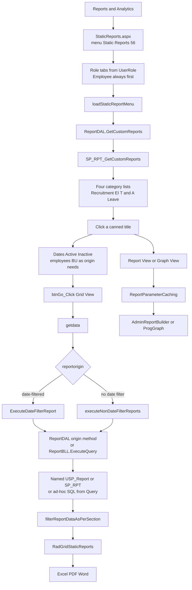
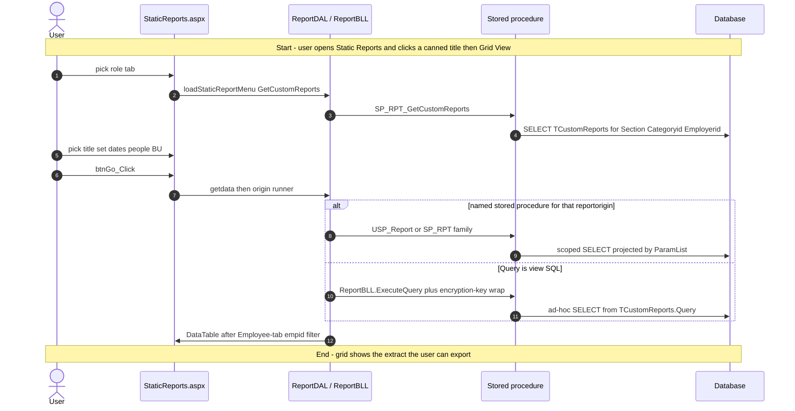
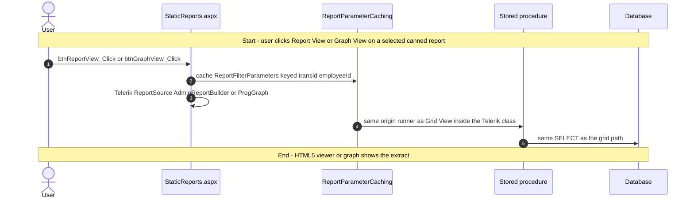
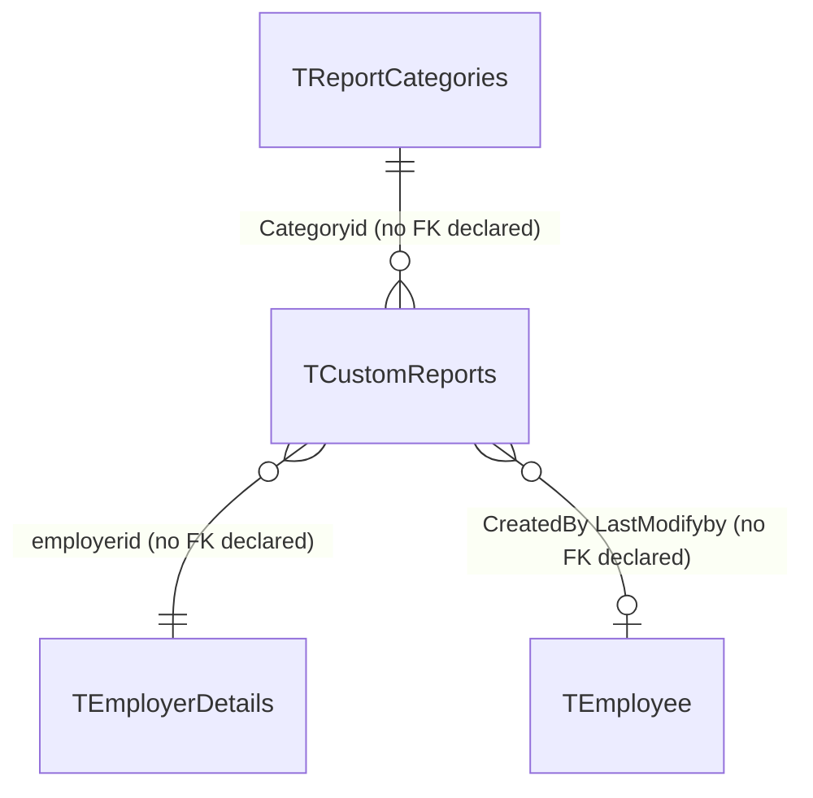

# Static Reports

## Overview

An employee, manager, HR user, or administrator needs a **named, already-saved extract** — not a blank builder. They open **Reports & Analytics → Static Reports**, land on a role tab (Employee is always first; extra tabs follow their `UserRole`), pick a canned report under Recruitment, Employee Information, Time & Attendance, or Leave, set the dates / active-inactive / people / business units that report asks for, and click **Grid View**. Rows land in a grid they can page, filter, and export to Excel, PDF, or Word. If the saved definition has aggregates, **Graph View** appears; **Report View** opens the same extract in a Telerik HTML5 viewer.

Nothing on this page inserts or updates a report definition. The list is `TCustomReports` rows that someone already saved (from **Report Builder** / **Report Designer**). Delete and pause live on **Manage Reports** / **Report Center**. The React sibling **Traditional Reports** is a parallel rewrite of this same runner; the left-nav item **Static Reports** still opens the WebForms page.

**Who's involved:**

- **Report consumer** — the logged-in user. Tab set comes from `UserRoles.GetReportUserRole()` (`UserRole` on the session). The Employee tab truncates results to the logged-in `empid` when that column is present.
- **Report author** — whoever saved the `TCustomReports` row (title, `reportorigin`, `Query`, filters, `Section` = role name, `Categoryid` 1–4). Not this screen.
- **Global-access user** — can switch organisation via `ucGlobalAccessEmployer`; changing org redirects back to this page.

There is **no** `llm-wiki/domain` lifecycle page for Static Reports. Table catalog rows live in `llm-wiki/reference/tables/hrms.md`. SourceCode's `docs/SystemModels/SystemModel-2/domain/contexts/reporting.md` names `StaticReports.aspx` as a Telerik engine and `TraditionalReports.aspx` as the React move of that page; both menu items remain live.

## Workflow

This page is WebForms postback. It does not call Node `/api/reports`. That family belongs to **Traditional Reports** / **Report Designer**.

## Request journey

Two requests live on this screen. Grid View ends as a SELECT result in `RadGridStaticReports`. Report View / Graph View ends as a Telerik render of the same `Transid`.

### Report consumer — run a canned report in the grid

### Report consumer — Report View or Graph View

Graph View is shown only when `TCustomReports.IsAggreagateApplied` is `Y`. AdminReportBuilder is the Telerik Reporting class; it is **not** the Report Builder sidebar page.

## Entry points

`tMenuDetails` (SourceCode `migration.md`, checked against DEV): MenuId **56** `'Static Reports'` → `~/HRM/Reports/StaticReports.aspx`. That file is in `HRMS.Web.csproj`. Do not follow `Reports_React/TraditionalReports.aspx` for this sidebar item — that URL is the sibling **Traditional Reports** entry.

`StaticReports_Old.aspx` sits next to the live page and is **not** in `HRMS.Web.csproj`.

| UI page / API | Purpose |
|---|---|
| `HRMS.Web/HRMS.Web/HRM/Reports/StaticReports.aspx` | **This feature.** WebForms canned-report runner. MenuId 56. Role tabs, four category lists, `btnGo_Click` / `btnReportView_Click` / `btnGraphView_Click`. |
| `HRMS.Web/HRMS.Web/HRM/Reports/StaticReports.aspx.cs` | Code-behind: tab strip, catalog load, origin switch, export, Telerik hand-off. |
| `HRMS.Shared/HRMS.DataAccessLayer/Reports/ReportDAL.cs` | Catalog + origin stored-procedure calls (Enterprise Library). `#region Static Report` is `GetCustomReports` / `GetLocation`. |
| `HRMS.Shared/HRMS.BusinessLayer/Reports/ReportBLL.cs` | Thin BLL. `ExecuteQuery` and employee-details wrappers. |
| `HRMS.Shared/HRMS.ReportBuilder/AdminReportBuilder.cs` | Telerik report class used by **Report View**. |
| `HRMS.Shared/HRMS.ReportBuilder/ProgGraph.cs` | Telerik graph class used by **Graph View**. |
| `HRMS.Shared/HRMS.Reporting.Cache/ReportParameterCaching.cs` | 30-minute `HttpContext` cache keyed `transid~employeeId`. |
| `HRMS.Web/HRMS.Web/HRM/Reports_React/TraditionalReports.aspx` | **Not this menu item.** Sibling Traditional Reports (React rewrite of this runner). |
| `HRMS.Web/HRMS.Web/HRM/Reports/StaticReports_Old.aspx` | On disk, **not compiled**. |
| `HRMS.Web/HRMS.Web/HRM/Reports/SSRSStaticReports.aspx` | SSRS viewer, not the Static Reports sidebar item. |
| `HRMS.Web/HRMS.Web/HRM/TravelAndExpense/StaticReports.aspx` | T&E module, not Reports & Analytics. |

Activity log on `Page_Load` uses `ActivityDescription.StaticReports` (enum value **386**). There is no `MenuPage` constant for 56 (Report Builder has `ADMIN_REPORT_MENU_ID = 55`).

## Code → database call chain

Postbacks only. Enterprise Library `GetStoredProcCommand` from `ReportDAL`, except `ExecuteQuery` which takes a DB handle then runs **ad-hoc SQL** (`GetSqlStringCommand`) wrapped in `Sp_OpenEncryptionKeys` / `SP_CloseEncryptionKey` unless the text already contains `dbo.USp_GetEmployeeReports`.

DAL constant `SP_GetCustomReports` in `DBConstant.cs` is the **string** `"SP_RPT_GetCustomReports"`. That is the live catalog procedure. Sibling file `SP_GetCustomReports.sql` is an older body without `IsAllowGlobalAccess` / `ReportEmployerIds`.

### Catalog, tabs, criteria

| Entry | BLL / DAL | Stored procedure |
|---|---|---|
| `Page_Load` → `bindStaticTabStrip` `StaticReports.aspx.cs:6120` | `UserRoles.GetReportUserRole` `Common.cs:827` (session `UserRole`, no DB). Administrator extra tabs: `RoleManagementDAL.GetDefinedRoles` `RoleManagementDAL.cs:31` | `SP_AdminRoleM_GetRoles` |
| `loadStaticReportMenu` `StaticReports.aspx.cs:6204` (categories 1–4) | `ReportDAL.GetCustomReports` `ReportDAL.cs:1491` | `SP_RPT_GetCustomReports` |
| `bindSearchEmployee` / `ChangeEmployeeStatus` `StaticReports.aspx.cs:234` | `EmployeeDal.GetAllEmployeeForStaticReport` `EmployeeDAL.cs:289` | `SP_RPT_GetAllEmployeeRoleWiseDet` |
| `bindBU` `StaticReports.aspx.cs:195` | `WebCommon.GetOrgStructureReport` → `DBHelper.GetOrgStructureXmlForReports` `DBHelper.cs:3195`. Fallback `CommonBLL.GetOrgStructureXml` | `sp_GetOrganisationHierarchyForReports` / `sp_GetOrganisationHierarchy` |
| `btnGo_Click` `StaticReports.aspx.cs:313` → `getdata` `:1904` | Reads `Query`, `reportorigin`, `Transid`, `IsAggreagateApplied`, `ReportFilters` from the catalog row | (no extra SP; uses the catalog DataTable) |
| `RadGridStaticReports_NeedDataSource` `StaticReports.aspx.cs:1102` | Same `getdata(true, …)` as Go, for paging | same as run |
| `StaticReportMenu_TabClick` `StaticReports.aspx.cs:1278` | Reloads catalog for that section; no run | `SP_RPT_GetCustomReports` |
| `ucGlobalAccessEmployer` change `StaticReports.aspx.cs:309` | `Response.Redirect` to `~/HRM/Reports/StaticReports.aspx` | — |

`getdata` then either `ExecuteDateFilterReport` (`StaticReports.aspx.cs:4865`) or `executeNonDateFilterReports` (`:2164`) from `getReportOrigin()` (`:2107`).

### Date-filtered origins (`ExecuteDateFilterReport`)

| `reportorigin` | Page method | DAL | Stored procedure |
|---|---|---|---|
| Working hours | `executeWorkingHoursReport` `:2838` | `GetActualHoursData` `ReportDAL.cs:1315` | `SP_RPT_GetActOffWorkingTimeForAllEmp` |
| Actual working hours | `executeActualWorkingHours` `:2961` | `GetActualWorkHoursDetails_New` `:1332` | `Sp_RPT_GetEmpActualWorkingHrs_New` |
| Employee daily absent | `executeEmployeeDailyAbsentReport` `:2999` | `GetEmpDailyAbsentDetails` `:792` | `Sp_GetEmpDailyAbsentRpt` |
| Claim overtime | `executeOvertimeReport` `:3120` | `GetOvertimeReportDetails` `:815` | `USP_ClaimOT_Detail_Report` |
| Pre-approval OT | `executePreApprovalOTReport` `:3061` | `GetPreApprovalOTReportDetails` `:841` | `USP_OT_OTRequest_PreApproval_Report` |
| Claim locum | `executeClaimLocumReport` `:3182` | `GetClaimLocumReportDetails` `:942` | `USP_ClaimLocum_Report` |
| Claim PH duration | `executeClaimPHDuration` `:3241` | `GetClaimPHDurationReportDetails` `:892` | `USP_ClaimPH_Report` |
| Claim OT summary | `executeClaimOTSummaryReport` `:3299` | `GetClaimOTSummaryReportDetails` `:917` | `USP_ClaimOT_Summary_Report` |
| Claim compensatory off | `executeClaimCompOffReport` `:5426` | `GetClaimCompOffReportDetails` `:967` | `USP_ClaimCompOff_Report` |
| Leave encashment | inline `:4909` | `GetLeaveEncashmentReportDetails` `:990` | `USP_Report_Leave_LeaveEncashmment` |
| Assigned employees | inline `:4956` | `ExecuteAssignedEmployeeReport` `:314` | `USP_vw_AssignedEmployeeReport` |
| Role-wise menu / report access | `executeRolewiseMenuAndReportAccessReport` `:3358` | `GetCustomReportAccessData` `:1140` | `ReportBLL.ExecuteQuery` on the three SQL fragments in `Query` (no dedicated SP) |
| Employee compensation | `executeEmployeeCompensationQuery` `:4114` | `GetEmployeeCompensationDetails` `:643` | `SP_RPT_GetEmployeeCompensation` |
| Candidate compensation | `executeCandidateCompensationQuery` `:4131` | `GetCandidateCompensationDetails` `:671` | `SP_RPT_GetCandidateCompensation` |
| Employee appraisal | inline `:5073` | `ExecuteEmployeeAppraisalReport` `:175` | `SP_PMS_GetEmployeeAppraisalReport` |
| Policy documents | inline `:5086` | `executeQueryAndDecryptValuesInResult` `:5696` | ad-hoc `ExecuteQuery` |
| Attendance regularization | inline `:5123` | `bindARDetailsUsingSP` `:248` | `sp_vw_AttendanceRegularizationSummaryReports` |
| Leave range | inline `:5181` | `GetLeaveRangeData` `:481` | `USP_Report_Leave_LeaveRange` |
| Optional holiday | inline `:5195` | `GetOptionalHolidayData` `:512` | `USP_Report_TimeAttendance_OptionalHoliday` |
| Work from home | inline `:5207` | `GetWorkFromHomeSummaryReportDetails` `:1695` | `USP_Report_TimeAttendance_WorkFromHomeSummary` |
| Pending approvals | inline `:5218` | `GetPendingApprovalsReport` `:1724` | `USP_Report_Leave_PendingApprovals` |
| Data privacy acknowledgement | inline `:5236` | `GetDataPrivacyAcknowledgmentReportDetails` `:1038` | `USP_DataPrivacyAcknowledgement_Report` |
| Candidate fields | `executeCandidateFieldsReport` `:5331` | `ExecuteRRSCandidateFieldsReport` `:276` | `USP_Vw_RRSCandidateFieldsReport` |
| Employee details | `executeEmployeeDetailsReport` `:6382` | `GetEmployeeDetailsData` / `GetOldEmployeeDetailsData` `:1386` / `:1414` | `USp_GetEmployeeReports` / `SP_OLD_GetEmployeeReports` |
| Employee full information | `executeEmployeeFullDetailsReport` `:6562` | `GetEmployeeFullDetailsData` `:1399` | `USp_GetEmployeeFullInfoReports` |
| Unmatched date-filtered origin | else `:5251` | `executeQueryAndDecryptValuesInResult` | ad-hoc `ExecuteQuery` |

### Attendance-related switch (`executeEmployeeAttendanceRelatedReports` `:3382`)

Reached when `Query` splits on `~` into more than one part (PBI 18236). `reportorigin` is compared **case-sensitively** to `ReportConstants`.

| `reportorigin` | DAL | Stored procedure |
|---|---|---|
| Punch in/out | `GetActualHoursHorizontalData_New` `ReportDAL.cs:1351` | `SP_RPT_GetEmpActualOffTime` |
| Attendance | `ExecuteDailyAttnReport` `:218` | `Hrms_Sp_DailyAttendanceReport` |
| Day-wise OT | `GetDayWiseOTReportDetails` `:867` | `USP_OT_PreApproved_DayWise_Report` |
| Full-day / half-day absent | `GetEmpFullDayHalfDayAbsentDetails` `:722` | `Sp_GetEmpAttendanceDetails` |
| User access rights | `GetUserAccessRightsReportDetails` `:1015` | `Sp_UserAccessRights_Rpt` |
| Skill summary | `GetEmployeeSkillSummary` `:341` | `SP_RPT_EmpSkillSummary` |
| FPF family (discipline, awards, …) | `GetFPFReportData` `:1061` | `SP_RPT_FPF_GetDisciplineRecords` (`FormName` distinguishes the form) |
| Employee competency | `GetEmployeeCompetency` `:695` | `SP_RPT_EmpCompetency` |
| Leave | `GetEmployeeLeave` `:392` | `USP_Report_Leave_LeaveReport` |
| Leave ledger | `GetLeaveLedgerData` `:422` | `USP_Report_Leave_LeaveLedger` |
| Employee attendance | `GetEmployeeAttendance` `:595` | `SP_RPT_AttendanceReport_ByDate` |
| Card swipe / clock in-out | `GetEmployeeCardSwipeHistory` `:567` | `SP_RPT_EmpCheckInCheckOut` |
| Skills and allocations | `GetEmployeeSkillAndAllocations` `:367` | `Sp_GetEmpSummaryRpt` |
| Separation clearance | `GetSeperationClearanceData` `:1090` | `Usp_SeparationClearanceReport` |
| Payroll | `ExecuteGetAttendanceForPayroll` `:767` | `USP_GetAttendanceForPayroll` |
| Asset mapping | `GetAssetMappingDetails` `:623` | `SP_RPT_GetAssetMappingDetails` |
| Late in / early out | `GetLateInEarlyOutReportDetails` `:1755` | `SP_Report_TimeAndAttendance_LateInEarlyOutReport` |
| default | `GetEmployeeCheckInCheckOutData` `:1118` | `SP_GetCheckinCheckoutTimeForAllEmployee` |

### Non-date origins (`executeNonDateFilterReports`)

| `reportorigin` | DAL | Stored procedure |
|---|---|---|
| Employee search purpose / deleted personal-info audit / family details / appraisal rating | `ReportBLL.ExecuteQuery` | ad-hoc SQL from `Query` |
| Work location | `GetWorkLocationData` `ReportDAL.cs:541` | `SP_RPT_vw_WorkLocationReport` |
| Leave summary | `GetLeaveSummaryData` `:451` | `USP_Report_Leave_LeaveSummary` |

After a named-SP run, `filterReportDataAsPerSection` (`StaticReports.aspx.cs:2919`) keeps only rows where `empid` equals the logged-in employee when the **Employee** tab is selected and that column exists. Other sections pass the table through. Manager-style `ReportsToEmployeeID` filtering in that method is commented out.

## API endpoints

**Static Reports (`StaticReports.aspx`) has no API layer.** Catalog load, criteria, Grid View, Report View, Graph View, and export are WebForms postbacks (`btnGo_Click`, `btnReportView_Click`, `btnGraphView_Click`, `btnReportList_Click`, `StaticReportMenu_TabClick`). No `WebMethod` / `PageMethod` on this code-behind. There is no C# Web API controller for this page.

The Node routes under `/api/reports` belong to **Traditional Reports** and **Report Designer**, not this menu item.

## Stored procedures & tables involved

No domain wiki page covers this feature. Catalog one-liners cite `llm-wiki/reference/tables/hrms.md` where a row exists.

Live catalog procedure is `SP_RPT_GetCustomReports`, not `SP_GetCustomReports`.

| Object | File path | Purpose | Wiki |
|---|---|---|---|
| `TCustomReports` | `HRMS-DATABASE/HRMS/TABLES/TCustomReports.sql` | Canned definition: title, `Section` (role name), `Categoryid`, `Query`, `reportorigin`, filters, grouping. No FK declared. | `llm-wiki/reference/tables/hrms.md` |
| `TReportCategories` | `…/TABLES/TReportCategories.sql` | Category lookup. This page hardcodes ids **1–4** (Recruitment, Employee Information, Time & Attendance, Leave). No FK declared. | same |
| `tMenuDetails` / `TDynamicMenuHierarchy` | `…/TABLES/` + DML | Sidebar: Static Reports Value **56**. | `hrms.md` (`TDynamicMenuHierarchy`) |
| `SP_RPT_GetCustomReports` | `…/STOREPROCEDURE/SP_RPT_GetCustomReports.sql` | SELECT non-deleted rows for Section + Categoryid + Employerid, including `IsAllowGlobalAccess` and `ReportEmployerIds` | — |
| `SP_GetCustomReports` | `…/STOREPROCEDURE/SP_GetCustomReports.sql` | Older catalog body (no global-access columns). **Not** what `ReportDAL.GetCustomReports` calls. | — |
| `SP_RPT_GetAllEmployeeRoleWiseDet` | `…/STOREPROCEDURE/` | Employee multi-select on this page | — |
| `SP_AdminRoleM_GetRoles` | same | Extra Administrator tabs | — |
| `sp_GetOrganisationHierarchyForReports` / `sp_GetOrganisationHierarchy` | same | Business-unit tree | — |
| `Sp_OpenEncryptionKeys` / `SP_CloseEncryptionKey` | same | Wrap around ad-hoc `ExecuteQuery` | — |

Category runners (read-only extracts; sources are the owning domain tables). Under `HRMS-DATABASE/HRMS/STOREPROCEDURE/` unless noted:

| Object | Purpose on this page |
|---|---|
| `USP_Report_Leave_LeaveReport` / `_LeaveSummary` / `_LeaveLedger` / `_LeaveRange` / `_PendingApprovals` / `_LeaveEncashmment` | Leave origins |
| `USp_GetEmployeeReports` / `USp_GetEmployeeFullInfoReports` / `SP_OLD_GetEmployeeReports` | Employee details / full info |
| `Hrms_Sp_DailyAttendanceReport`, `USP_Report_TimeAttendance_OptionalHoliday`, `USP_Report_TimeAttendance_WorkFromHomeSummary`, `USP_GetAttendanceForPayroll`, `sp_vw_AttendanceRegularizationSummaryReports`, `USP_ClaimOT_Detail_Report`, `USP_ClaimOT_Summary_Report`, `USP_ClaimCompOff_Report`, `USP_OT_OTRequest_PreApproval_Report`, `USP_OT_PreApproved_DayWise_Report`, `USP_ClaimLocum_Report`, `USP_ClaimPH_Report`, `SP_GetCheckinCheckoutTimeForAllEmployee`, `Sp_GetEmpDailyAbsentRpt`, `SP_RPT_EmpCheckInCheckOut`, `Sp_GetEmpAttendanceDetails`, `SP_Report_TimeAndAttendance_LateInEarlyOutReport`, `SP_RPT_AttendanceReport_ByDate`, `SP_RPT_GetActOffWorkingTimeForAllEmp`, `Sp_RPT_GetEmpActualWorkingHrs_New`, `SP_RPT_GetEmpActualOffTime` | Time & Attendance |
| `SP_PMS_GetEmployeeAppraisalReport` | Employee appraisal |
| `Usp_SeparationClearanceReport` | Separation clearance |
| `Sp_UserAccessRights_Rpt`, `USP_DataPrivacyAcknowledgement_Report` | Admin-style extracts |
| `SP_RPT_GetAssetMappingDetails` | Asset mapping |
| `SP_RPT_GetEmployeeCompensation` / `SP_RPT_GetCandidateCompensation` | Compensation |
| `USP_Vw_RRSCandidateFieldsReport` | Recruitment candidate fields |
| `USP_vw_AssignedEmployeeReport` | Assigned employees |
| `SP_RPT_EmpSkillSummary`, `Sp_GetEmpSummaryRpt`, `SP_RPT_EmpCompetency` | Skills / competency |
| `SP_RPT_FPF_GetDisciplineRecords` | FPF forms (`FormName` parameter) |
| `SP_RPT_vw_WorkLocationReport` | Work location |

`llm-wiki/architecture/module-catalog.md` documents a **different** reporting engine (`OV_Rule_*` dashboard cards), not this runner.

## Table relationships

No domain `erDiagram` exists. Edges below are logical keys with **no FK declared** on `TCustomReports` (same convention as other feature guides). Category-runner source tables (leave request, attendance, RRS, …) are omitted — they belong to those domains.

`Section` is a role-name string (Employee, Manager, Administrator, HR, …), not an FK to `TRoles`. `Query` is either view SQL or a `~`-delimited ParamList plus saved filters; it is not a child table. `TFields` is not read on this page (Report Builder / Designer load fields; this page runs the saved row).

## Known gaps

- **Filename vs sibling menu.** Sidebar **Static Reports** opens `StaticReports.aspx`. **Traditional Reports** opens `Reports_React/TraditionalReports.aspx`. Both stay in the nav. SystemModel-2 `reporting.md` describes Traditional Reports as the move of this page; it does not replace MenuId 56.
- **Dead file.** `StaticReports_Old.aspx` is on disk and **not** in `HRMS.Web.csproj`.
- **Two catalog procedures.** DAL calls `SP_RPT_GetCustomReports`. `SP_GetCustomReports.sql` is a narrower older twin. Do not document the older name as live.
- **Ad-hoc SQL.** Origins that miss the named-SP switch run `TCustomReports.Query` through `ReportBLL.ExecuteQuery` (encryption-key wrap). That contradicts the “everything is a named SP” rule for this feature.
- **Case-sensitive origin switch.** `executeEmployeeAttendanceRelatedReports` switches on `strReportOrigin` without `.ToUpper()`, unlike most other branches.
- **Employee-tab truncation only.** `filterReportDataAsPerSection` filters `empid` for the Employee section. The Manager `ReportsToEmployeeID` / `FunctionalManagerEmployeeID` block is commented out. Remaining row scope is whatever the SP applies via `LoginEmployeeId`.
- **Four categories only.** Report Builder has 13 category tabs. This page only lists Categoryid 1–4. Saved reports in other categories do not appear here.
- **No save / delete on this page.** Persistence is Report Builder (insert) and Manage Reports (delete).
- **No llm-wiki domain page.** `module-catalog.md` “Reporting rule engine” is the dashboard `OV_Rule_*` family.
- **SystemModel-2 drift.** `behavior/workflows/report-generation.md` still says only Leave is migrated to React and talks about AdminReports, not this runner.
- **T&E / SSRS namesakes.** `TravelAndExpense/StaticReports.aspx` and `SSRSStaticReports.aspx` are other products.
- **DEV menu query** was not re-run from this session (`sequelize` not resolvable in the Node API tree). Menu URL is taken from SourceCode `migration.md` (DEV `tMenuDetails`) plus DML `Value="56"`.

## Reference

Confidence is **high** for the menu URL, catalog load, Grid View origin switch, and the named-SP map in `ReportDAL`. Category-runner source tables were not re-derived line-by-line from every `USP_Report_*` body. Wiki catalog rows were reused, not rewritten.

### SourceCode

- `HRMS.Web/HRMS.Web/HRM/Reports/StaticReports.aspx` (+ `.cs`)
- `HRMS.Shared/HRMS.DataAccessLayer/Reports/ReportDAL.cs`
- `HRMS.Shared/HRMS.BusinessLayer/Reports/ReportBLL.cs`
- `HRMS.Shared/HRMS.DataAccessLayer/DBConstant.cs` (`SP_GetCustomReports` → `SP_RPT_GetCustomReports`)
- `HRMS.Shared/HRMS.DataAccessLayer/Employee/EmployeeDAL.cs` (`GetAllEmployeeForStaticReport`)
- `HRMS.Shared/HRMS.DataAccessLayer/RoleManagement/RoleManagementDAL.cs` (`GetDefinedRoles`)
- `HRMS.Shared/HRMS.DataAccessLayer/DBHelper.cs` (`GetOrgStructureXmlForReports`)
- `HRMS.Shared/HRMS.Common/Common.cs` (`GetReportUserRole`)
- `HRMS.Shared/HRMS.DataContract/Common/Enums.cs` (`StaticReports = 386`)
- `HRMS.Shared/HRMS.ReportBuilder/AdminReportBuilder.cs`
- `HRMS.Shared/HRMS.ReportBuilder/ProgGraph.cs`
- `HRMS.Shared/HRMS.Reporting.Cache/ReportParameterCaching.cs`
- `migration.md` (`tMenuDetails` 56 → StaticReports.aspx; Traditional Reports → Reports_React)
- `docs/SystemModels/SystemModel-2/domain/contexts/reporting.md`
- `docs/SystemModels/SystemModel-2/behavior/workflows/report-generation.md`

### TDG HRMS DB

- `llm-wiki/reference/tables/hrms.md` (`TCustomReports`, `TReportCategories`)
- `llm-wiki/architecture/module-catalog.md` (does **not** cover this runner)
- `HRMS-DATABASE/HRMS/TABLES/TCustomReports.sql`
- `HRMS-DATABASE/HRMS/TABLES/TReportCategories.sql`
- `HRMS-DATABASE/HRMS/STOREPROCEDURE/SP_RPT_GetCustomReports.sql`
- `HRMS-DATABASE/HRMS/STOREPROCEDURE/SP_GetCustomReports.sql` (older twin, not the DAL target)
- `HRMS-DATABASE/HRMS/STOREPROCEDURE/USP_Report_Leave_LeaveReport.sql` (and sibling `USP_Report_*`)
- `HRMS-DATABASE/HRMS/DML/Tmenudetails DML.sql` (Reports & Analytics → Static Reports Value 56)
