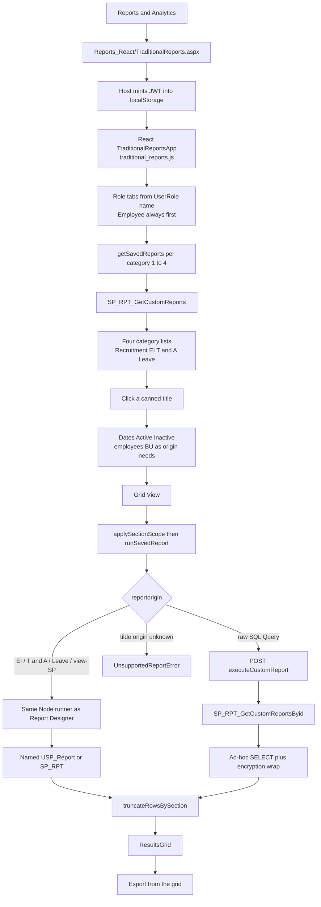
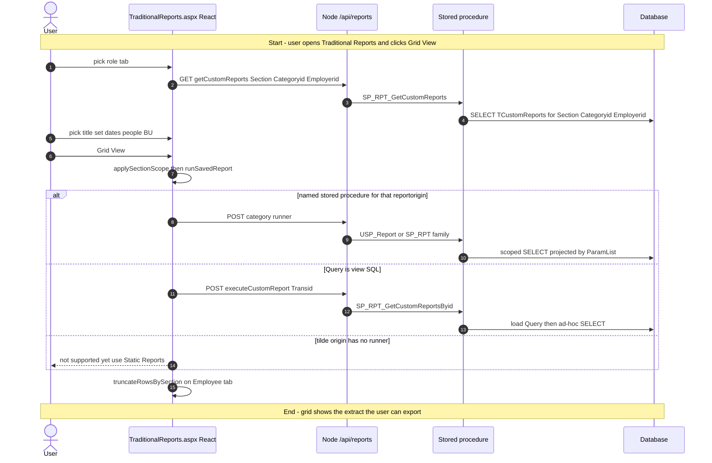
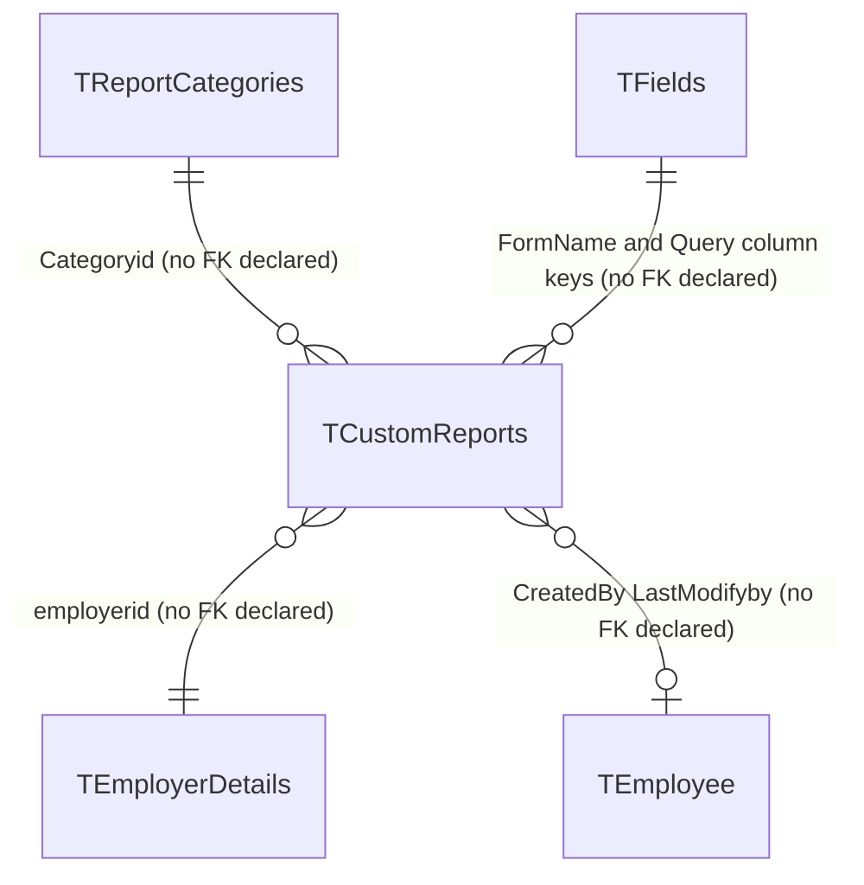

# Traditional Reports

## Overview

An employee, manager, HR user, or administrator needs a **named, already-saved extract** — not a blank builder. They open **Reports & Analytics → Traditional Reports**, land on a role tab (Employee is always first; extra tabs follow their **role name**), pick a canned report under Recruitment, Employee Information, Time & Attendance, or Leave, set the dates / active-inactive / people / business units that origin asks for, and click **Grid View**. Rows land in a grid they can sort, search, and export. Nothing on this page inserts, updates, or deletes a report definition.

The list is `TCustomReports` rows that someone already saved from **Report Builder** / **Report Designer**. Delete, rename, and pause live on **Manage Reports** / **Report Center**. The WebForms sibling **Static Reports** is the same runner in postback form; the left-nav item **Traditional Reports** opens this React host, not `StaticReports.aspx`.

**Who's involved:**

- **Report consumer** — the logged-in user. Tab set comes from `LoggedInEmployee.UserRole` (the tenant **role name**, via `buildSectionTabs`). The Employee tab rewrites the employee filter to the logged-in `empid` and, after the run, keeps only that employee's rows when an `empid` column is present. The Manager tab scopes to `fn_getorghierarchybyemployeeid`.
- **Report author** — whoever saved the `TCustomReports` row (title, `reportorigin`, `Query`, filters, `Section` = role name, `Categoryid` 1–4). Not this screen.
- **Global-access user** — can switch organisation (single-select). Changing org resets the page, same idea as legacy `ucGlobalAccessEmployer` redirecting `StaticReports.aspx`.

There is **no** `llm-wiki/domain` lifecycle page for Traditional Reports. Table catalog rows live in `llm-wiki/reference/tables/hrms.md`. SourceCode `migration.md` is the canonical note that this React host is a **separate nav entry** from Static Reports and that both stay live. SystemModel-2 `domain/contexts/reporting.md` names `TraditionalReports.aspx` as the React move of the canned runner; `behavior/workflows/report-generation.md` is behind the live code (it still says only Leave is migrated).

## Workflow

This page is a React SPA hosted in WebForms. Catalog load and Grid View are Axios calls to Node `/api/reports/*` with `Authorization` from `localStorage`. The WebForms code-behind only seeds session identity and the JWT; it does not bind the grid. There is **no** Report View / Graph View / Telerik path here.

## Request journey

One request lives on this screen. Grid View ends as a SELECT result in `ResultsGrid`. There is no write.

### Report consumer — run a canned report in the grid

Pause/rename/delete of saved reports are **Manage Reports** / **Report Center**. Creating a definition is **Report Builder** / **Report Designer**.

## Entry points

`tMenuDetails` (SourceCode `migration.md`): MenuName **Traditional Reports** → `~/HRM/Reports_React/TraditionalReports.aspx`. That file is in `HRMS.Web.csproj`. Do not follow `HRM/Reports/StaticReports.aspx` for this sidebar item — that URL is the sibling **Static Reports** entry (MenuId 56).

The host was moved from `HRM/Reports/TraditionalReports.aspx` on 2026-07-17; no stub remains at the old path. The page title and React `PageHeader` both say **"Traditional Reports"**.

| UI page / API | Purpose |
|---|---|
| `HRMS.Web/HRMS.Web/HRM/Reports_React/TraditionalReports.aspx` | **This feature.** WebForms host. Seeds hidden identity fields and JWT; loads `traditional_reports.js`. |
| `HRMS.Web/HRMS.Web/HRM/Reports_React/TraditionalReports.aspx.cs` | Code-behind: session → hidden fields, `localStorage.Authorization`. |
| `HRMS.Web/HRMS.Web/HRM/Reports_React/src/main-traditional.tsx` | React mount into `#root`. |
| `HRMS.Web/HRMS.Web/HRM/Reports_React/src/components/TraditionalReports/TraditionalReportsApp.tsx` | Role tabs, four category lists, criteria, Grid View. |
| `HRMS.Web/HRMS.Web/HRM/Reports_React/src/apis/traditional-reports.ts` | Catalog + `runSavedReport` origin switch. |
| `HRMS.Web/HRMS.Web/HRM/Reports_React/src/logic/traditional-reports.ts` | Tab rules, criteria visibility, origin→endpoint maps. |
| `HRMS.CoreAPI/HRMS.Core.WebAPI.Node/Routes/Reports.js` | `/api/reports` router. |
| `HRMS.CoreAPI/HRMS.Core.WebAPI.Node/Controllers/reportsController.js` | JWT stamp (`req.EID`) then DAL. |
| `HRMS.CoreAPI/HRMS.Core.WebAPI.Node/Core/DataAccessLayer/reportsDAL.js` | Named SPs + `executeCustomReport` ad-hoc SQL. |
| `HRMS.Web/HRMS.Web/HRM/Reports/StaticReports.aspx` | **Not this menu item.** Sibling Static Reports (WebForms runner). |

Activity log is not written from this React host (legacy Static Reports uses `ActivityDescription.StaticReports` = 386). There is no `MenuPage` constant for this item (Report Builder has `ADMIN_REPORT_MENU_ID = 55`).

## Code → database call chain

Axios from `src/core/http.ts` (`baseURL` = `{API_BASE_URL}/api`, `Authorization` from `localStorage`). Node `Authorize` middleware. `LoginEmployeeId` on POSTs that go through `taEndpointWithLogin` / Leave generators / `executeCustomReport` is overwritten from the token (`req.EID`), not trusted from the client.

### Catalog, tabs, criteria

| Entry | React / Node | Stored procedure |
|---|---|---|
| Host `Page_Load` `TraditionalReports.aspx.cs:32` | Session identity + JWT; no DB | — |
| Admin extra tabs `TraditionalReportsApp.tsx:109` | `getReportSections` `save-report.ts:30` → `GET /api/entity/getRoles` → `EntityDAL.getRoles` | `SP_AdminRoleM_GetRoles` (do **not** use `/reports/getRoles` / `SP_RPT_GetRoles`) |
| Catalog `TraditionalReportsApp.tsx:122` | `getSavedReports` `traditional-reports.ts:39` → `GET /api/reports/getCustomReports` → `reportsDAL.getCustomReports` `reportsDAL.js:1861` | `SP_RPT_GetCustomReports` |
| Visibility after catalog | `isReportVisible` `traditional-reports.ts:200` (hide `IsAllowGlobalAccess=Y` unless the user is global) | — |
| Org picker `TraditionalReportsApp.tsx:99` | `getOrganizations` `lookups.ts:68` | `SP_GetGlobalAccessEmployerList` |
| BU label | `useBusinessUnitLabel` → `GET /api/dashBoard/GetEmployerBusinessUnitLabel` | `SP_GetBusinessUnitByEmployerId` |
| Employee picker `TraditionalReportsApp.tsx:223` | `getEmployees` `lookups.ts:306` → `GET /api/reports/getEmployeeListForReports` | `SP_RPT_GetEmployeeDetails` (page employer, **not** the report's `ReportEmployerIds`) |
| BU tree `TraditionalReportsApp.tsx:233` | `getBusinessUnitsRaw` `lookups.ts:261` → `GET /api/overTime/OTManagementFetchMasterData` `requestType=BusinessUnit` | `USP_Employer_Master_Data_Select` |
| Manager scope `TraditionalReportsApp.tsx:137` | `getOrgHierarchyEmployeeIds` `tab-permissions.ts:84` → `GET /api/reports/getOrgHierarchyEmployeeIds` `reportsDAL.js:2088` | `fn_getorghierarchybyemployeeid(@EmployeeId, -2)` (TVF, not an SP) |
| Grid headers `TraditionalReportsApp.tsx:190` | `getReportFields` `get-report-fields.ts:9` | `SP_GetTemplateFields` |
| `run` `TraditionalReportsApp.tsx:254` | `applySectionScope` then `runSavedReport` then `truncateRowsBySection` | (see origin tables) |

`getdata` on Static Reports then either a named-SP origin or ad-hoc SQL. Here `runSavedReport` (`traditional-reports.ts:62`) does the same job, routing by `reportorigin` (case-insensitive) before falling through to `executeCustomReport`.

### Origin routing (`runSavedReport`)

Order is fixed: Employee Information defs → Time & Attendance defs → view→SP std map → Performance Assessment map → Employee Appraisal → RRS Fields → Leave map → `runCategoryReport` (Admin, Asset, Compensation, Recruitment, Separation, Custom pivot, ESS) → tilde `UnsupportedReportError` → raw SQL `executeCustomReport`.

| `reportorigin` family | React | Node | Stored procedure |
|---|---|---|---|
| Employee Details / Full Information / Competency / Work Location / Family / Education / Policy / Passport / Statutory / Benefit Vouchers | `getEIReportDefByOrigin` → `runEmployeeInfoReport` `employee-info-report.ts:23` | `POST getEmployeeDetails`, `getEmployeeFullInfoDetails`, `getFamilyDetailsReport`, …; `GET getEmployeeCompetency`, `getWorkLocationReport` | `USp_GetEmployeeReports`, `USp_GetEmployeeFullInfoReports`, `USP_Report_EmployeeInfo_*`, `SP_RPT_EmpCompetency`, `SP_RPT_vw_WorkLocationReport` |
| Attendance, Payroll, WFH, Claim/OT family, Punch/Check In-Out, Daily Absent, Late In/Early Out, … | `getTAReportDefByOrigin` → `runTimeAttendanceReport` `time-attendance-report.ts:22` | T&A POSTs in `Reports.js:30-43`; some GET leftovers | `Hrms_Sp_DailyAttendanceReport`, `USP_Report_TimeAttendance_*`, `USP_GetAttendanceForPayroll`, `sp_vw_AttendanceRegularizationSummaryReports`, `USP_ClaimOT_*`, `USP_ClaimCompOff_Report`, `USP_OT_*`, `USP_ClaimLocum_Report`, `USP_ClaimPH_Report`, `SP_GetCheckinCheckoutTimeForAllEmployee`, `Sp_GetEmpDailyAbsentRpt`, `SP_RPT_EmpCheckInCheckOut`, `Sp_GetEmpAttendanceDetails`, `SP_Report_TimeAndAttendance_LateInEarlyOutReport` |
| Confirmation Status, WorkFlow Group Page, Audit Log History Reports, Employee Search Purpose, Deleted Personal Info Audit Log Report, Help Desk Report, Pre Employment, OnBoarded Employee, Exit Interview Report | `SP_VIEW_STD_ENDPOINTS` `traditional-reports.ts:719` | matching `POST /api/reports/get*Report` | `USP_Report_Confirmation_ConfirmationStatus`, `USP_Report_Custom_WorkFlowGroup`, `USP_Report_Admin_*`, `USP_Report_ESS_HelpDesk`, `USP_Report_BGV_*`, `USP_Report_Separation_ExitInterview` |
| Appraisal Rating / Competency & Category | `SP_VIEW_PA_ENDPOINTS` `traditional-reports.ts:738` | `POST getAppraisalRatingReport`, `getCompetencyCategoryReport` | `USP_Report_PerfAssessment_*` |
| Employee Appraisal | `SP_EMPLOYEE_APPRAISAL_ENDPOINT` `traditional-reports.ts:759` | `POST getEmployeeAppraisalReport` | `SP_PMS_GetEmployeeAppraisalReport` |
| RRS Fields | `SP_VIEW_RRS_ENDPOINT` `traditional-reports.ts:744` | `POST getRRSFieldsReport` | `USP_Report_Recruitment_RRSFields` |
| Leave / Leave Summary / Leave Ledger / Leave Range / Pending Approvals / Leave Encashment | `TYPED_LEAVE_ENDPOINTS` `traditional-reports.ts:452` | `POST generateLeave*Report` | `USP_Report_Leave_LeaveReport` / `_LeaveSummary` / `_LeaveLedger` / `_LeaveRange` / `_PendingApprovals` / `_LeaveEncashmment` |
| Remaining Admin / Asset / Compensation / Recruitment / Separation / ESS / Role-wise pivot | `runCategoryReport` `traditional-category-runner.ts:89` | same Report Designer runners | see Report Designer category table |
| Raw-SQL `Query` (contains `select`, not a `~` ParamList) | `POST /api/reports/executeCustomReport` `traditional-reports.ts:242` → `reportsDAL.executeCustomReport` `reportsDAL.js:213` | `SP_RPT_GetCustomReportsByid` then ad-hoc SQL wrapped in `Sp_OpenEncryptionKeys` / `SP_CloseEncryptionKey` unless the text already contains `dbo.USp_GetEmployeeReports` |

Leave Summary also drops zero-balance rows client-side (`dropZeroLeaveBalanceRows`) after the SP returns.

`HRMS.Shared/HRMS.ReportBuilder/AdminReportBuilder.cs` is the Telerik **Reporting** class used by Static Reports Report View. This page does not call it.

## API endpoints

All of the following require `Authorize` (JWT). Success is typically HTTP 200 with a raw recordset array (not `ActionResult`). Validation failures on `getCustomReports` return HTTP 400 from `validateRequestData`. `LoginEmployeeId` on `executeCustomReport` and the Leave / T&A generators is overwritten from the token (`req.EID`).

### Shared (this page always uses these)

| Verb | Route | Parameters | Purpose | Source |
|---|---|---|---|---|
| GET | `/api/reports/getCustomReports` | Query **required**: `Section` string, `Employerid` numeric, `Categoryid` numeric | Catalog of non-deleted saved reports for one role tab + category | `Reports.js:105`, `validateRequestData.js:230`, `traditional-reports.ts:39` |
| GET | `/api/entity/getRoles` | `employerId` (Entity controller; React sends `employerId`) | Administrator extra section tabs = defined role names | `EntityRoutes.js:8`, `GetRolesParamters.js:11` |
| GET | `/api/dashBoard/GetGlobalAccessEmployerList` | `employeeId` **required** | Organization picker (global-access users only, single-select) | `DashBoardRoutes.js:59`, `lookups.ts:68` |
| GET | `/api/dashBoard/GetEmployerBusinessUnitLabel` | `employerId` **required** | Tenant BU label | `DashBoardRoutes.js:288` |
| GET | `/api/reports/getEmployeeListForReports` | `EmployerId` **required**, `LoginEmployeeId` **required** (JWT stamp) | Criteria employee picker, scoped to the **page** employer | `Reports.js:12`, `lookups.ts:306` |
| GET | `/api/overTime/OTManagementFetchMasterData` | `employerIds` **required**, `requestType` = `BusinessUnit` | Business-unit tree | `OverTimeRoutes.js:43`, `lookups.ts:261` |
| GET | `/api/reports/getOrgHierarchyEmployeeIds` | `EmployeeId` string **required** | Manager section EmpIds | `Reports.js:113`, `reportsController.js:749` |
| GET | `/api/reports/getReportFields` | `EmployerId` string **required**. `FormName` string optional (DAL defaults `LEAVEREPORTS`) | Header DisplayName + reconstruct selected columns | `Reports.js:139`, `get-report-fields.ts:9` |
| POST | `/api/reports/executeCustomReport` | Body **required**: `Transid` numeric, `EmployerId` numeric. Optional: `Section`, `EmpIds`, `OrgUnitIds`, `EmployeeStatus`, `ReportingType`. `LoginEmployeeId` from JWT | Load `Query` by Transid and run it | `Reports.js:19`, `reportsController.js:164`, `traditional-reports.ts:242` |

### Category runners used from Grid View

Same `/api/reports/*` family as **Report Designer**. Traditional Reports does not invent a second contract — it reconstructs the Designer's payload from the saved `~` query plus on-screen filters. Representative routes this host actually POSTs:

| Verb | Route | Purpose | Source |
|---|---|---|---|
| POST | `/api/reports/generateLeaveReport` (and Ledger / Summary / Range / Pending Approvals / Encashment) | Leave origins | `traditional-reports.ts:452` |
| POST | `/api/reports/getEmployeeDetails`, `getEmployeeFullInfoDetails`, `getFamilyDetailsReport`, … | Employee Information | `employee-info-report.ts` |
| POST | `/api/reports/getDailyAttendanceReport` and sibling T&A POSTs | Time & Attendance | `time-attendance-report.ts` |
| POST | `/api/reports/getConfirmationStatusReport`, `getWorkFlowGroupReport`, `getAuditLogHistoryReport`, `getHelpDeskReport`, `getPreEmploymentReport`, `getPostEmploymentReport`, `getExitInterviewReport`, … | `SP_VIEW_STD_ENDPOINTS` | `traditional-reports.ts:719` |
| POST | `/api/reports/getAppraisalRatingReport`, `getCompetencyCategoryReport`, `getEmployeeAppraisalReport` | Performance Assessment | `traditional-reports.ts:738` / `:759` |
| POST | `/api/reports/getRRSFieldsReport` | Recruitment RRS Fields | `traditional-reports.ts:744` |
| POST | Admin / Asset / Compensation / Recruitment / Separation / ESS / role-wise pivot routes | `runCategoryReport` | `traditional-category-runner.ts:89` |

Not used by this host (same router, other pages): `POST saveCustomReport`, `saveReportSchedule`; `GET getScheduledReportsList`, `getCustomReportsForDelete`, `getReportCountForDel`; `PUT updateCustomReportsById`, `updateReportScheduleEnable`; `DELETE getDelCustomReports`. Those belong to Report Designer (save/schedule) and Report Center / Manage Reports (list/edit/pause/delete).

This page has **no** C# Web API controller and **no** `WebMethod` / `PageMethod` on the ASPX code-behind.

## Stored procedures & tables involved

No domain wiki page covers this feature. Catalog one-liners cite `llm-wiki/reference/tables/hrms.md` where a row exists.

Live catalog procedure is `SP_RPT_GetCustomReports`, not `SP_GetCustomReports`. Raw-SQL runs load the definition with `SP_RPT_GetCustomReportsByid` (never send `Query` on the wire).

| Object | File path | Purpose | Wiki |
|---|---|---|---|
| `TCustomReports` | `HRMS-DATABASE/HRMS/TABLES/TCustomReports.sql` | Canned definition: title, `Section` (role name), `Categoryid`, `Query`, `reportorigin`, filters, grouping. No FK declared. | `llm-wiki/reference/tables/hrms.md` |
| `TReportCategories` | `…/TABLES/TReportCategories.sql` | Category lookup. This page hardcodes ids **1–4** (Recruitment, Employee Information, Time & Attendance, Leave). No FK declared. | same |
| `TFields` | `…/TABLES/TFields.sql` | Form field registry used for grid headers (`DisplayName`). No FK declared. | same |
| `tMenuDetails` / `TDynamicMenuHierarchy` | `…/TABLES/` + DML | Sidebar: Traditional Reports → `Reports_React/TraditionalReports.aspx`. | `hrms.md` (`TDynamicMenuHierarchy`) |
| `SP_RPT_GetCustomReports` | `…/STOREPROCEDURE/SP_RPT_GetCustomReports.sql` | SELECT non-deleted rows for Section + Categoryid + Employerid, including `IsAllowGlobalAccess` and `ReportEmployerIds` | — |
| `SP_GetCustomReports` | `…/STOREPROCEDURE/SP_GetCustomReports.sql` | Older catalog body (no global-access columns). **Not** what Node `getCustomReports` calls. | — |
| `SP_RPT_GetCustomReportsByid` | `…/STOREPROCEDURE/SP_RPT_GetCustomReportsByid.sql` | Load one definition by Transid for `executeCustomReport` | — |
| `SP_RPT_GetEmployeeDetails` | `…/STOREPROCEDURE/` | Employee multi-select on this page | — |
| `SP_AdminRoleM_GetRoles` | same | Extra Administrator tabs | — |
| `SP_GetGlobalAccessEmployerList` | same | Organization picker | — |
| `SP_GetBusinessUnitByEmployerId` | same | BU label | — |
| `USP_Employer_Master_Data_Select` | same | Business-unit tree (`RequestType=BusinessUnit`) | — |
| `SP_GetTemplateFields` | same | Header field metadata | — |
| `fn_getorghierarchybyemployeeid` | `…/FUNCTIONS/fn_GetOrgHierarchyByEmployeeid.sql` | Manager employee-id scope (`RankLevel = -2`) | — |
| `Sp_OpenEncryptionKeys` / `SP_CloseEncryptionKey` | `…/STOREPROCEDURE/` | Wrap around ad-hoc `executeCustomReport` | — |

Category runners (read-only extracts; sources are the owning domain tables). Under `HRMS-DATABASE/HRMS/STOREPROCEDURE/` unless noted — same set Report Designer / Static Reports use:

| Object | Purpose on this page |
|---|---|
| `USP_Report_Leave_LeaveReport` / `_LeaveSummary` / `_LeaveLedger` / `_LeaveRange` / `_PendingApprovals` / `_LeaveEncashmment` | Leave origins |
| `USp_GetEmployeeReports` / `USp_GetEmployeeFullInfoReports` / `USP_Report_EmployeeInfo_*` | Employee Information |
| `Hrms_Sp_DailyAttendanceReport`, `USP_Report_TimeAttendance_*`, `USP_GetAttendanceForPayroll`, `sp_vw_AttendanceRegularizationSummaryReports`, `USP_ClaimOT_*`, `USP_ClaimCompOff_Report`, `USP_OT_*`, `USP_ClaimLocum_Report`, `USP_ClaimPH_Report`, `SP_GetCheckinCheckoutTimeForAllEmployee`, `Sp_GetEmpDailyAbsentRpt`, `SP_RPT_EmpCheckInCheckOut`, `Sp_GetEmpAttendanceDetails`, `SP_Report_TimeAndAttendance_LateInEarlyOutReport` | Time & Attendance |
| `SP_PMS_GetEmployeeAppraisalReport`, `USP_Report_PerfAssessment_*` | Performance Assessment |
| `Usp_SeparationClearanceReport`, `USP_Report_Separation_*` | Separation |
| `Sp_UserAccessRights_Rpt`, `USP_DataPrivacyAcknowledgement_Report`, `USP_Report_Admin_*` | Admin-style extracts |
| `SP_RPT_GetAssetMappingDetails` | Asset mapping |
| `SP_RPT_GetEmployeeCompensation` / `SP_RPT_GetCandidateCompensation` | Compensation |
| `USP_Vw_RRSCandidateFieldsReport`, `USP_Report_Recruitment_RRSFields` | Recruitment |
| `USP_Report_ESS_HelpDesk`, `USP_Report_Confirmation_ConfirmationStatus`, `USP_Report_Custom_WorkFlowGroup`, `USP_Report_BGV_*` | ESS / Confirmation / Custom / BGV |

`llm-wiki/architecture/module-catalog.md` documents a **different** reporting engine (`OV_Rule_*` dashboard cards), not this runner.

## Table relationships

No domain `erDiagram` exists. Edges below are logical keys with **no FK declared** on `TCustomReports` (same convention as other feature guides). Category-runner source tables (leave request, attendance, RRS, …) are omitted — they belong to those domains.

`Section` is a role-name string (Employee, Manager, Administrator, HR, …), not an FK to `TRoles`. `Query` is either view SQL or a `~`-delimited ParamList plus saved filters; it is not a child table. `TFields` is a SELECT source for grid headers (`SP_GetTemplateFields`), not a child of `TCustomReports`. Scheduler tables (`TReportBuilderRecurranceSchedule`, …) are not read on this page.

## Known gaps

- **Filename vs sibling menu.** Sidebar **Traditional Reports** opens `Reports_React/TraditionalReports.aspx`. **Static Reports** opens `StaticReports.aspx`. Both stay in the nav. SystemModel-2 `reporting.md` describes Traditional Reports as the move of Static Reports; it does not replace MenuId 56.
- **No Report View / Graph View.** Legacy Static Reports hands off to Telerik `AdminReportBuilder` / `ProgGraph`. This React page only has **Grid View**.
- **No save / delete on this page.** Persistence is Report Builder / Report Designer (insert) and Manage Reports / Report Center (edit/delete/pause).
- **Four categories only.** Report Designer has 13 category tabs. This page only lists Categoryid 1–4. Saved reports in other categories do not appear in the four boxes, but `runSavedReport` can still execute those origins if a row were listed (it is not).
- **Two catalog procedures.** Node calls `SP_RPT_GetCustomReports`. `SP_GetCustomReports.sql` is a narrower older twin. Do not document the older name as live.
- **Ad-hoc SQL.** Origins that miss every named-SP map run `TCustomReports.Query` through `executeCustomReport` (encryption-key wrap). That contradicts the “everything is a named SP” rule for this feature. SQL is loaded server-side by Transid.
- **Unsupported origins.** A `~` saved report whose origin matches no category throws `UnsupportedReportError` and tells the user to use Static Reports. `migration.md` intends that only unmatched origins hit this path.
- **Employee-tab truncation plus query rewrite.** `applySectionScope` replaces the employee filter (Employee → own id, Manager → hierarchy, fail-closed to own id). `truncateRowsBySection` then filters `empid` for the Employee section only. Manager `ReportsToEmployeeID` post-filter on Static Reports is commented out there too; React uses the TVF instead.
- **Employee picker SP differs from legacy.** Traditional Reports uses `SP_RPT_GetEmployeeDetails`; Static Reports uses `SP_RPT_GetAllEmployeeRoleWiseDet` and also passes the status radio. Inactive-only filtering of the dropdown is unported (`migration.md`).
- **Super-user org list unported.** `UserType == "S"` without global access has no Node equivalent of `EmployeeHelper.GetAllEmployers`; React hides the picker for those users.
- **Day Wise Attendance multi-org.** `USP_Report_TimeAttendance_DayWiseAttendance` / `SP_DayWiseAttendance` throws on 2+ employers — a pre-existing SP defect, not unique to this page (`migration.md`).
- **No llm-wiki domain page.** `module-catalog.md` “Reporting rule engine” is the dashboard `OV_Rule_*` family.
- **SystemModel-2 drift.** `reporting.md` (2026-07-24) treats Traditional Reports as the move of Static Reports and still talks about category `menuId` “not enforced client-side yet”. `report-generation.md` still says only Leave is migrated and describes AdminReports, not this runner.
- **DEV menu query** was not re-run from this session (`sequelize` not resolvable in the Node API tree). Menu URL is taken from SourceCode `migration.md` (`tMenuDetails` NavigateURL). Numeric MenuId for Traditional Reports was not confirmed here.

## Reference

Confidence is **high** for the menu URL, React host, catalog load, Grid View origin switch, and the Node `executeCustomReport` path. Category-runner source tables were not re-derived line-by-line from every `USP_Report_*` body; those maps reuse the Report Designer / Static Reports guides. Wiki catalog rows were reused, not rewritten.

### SourceCode

- `HRMS.Web/HRMS.Web/HRM/Reports_React/TraditionalReports.aspx` (+ `.cs`)
- `HRMS.Web/HRMS.Web/HRM/Reports_React/src/main-traditional.tsx`
- `HRMS.Web/HRMS.Web/HRM/Reports_React/src/components/TraditionalReports/TraditionalReportsApp.tsx`
- `HRMS.Web/HRMS.Web/HRM/Reports_React/src/apis/traditional-reports.ts`
- `HRMS.Web/HRMS.Web/HRM/Reports_React/src/apis/traditional-category-runner.ts`
- `HRMS.Web/HRMS.Web/HRM/Reports_React/src/logic/traditional-reports.ts`
- `HRMS.Web/HRMS.Web/HRM/Reports_React/src/core/http.ts`
- `HRMS.CoreAPI/HRMS.Core.WebAPI.Node/Routes/Reports.js`
- `HRMS.CoreAPI/HRMS.Core.WebAPI.Node/Controllers/reportsController.js`
- `HRMS.CoreAPI/HRMS.Core.WebAPI.Node/Core/DataAccessLayer/reportsDAL.js` (`getCustomReports`, `executeCustomReport`, `getOrgHierarchyEmployeeIds`)
- `HRMS.CoreAPI/HRMS.Core.WebAPI.Node/Middlewares/validateRequestData.js` (`getCustomReports`)
- `migration.md` (`tMenuDetails` Traditional Reports → `Reports_React/TraditionalReports.aspx`; Static Reports stays on `StaticReports.aspx`)
- `docs/SystemModels/SystemModel-2/domain/contexts/reporting.md`
- `docs/SystemModels/SystemModel-2/behavior/workflows/report-generation.md`

### TDG HRMS DB

- `llm-wiki/reference/tables/hrms.md` (`TCustomReports`, `TReportCategories`, `TFields`)
- `llm-wiki/architecture/module-catalog.md` (does **not** cover this runner)
- `HRMS-DATABASE/HRMS/TABLES/TCustomReports.sql`
- `HRMS-DATABASE/HRMS/TABLES/TReportCategories.sql`
- `HRMS-DATABASE/HRMS/TABLES/TFields.sql`
- `HRMS-DATABASE/HRMS/STOREPROCEDURE/SP_RPT_GetCustomReports.sql`
- `HRMS-DATABASE/HRMS/STOREPROCEDURE/SP_GetCustomReports.sql` (older twin, not the Node target)
- `HRMS-DATABASE/HRMS/STOREPROCEDURE/SP_RPT_GetCustomReportsByid.sql`
- `HRMS-DATABASE/HRMS/FUNCTIONS/fn_GetOrgHierarchyByEmployeeid.sql`
- `HRMS-DATABASE/HRMS/STOREPROCEDURE/USP_Report_Leave_LeaveReport.sql` (and sibling `USP_Report_*`)
