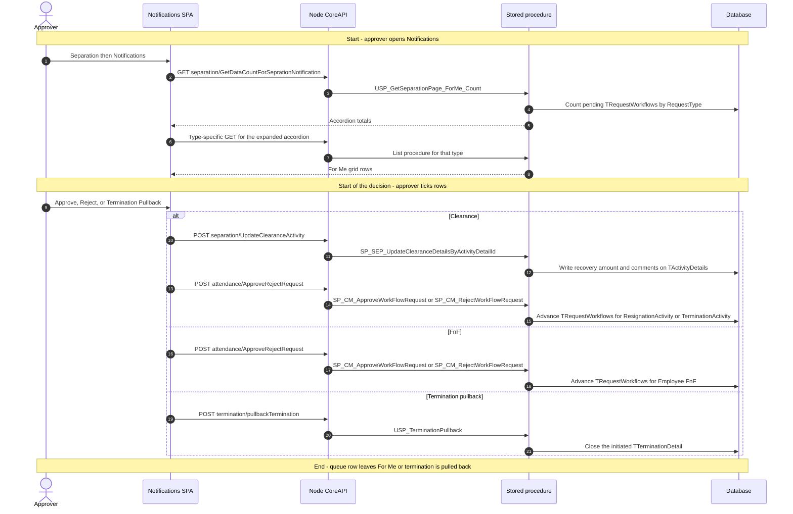
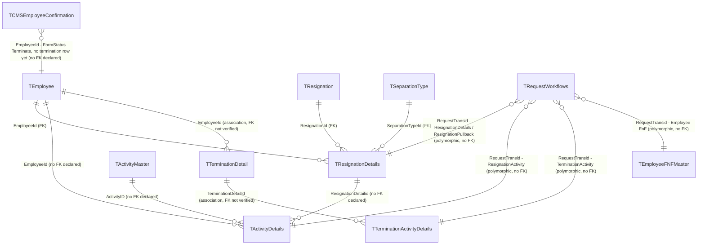

# Notifications

## Overview

A manager or HR person opens **Separation → Notifications** to work a queue of other people's exits. The page is split **For Me** (items waiting on this person) and **By Me** (items this person submitted that are still sitting with someone else). Each accordion is a request type — pending resignations, resignation pullbacks, clearance activities, re-initiated clearance, termination recommendations, initiated terminations, due/overdue deactivations, Full & Final (FnF) approvals — and most sections only render when a count is greater than zero.

Unlike Leave & Attendance Notifications, this inbox does **not** approve resignations or pullbacks in place. Clicking an employment number or name leaves this page and opens **Separation Tasks** (`ResignationDetails.aspx`) on the matching tab. What *does* complete here is clearance (activity or category, including re-initiated) and FnF: tick rows, enter comments and recovery amounts, then approve or reject through the shared workflow engine. HR can also pull back an initiated termination from this page.

An employee uses **By Me** as a status list of their own pending resignation, pullback, and clearance — view only, no decision buttons.

**Who's involved:**

- **Approver (For Me)** — the manager (or clearance owner) at the current workflow level. They approve clearance and FnF here; they open Record Resignation / Pullback / Termination / Deactivation on Separation Tasks to decide those.
- **Initiator (By Me)** — the employee who submitted the resignation, pullback, or clearance; they watch status.
- **HR / Administrator** — extra For Me accordions for termination recommendations (from CMS "Terminate"), initiated terminations, and pending deactivations. They also see "All …" radio filters, not only "for my approval".

This page is the **inbox**, not the apply form. Recording a resignation, running deactivation, and generating FnF input live on Separation Tasks. The queue itself is pending `TRequestWorkflows` rows (plus a few list procedures that are not workflow-queued). Approve/reject is the shared engine in `llm-wiki/domain/approval-workflow.md`. Exit tables and deactivation are in `llm-wiki/domain/employee-lifecycle.md`. SourceCode's `docs/SystemModels/SystemModel-2/domain/contexts/hr-core.md` names `Separation_React` as the live React surface for separation.

## Workflow

```mermaid
flowchart TD
  Nav["Separation then Notifications<br/>SeparationNotifications.aspx"] --> Shell["Notifications.js<br/>For Me / By Me toggle"]
  Shell --> AppData["AppDataProvider load"]
  AppData --> Orgs["GET separation/GetOrganizationWithChildOrgs<br/>or GetGlobalAccessEmployerList"]
  AppData --> Counts["GET separation/GetDataCountForSeprationNotification"]
  Counts --> CountSP["USP_GetSeparationPage_ForMe_Count"]
  CountSP --> AccordionHint["Accordion totals + No pending notifications"]
  AppData --> Acts["GET separation/GetEmployeeActivitiesForApproval"]
  Acts --> ActSP["SP_SEP_GetEmpActForApproval"]
  AppData --> Recs["GET termination/GetTerminationRecommendations"]
  Recs --> RecSP["USP_GetTerminationRecommendations"]

  Shell -->|"For Me"| ForMe["ForMePage.js"]
  ForMe --> Res["PendingResignation<br/>GET GetAllResignationDetails Type P or A"]
  Res --> ResSP["SP_SEP_GetAllResignationDetails"]
  ForMe --> Pull["PendingPullback<br/>GET GetResignationPullbackRequests"]
  Pull --> PullSP["SP_SEP_GetResignationPullbackRequests"]
  ForMe --> Clear{"ClearanceApproverMapping"}
  Clear -->|"Activity"| ActGrid["PendingActivity + ReInitiatedPendingClearance"]
  Clear -->|"Category"| CatGrid["PendingClearanceCategory + ReInitiatedPendingClearanceCategory"]
  ActGrid --> ClearWrite["POST UpdateClearanceActivity<br/>then POST attendance/ApproveRejectRequest"]
  CatGrid --> ClearWrite
  ClearWrite --> UpdSP["SP_SEP_UpdateClearanceDetailsByActivityDetailId"]
  ClearWrite --> CM["SP_CM_ApproveWorkFlowRequest /<br/>SP_CM_RejectWorkFlowRequest"]
  ForMe -->|"HR / Admin only"| TermRec["TerminationRecommendation"]
  ForMe -->|"HR / Admin only"| TermPend["PendingTerminationDetails<br/>GET GetPendingTerminationDetail"]
  TermPend --> TermSP["USP_GetPendingTerminationDetail"]
  TermPend -->|"Pullback"| TermPB["POST termination/pullbackTermination"]
  TermPB --> TermPBSP["USP_TerminationPullback"]
  ForMe -->|"HR / Admin only"| Deact["PendingDeactivation<br/>GET GetEmployeesPendingDeactivations"]
  Deact --> DeactSP["SP_SEP_PendingDeactivations"]
  ForMe --> FnF["PendingFnF<br/>GET GetPendingFNFApprovals"]
  FnF --> FnFSP["USP_FNF_Notification_List"]
  FnF -->|"Approve / Reject"| CM

  Res -->|"click name"| Tasks["ResignationDetails.aspx<br/>Record Resignation tab"]
  Pull -->|"click name"| Tasks
  TermRec -->|"click name"| Tasks
  TermPend -->|"click name"| Tasks
  Deact -->|"click name"| Tasks

  Shell -->|"By Me"| ByMe["ByMeProvider three GETs"]
  ByMe --> ByMeSP["SP_GetHomePagePendingDetailsByMe"]
```

Tenant config `ClearanceApproverMapping` (`SP_AdminMstr_GetResignationConfigurationData`, second recordset) chooses Activity vs Category clearance grids. Termination recommendation, initiated termination, and deactivation accordions render only when the logged-in role name or role type is `administrator` or `hr` (`ForMePage.js:53-59`).

## Request journey

This page does not create resignation or termination rows — it is the inbox. The request that **starts** here is the approver's on-page decision (clearance, FnF, or termination pullback). Loading the queue is shown first so you can see where that decision is read from. Clicking a resignation / pullback / termination / deactivation name is a **redirect** to Separation Tasks, not a write on this page.

## Entry points

> The live shell is the React bundle on `SeparationNotifications.aspx`. `routes.js` registers that URL on `MainLayout`, which always mounts `Notifications`. There is no sibling page under `HRM/Separation/` for this inbox. Node CoreAPI `_V2`/`_V3` separation and termination routers exist but `routeIndex.js` mounts only the unsuffixed V1 `/separation` and `/termination` — same dead-version note as the parent Separation guide.

| Entry point | Purpose | Live? |
|---|---|---|
| `HRM/Separation_React/SeparationNotifications.aspx` | Inbox shell; injects session employee/employer into hidden fields, loads `BuildJS/separation_module.min.js` | Yes |
| `?NotificationId=RPI_…` | Expands the matching For Me accordion on load | Yes |
| Node CoreAPI `/separation/*`, `/termination/*` (V1) | Backing API for the React inbox | Yes |
| Node CoreAPI `separationController_V2/_V3` + DAL | Versioned rewrite | No — not mounted in `routeIndex.js` |
| `GetResignationListForMe` | Commented-out For Me list that would have reused the By Me homepage SP | No — controller and DAL are commented |

Deep-link `NotificationId` values the accordions actually test:

| Query value | Accordion |
|---|---|
| `RPI_PendingResignationDetails` (also the default when the query is absent) | Pending Resignation Details |
| `RPI_PendingResignationPullback` | Pending Resignation Pullback Details |
| `RPI_PendingActivityApproval` | Pending Clearance Approvals (activity or category) |
| `RPI_PendingReInitiatedActivityApproval` | Re-initiated clearance |
| `RPI_TerminationRecommendations` | Termination Recommendations by Manager |
| `RPI_TerminationInitiated` | Pending termination initiations |
| `RPI_DueAndOverdueDeactivations` | Pending deactivations |
| `RPI_PendingFNFApproval` | Pending F&F Input Approvals |

## Code → database call chain

| Step | Entry point | App code | Stored procedure |
|---|---|---|---|
| Page load / org list | `AppDataContext.js:87-104` | `GET /separation/GetOrganizationWithChildOrgs` → `separationController.js:1073` → `separationDAL.js:1587` (or `GetGlobalAccessEmployerList` when `IsGlobalAccess='Y'`, `separationController.js:892` → `separationDAL.js:973`) | `SP_GetOrganizationWithChildOrganisations` / `SP_GetGlobalAccessEmployerList` |
| For Me badge counts | `AppDataContext.js:126` | `GET /separation/GetDataCountForSeprationNotification` → `separationController.js:305` → `separationDAL.js:171` | `USP_GetSeparationPage_ForMe_Count` |
| Pending clearance list (For Me) | `AppDataContext.js:124` | `GET /separation/GetEmployeeActivitiesForApproval` → `separationController.js:527` → `separationDAL.js:455` | `SP_SEP_GetEmpActForApproval` |
| Termination recommendations | `AppDataContext.js:125` | `GET /termination/GetTerminationRecommendations` → `terminationController.js:95` → `terminationDAL.js:122` | `USP_GetTerminationRecommendations` |
| Clearance mapping (Activity vs Category) | `ForMePage.js:25-40` | `GET /separation/GetResignationConfigurationsData` → `separationController.js:3007` → `separationDAL.js:2088` | `SP_AdminMstr_GetResignationConfigurationData` (all recordsets; mapping is `data[1][0].ClearanceApproverMapping`) |
| Pending resignations grid | `PendingResignation.js:342-348` | `GET /separation/GetAllResignationDetails` (`Type=P` my-queue / `Type=A` all) → `separationController.js:211` → `separationDAL.js:186` | `SP_SEP_GetAllResignationDetails` — controller splits `pendingInManagersQueue` vs `all` when `requestFrom=web` |
| Pending pullbacks grid | `PendingPullback.js:243-249` | `GET /separation/GetResignationPullbackRequests` → `separationController.js:269` → `separationDAL.js:204` | `SP_SEP_GetResignationPullbackRequests` |
| Re-initiated clearance | `ReInitiatedPendingClearance.js:40` / `…Category.js:46` | `GET /separation/GetReInitiatedEmpActForApproval` → `separationController.js:1334` → `separationDAL.js:1600` | `SP_SEP_GetReInitiatedEmpActForApproval` |
| Category status roll-up | `PendingClearanceCategory.js:80` | `GET /separation/GetEmployeeActivityDetailsByEmpAct` → `separationController.js:2100` → `separationDAL.js:1892` | `SP_SEP_GetEmployeeActivityDetailsByEmpAct` |
| Clearance detail + save | `ViewModal.js` / `ViewModalCategory.js` | `GET /separation/GetClearanceActivityDetails` (`separationController.js:1310`) then `POST /separation/UpdateClearanceActivity` (`separationController.js:1322` → BLL) | `SP_SEP_GetEmployeeActivityDetailsByActivityDetailId` then `SP_SEP_UpdateClearanceDetailsByActivityDetailId` |
| Clearance / FnF approve or reject | `postPendingActivity` in `ViewModal.js:387`, `PendingFnF.js:502` | `POST /attendance/ApproveRejectRequest` → `AttendanceController.js:907` → `attendanceBLL.js:131` → `AttendanceDAL.js:1158/1176` | `SP_CM_ApproveWorkFlowRequest` / `SP_CM_RejectWorkFlowRequest` |
| Pending FnF grid | `PendingFnF.js:64` | `GET /separation/GetPendingFNFApprovals` → `separationController.js:1208` → `separationDAL.js:1451` | `USP_FNF_Notification_List` |
| FnF history popup | `PendingFnF.js:309` | `GET /separation/GetAllFNFHistory` → `separationController.js:1196` → `separationDAL.js:1443` | `USP_FNF_Employee_History_FNF` |
| Pending terminations | `PendingTerminationDetails.js:101` | `GET /termination/GetPendingTerminationDetail` (`Type=P` / `A`) → `terminationController.js:111` → `terminationDAL.js:137` | `USP_GetPendingTerminationDetail` |
| Termination pullback | `PendingTerminationDetails.js:246` | `POST /termination/pullbackTermination` → `terminationController.js:170` | `USP_TerminationPullback` |
| Pending deactivations | `PendingDeactivation.js:197` | `GET /separation/GetEmployeesPendingDeactivations` → `separationController.js:3036` → `separationDAL.js:2115` | `SP_SEP_PendingDeactivations` |
| Auto-deactivation flag | `PendingDeactivation.js:190` | `GET /separation/GetResignationConfigurationData` (singular, first recordset) → `separationController.js:1010` → `separationDAL.js:1138` | `SP_AdminMstr_GetResignationConfigurationData` |
| By Me lists | `ByMeProvider.js:64-66` | `GET /separation/GetResignationListByMe` ×3 (`RPI_PendingResignationDetails_ByMe`, `RPI_PendingResignationPullback_ByMe`, `RPI_PendingActivityApproval_ByMe`) → `separationController.js:1030` → `separationDAL.js:1170` | `SP_GetHomePagePendingDetailsByMe` |
| Resignation timeline popup | `Notifications.js:137` | `GET /separation/GetEmployeeResignationStatusDetails` → `separationController.js:954` → `separationDAL.js:1043` | `SP_GETTEAMRESIGNATIONSTATUSDETAILS` |
| Termination timeline popup | `Notifications.js:157` | `GET /termination/GetTeamTerminationStatusDetails` → `terminationController.js:195` → `terminationDAL.js:240` | `USp_GetTeamTerminationStatusDetails` |
| Leave calendar popup | `Notifications.js:193` | `GET /attendance/GetEmployeeLeaveCalenderForYear` → `AttendanceController.js:1208` → `AttendanceDAL.js:1234` | `SP_LA_LeaveCalender` |
| Header employee name | `Notifications.js:113` | `GET /myProfile/GetEmployeeDetails` → `myProfileController.js:7` → `myProfileDAL.js:16` | `SP_CM_GetEmployeeFullInformation` |
| Header org name | `Notifications.js:99` | `GET /reports/getEmployerNames` → `reportsController.js:718` | reports DAL (lookup; not a separation procedure) |
| Currency list (clearance modal) | `ViewModal.js:66` | `GET /dashBoard/GetAllCurrency` → `dashboardController.js:1704` → `dashBoardDAL.js:2843` | `SP_CM_GetCurrency` |
| Currency check | `ViewModal.js:358` | `GET /separation/ValidateCurrency` → `separationController.js:2148` → `separationDAL.js:1948` | `SP_SEP_VALIDATE_CURRENCY` |
| Allocated assets (clearance modal) | `ViewModal.js:170` | `GET /separation/GetEmployeeAssetInformation` → `separationController.js:1298` → `separationDAL.js:1532` | `USP_ASSET_GetAllocatedDeallocatedAssetByEmployeeId` |

## API endpoints

Routes below are relative to the Node CoreAPI mounts in `routeIndex.js` (`/separation` at `:37`, `/termination` at `:125`, `/attendance` at `:104`). All listed handlers sit behind `Authorize`.

| Verb | Route | Parameters | Purpose | Source |
|---|---|---|---|---|
| GET | `/separation/GetDataCountForSeprationNotification` | `EmployeeId` int required; `EmployerId` varchar (comma-separated orgs) required | For Me accordion totals (`RPI_*` + `Total`) | `separationRoutes.js:72`, `separationController.js:305` |
| GET | `/separation/GetOrganizationWithChildOrgs` | `employerId` int required; `userType` char required | Org picker when global access is off | `separationRoutes.js:74`, `separationController.js:1073` |
| GET | `/separation/GetGlobalAccessEmployerList` | `employeeId` int required | Org picker when `IsGlobalAccess='Y'` | `separationRoutes.js:50`, `separationController.js:892` |
| GET | `/separation/GetEmployeeActivitiesForApproval` | `employeeId` int required; `employerIds` varchar required | Pending clearance rows for For Me | `separationRoutes.js:26`, `separationController.js:527` |
| GET | `/separation/GetAllResignationDetails` | `employeeId` int required; `employerId` varchar required; `Type` char (`P`/`A`) required; `requestFrom` optional (`web` reshapes the body); `IsPendingOnly` optional | Pending / all resignations | `separationRoutes.js:13`, `separationController.js:211` |
| GET | `/separation/GetResignationPullbackRequests` | `employeeId` int required; `employerId` varchar required; `Type` char required; `requestFrom` optional | Pending / all pullbacks | `separationRoutes.js:14`, `separationController.js:269` |
| GET | `/separation/GetResignationListByMe` | `NotificationType` varchar required; `EmployeeId` int required | By Me list for one `RPI_*_ByMe` type | `separationRoutes.js:66`, `separationController.js:1030` |
| GET | `/separation/GetResignationConfigurationsData` | `EmployerId` int required; `ConsiderAllActivityDetailsCount` bit | All config recordsets (clearance mapping) | `separationRoutes.js:63`, `separationController.js:3007` |
| GET | `/separation/GetResignationConfigurationData` | `EmployerId` int required; `ConsiderAllActivityDetailsCount` bit | First config recordset (auto-deactivation flag) | `separationRoutes.js:62`, `separationController.js:1010` |
| GET | `/separation/GetReInitiatedEmpActForApproval` | `employeeId` int required; `employerIds` varchar required | Re-initiated clearance queue | `separationRoutes.js:94`, `separationController.js:1334` |
| GET | `/separation/GetEmployeeActivityDetailsByEmpAct` | `employeeID` int required; `ActivityType` required | Activities in one category (status roll-up) | `separationRoutes.js:125`, `separationController.js:2100` |
| GET | `/separation/GetClearanceActivityDetails` | `Activitydetailid` int required; `ActivityHistoryId` optional; `EmployeeId` required; `SeperationType` optional (query spelling) | Clearance modal load | `separationRoutes.js:93`, `separationController.js:1310` |
| POST | `/separation/UpdateClearanceActivity` | body: `Activitydetailid`, `EmployeeId`, `ActivityResponse`, `IsRecovery`, `IsRecoveryAmountTBD`, `RecoveryAmount`, `Comments`, `CurrencyCode`, `UpdatedBy`, `RequestType`, `ActivityOnHold` | Save recovery / hold before workflow approve | `separationRoutes.js:95`, `separationController.js:1322` |
| GET | `/separation/GetPendingFNFApprovals` | `EmployeeId` required; `EmployerIds` varchar required | FnF For Me grid | `separationRoutes.js:85`, `separationController.js:1208` |
| GET | `/separation/GetAllFNFHistory` | `FNFId` required | FnF timeline popup | `separationRoutes.js:84`, `separationController.js:1196` |
| GET | `/separation/GetEmployeesPendingDeactivations` | `employeeId` required; `employerId` varchar required | Due / overdue / failed deactivations | `separationRoutes.js:142`, `separationController.js:3036` |
| GET | `/separation/GetEmployeeResignationStatusDetails` | `ResignationDetailId` required; `EmployerId` required | Resignation timeline popup | `separationRoutes.js:57`, `separationController.js:954` |
| GET | `/separation/ValidateCurrency` | `EmployeeId`, `ActivityDetailId`, `CurrencyCode`, `RequestType` | Block mixed currencies on one approve | `separationRoutes.js:131`, `separationController.js:2148` |
| GET | `/separation/GetEmployeeAssetInformation` | `EmployerId` required; `EmployeeId` required | Assets on the clearance modal | `separationRoutes.js:92`, `separationController.js:1298` |
| GET | `/termination/GetTerminationRecommendations` | `EmployerId` varchar required; `EmployeeId` int required | CMS "Terminate" recommendations not yet a termination | `TerminationRoutes.js:18`, `terminationController.js:95` |
| GET | `/termination/GetPendingTerminationDetail` | `Employerid` varchar required; `UserId` int required (forced to logged-in employee); `Type` char (`P`/`A`) required | Initiated terminations | `TerminationRoutes.js:19`, `terminationController.js:111` |
| POST | `/termination/pullbackTermination` | body includes `TerminationDetailid`, `PullbackReason`, `PullbackEvidence`, `RequestType`, `Employerid` | Pull back an initiated termination | `TerminationRoutes.js:24`, `terminationController.js:170` |
| GET | `/termination/GetTeamTerminationStatusDetails` | `TerminationDetailId` required; `EmployerId` required | Termination timeline popup | `TerminationRoutes.js:27`, `terminationController.js:195` |
| POST | `/attendance/ApproveRejectRequest` | body `combinedARData[]`: `actionType` (`Approve`/`Reject`) required; `RequestTransId` int required; `EmployeeId` overwritten with `req.EID`; `comments`; `RequestType` (`ResignationActivity` / `TerminationActivity` / `EmployeeF&F`); `Employerid`; `RejectionReason` | Shared approve/reject for clearance and FnF | `AttendanceRoutes.js:32`, `AttendanceController.js:907` |
| GET | `/attendance/GetEmployeeLeaveCalenderForYear` | `Year` required; `Employeeid` (controller overwrites with `req.EID`); `Employerid` | Leave calendar popup | `AttendanceController.js:1208` |
| GET | `/myProfile/GetEmployeeDetails` | `employeeId` required | Logged-in name for Excel export headers | `myProfileController.js:7` |
| GET | `/reports/getEmployerNames` | `EmployerId` required | Org name for Excel export headers | `reportsController.js:718` |
| GET | `/dashBoard/GetAllCurrency` | none | Currency dropdown on clearance modal | `dashboardController.js:1704` |

This feature **does** have an API layer (the React SPA). It is not a WebForms postback inbox.

## Stored procedures & tables involved

> `USP_GetSeparationPage_ForMe_Count` is the live For Me count. There is no matching For Me *list* procedure of that name — each accordion calls its own list SP. By Me reuses the homepage procedure `SP_GetHomePagePendingDetailsByMe` (file `SP_GetHomePagePEndingDetailsByMe.sql`). `GetResignationListForMe` is commented out and is not live.

| Object | File path | Purpose | Wiki |
|---|---|---|---|
| `USP_GetSeparationPage_ForMe_Count` | `HRMS-DATABASE/HRMS/STOREPROCEDURE/USP_GetSeparationPage_ForMe_Count.sql` | For Me totals by hardcoded `RPI_*` | — |
| `SP_SEP_GetAllResignationDetails` | `…/SP_SEP_GetAllResignationDetails.sql` | For Me resignation grid | `domain/employee-lifecycle.md` |
| `SP_SEP_GetResignationPullbackRequests` | `…/SP_SEP_GetResignationPullbackRequests.sql` | For Me pullback grid | `domain/employee-lifecycle.md` |
| `SP_SEP_GetEmpActForApproval` | `…/SP_SEP_GetEmpActForApproval.sql` | Pending clearance For Me | `domain/employee-lifecycle.md` (`TActivityDetails`) |
| `SP_SEP_GetReInitiatedEmpActForApproval` | `…/SP_SEP_GetReInitiatedEmpActForApproval.sql` | Re-initiated clearance | — |
| `SP_SEP_GetEmployeeActivityDetailsByEmpAct` | `…/SP_SEP_GetEmployeeActivityDetailsByEmpAct.sql` | Category status roll-up | — |
| `SP_SEP_GetEmployeeActivityDetailsByActivityDetailId` | `…/SP_SEP_GetEmployeeActivityDetailsByActivityDetailId.sql` | Clearance modal | — |
| `SP_SEP_UpdateClearanceDetailsByActivityDetailId` | `…/SP_SEP_UpdateClearanceDetailsByActivityDetailId.sql` | Write recovery / hold | — |
| `SP_AdminMstr_GetResignationConfigurationData` | `…/SP_AdminMstr_GetResignationConfigurationData.sql` | Clearance mapping + auto-deactivation | — |
| `SP_GetHomePagePendingDetailsByMe` | `…/SP_GetHomePagePEndingDetailsByMe.sql` | By Me lists (three `RPI_*_ByMe` branches) | — |
| `USP_GetTerminationRecommendations` | `…/USP_GetTerminationRecommendations.sql` | CMS Terminate not yet initiated | — |
| `USP_GetPendingTerminationDetail` | `…/USP_GetPendingTerminationDetail.sql` | Initiated terminations | `domain/employee-lifecycle.md` |
| `USP_TerminationPullback` | `…/USP_TerminationPullback.sql` | Pull back initiation | — |
| `SP_SEP_PendingDeactivations` | `…/SP_SEP_PendingDeactivations.sql` | Due / overdue / failed deactivations | `domain/employee-lifecycle.md` |
| `USP_FNF_Notification_List` | `…/USP_FNF_Notification_List.sql` | FnF For Me | — |
| `USP_FNF_Employee_History_FNF` | `…/USP_FNF_Employee_History_FNF.sql` | FnF history popup | — |
| `SP_CM_ApproveWorkFlowRequest` / `SP_CM_RejectWorkFlowRequest` | `…/STOREPROCEDURE/` | Shared engine for clearance and FnF | `domain/approval-workflow.md` |
| `SP_GETTEAMRESIGNATIONSTATUSDETAILS` | `…/STOREPROCEDURE/` | Resignation timeline | — |
| `USp_GetTeamTerminationStatusDetails` | `…/STOREPROCEDURE/` | Termination timeline | — |
| `SP_LA_LeaveCalender` | `…/STOREPROCEDURE/` | Leave calendar popup | `domain/leave-lifecycle.md` |
| `SP_CM_GetEmployeeFullInformation` | `…/STOREPROCEDURE/` | Header employee name | — |
| `SP_CM_GetCurrency` | `…/STOREPROCEDURE/` | Currency dropdown | — |
| `SP_SEP_VALIDATE_CURRENCY` | `…/STOREPROCEDURE/` | Mixed-currency guard | — |
| `USP_ASSET_GetAllocatedDeallocatedAssetByEmployeeId` | `…/STOREPROCEDURE/` | Assets on clearance modal | — |
| `SP_GetOrganizationWithChildOrganisations` / `SP_GetGlobalAccessEmployerList` | `…/STOREPROCEDURE/` | Org picker | — |
| `TRequestWorkflows` | `HRMS-DATABASE/HRMS/TABLES/` | Pending routing rows (`ApproveStatus='P'`) | `domain/approval-workflow.md` |
| `TResignationDetails`, `TResignation`, `TSeparationType`, `TActivityDetails`, `TActivityMaster`, `TTerminationDetail`, `TTerminationActivityDetails` | `…/TABLES/` | Exit artifacts `RequestTransid` points at | `domain/employee-lifecycle.md` |
| `TEmployeeFNFMaster` | `…/TABLES/` | FnF header; `RequestType='EmployeeF&F'` | not in `llm-wiki/reference/tables/hrms.md` |
| `TCMSEmployeeConfirmation` | `…/TABLES/` | `FormStatus='Terminate'` feeds termination recommendations | `reference/tables/hrms.md` |
| `THomePageNotifications` | `…/THomePageNotifications.sql` | Catalog of `RPI_*` codes for the home page | `reference/tables/hrms.md` — **this React page does not read it**; counts are recomputed by `USP_GetSeparationPage_ForMe_Count` |

## Table relationships

Exit-table FKs are taken from `llm-wiki/domain/employee-lifecycle.md` §6b (only three FKs are declared, all on `TResignationDetails`). The polymorphic `TRequestWorkflows.RequestTransid` map is taken from `llm-wiki/domain/approval-workflow.md`. `TEmployeeFNFMaster` / `EmployeeF&F` and the CMS Terminate → recommendation edge are derived from `USP_GetSeparationPage_ForMe_Count` (no FK declared).

`USP_GetSeparationPage_ForMe_Count` joins those same request tables to `TRequestWorkflows` where `ApproveStatus = 'P'` (and, for recommendations, to `TCMSEmployeeConfirmation` where `FormStatus = 'Terminate'` and no `TTerminationDetail` exists). It does not read `THomePageNotificationCnts`.

## Known gaps

- **Count `RequestType` vs accordion deep link.** The count SP returns `RPI_PendingActivityApprovals_ForMe` (plural "Approvals"). The clearance accordion expands on `NotificationId=RPI_PendingActivityApproval`. A home-page bell that uses the count SP's string will not auto-expand that section.
- **Counts omit two For Me grids.** `USP_GetSeparationPage_ForMe_Count` has no row for due/overdue deactivations or re-initiated clearance. `Organization.js` "No pending notifications" is driven only by the count SP, so those queues can still render below a "none" banner. Bug 110360 added FnF to the count SP for that reason; deactivation and re-initiated were not added.
- **Resignation / pullback / termination / deactivation do not approve here.** The grid click calls `redirectToRecResignationDetails` / `redirectToTerminationDetailsFromNotification` / `handleRedirectionToEmployeeDeactivation` and lands on `ResignationDetails.aspx` (Separation Tasks). Only clearance and FnF (and termination pullback) write from this SPA.
- **`GetResignationListForMe` is dead.** Both the controller export and the DAL method are commented; For Me lists are the per-type SPs above, not the homepage By Me procedure.
- **Activity vs Category fallback.** `ForMePage.js:49` shows `PendingActivity` only when `pendingActivity.length > 0` **and** mapping is `Activity`. If mapping is Activity but the list is empty, the Category accordion mounts instead.
- **Leave calendar `Employeeid` overwrite.** `AttendanceController.GetEmployeeLeaveCalenderForYear` sets `req.query.Employeeid = req.EID` before calling `SP_LA_LeaveCalender`, so the popup may show the logged-in user's calendar rather than the departing employee's.
- **By Me is a subset.** Only resignation, pullback, and clearance. No By Me termination, FnF, or deactivation grids.
- **`TEmployeeFNFMaster` / `EmployeeF&F` is missing from `llm-wiki/reference/tables/hrms.md` and from `approval-workflow.md`'s RequestType list.** The count SP and `PendingFnF.js` still use `RequestType = "EmployeeF&F"`.
- **V2/V3** separation/termination controllers duplicate many of these routes and are unmounted. Treat them as dead, not a migration target.
- **reports DAL for `getEmployerNames`** was not present as `reportsDAL.js` in this workspace snapshot; the route and controller exist. Header org name is a lookup only.

## Reference

Call chain verified end-to-end from `SeparationNotifications.aspx` through the React inbox and Node V1 DAL `execute(...)` names. DB relationships for exit tables and `TRequestWorkflows` are reused from llm-wiki rather than re-derived. FnF / CMS Terminate edges come from the count SP source.

### SourceCode

- `HRMS.Web/HRMS.Web/HRM/Separation_React/SeparationNotifications.aspx(.cs)`
- `HRMS.Web/HRMS.Web/HRM/Separation_React/routes.js`
- `HRMS.Web/HRMS.Web/HRM/Separation_React/Layout/MainLayout.js`
- `HRMS.Web/HRMS.Web/HRM/Separation_React/AppDataContext.js`
- `HRMS.Web/HRMS.Web/HRM/Separation_React/Areas/Notifications/Container/Notifications.js`
- `HRMS.Web/HRMS.Web/HRM/Separation_React/Areas/Notifications/components/ForMe/ForMePage.js` and sibling For Me / By Me grids
- `HRMS.Web/HRMS.Web/HRM/Separation_React/Common/HttpClients/SeparationHttpClient.js`
- `HRMS.Web/HRMS.Web/HRM/Separation_React/Common/redirectionHelper.js`
- `HRMS.CoreAPI/HRMS.Core.WebAPI.Node/Routes/routeIndex.js`, `separationRoutes.js`, `TerminationRoutes.js`
- `HRMS.CoreAPI/HRMS.Core.WebAPI.Node/Controllers/separationController.js`, `terminationController.js`, `AttendanceController.js`
- `HRMS.CoreAPI/HRMS.Core.WebAPI.Node/Core/DataAccessLayer/separationDAL.js`, `terminationDAL.js`, `AttendanceDAL.js`
- `docs/SystemModels/SystemModel-2/domain/contexts/hr-core.md`
- `docs/SystemModels/SystemModel-2/experience/notifications/notifications.md` (email/in-app channels in general; not this inbox)

### TDG HRMS DB

- `llm-wiki/domain/employee-lifecycle.md`
- `llm-wiki/domain/approval-workflow.md`
- `llm-wiki/reference/event-catalog.md`
- `HRMS-DATABASE/HRMS/STOREPROCEDURE/USP_GetSeparationPage_ForMe_Count.sql`
- `HRMS-DATABASE/HRMS/STOREPROCEDURE/SP_GetHomePagePEndingDetailsByMe.sql`
- `HRMS-DATABASE/HRMS/STOREPROCEDURE/SP_SEP_GetEmpActForApproval.sql`
- `HRMS-DATABASE/HRMS/STOREPROCEDURE/USP_FNF_Notification_List.sql`
- `HRMS-DATABASE/HRMS/STOREPROCEDURE/USP_GetPendingTerminationDetail.sql`
- `HRMS-DATABASE/HRMS/STOREPROCEDURE/SP_SEP_PendingDeactivations.sql`
