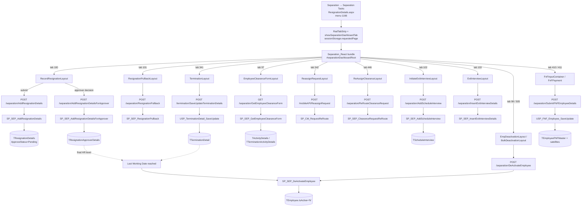
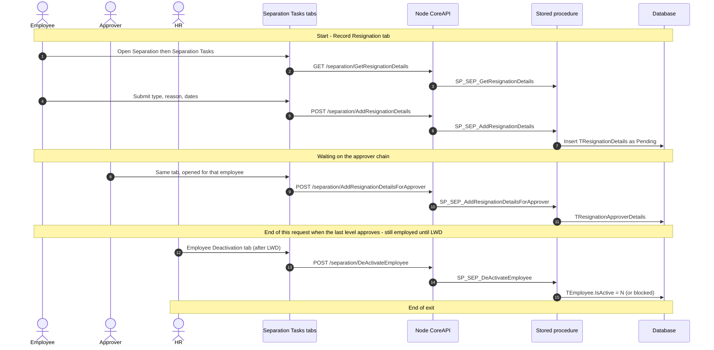
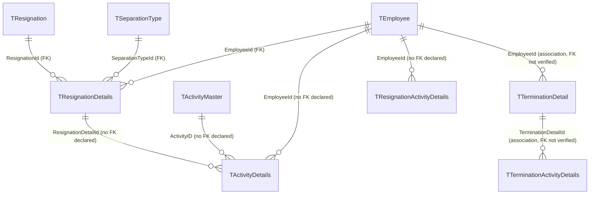

# Separation Tasks

## Overview

An employee is leaving — they resigned, HR is terminating them, or someone on their team already has an exit in flight. **Separation → Separation Tasks** is the operational workbench for that exit. It is not the inbox (that is Notifications) and not the analytics board (that is Separation Dashboard). It is the tab strip where people actually record, approve, clear, interview, settle, and deactivate.

What happens depends on which tab the user's role can see:

- An **employee** (self-service, `?mode=self`) opens **Record Resignation**, picks a separation type and reason, dates, and a requested last working date, and submits. The request sits **Pending** until the configured approver chain acts. If they change their mind, **Resignation Pullback** withdraws it. When HR has initiated an exit interview, they fill it in on **Exit Interview**.
- A **manager / approver** uses the same Record Resignation screen (opened from Notifications or Team Resignation with an employee id) to recommend a last working date, flag a notice-period shortfall, or approve/reject at their level. They can also see **Team Resignation** for their reports.
- **HR / admin** gets the rest of the strip: **Termination** (involuntary exit), **Employee Clearance Form**, **Employee Deactivation**, **Re-Assign Request** (move a pending resignation/pullback to a different approver), **Re-Assign Clearance**, **Initiate Exit Interview**, **View Exit Interview Feedback**, **All Separation Types**, **Generate F&F Input**, **F&F for Payment**, and **Bulk Deactivation**.

Approval of the request and the actual account exit are two separate events. After the last approver signs off, the employee keeps working until Last Working Date. Only then does deactivation run — a validation-gated write that refuses if assets, leave requests, or other open items are still outstanding. Full & Final settlement is a further, separately initiated step.

This page is the **application call chain** for that workbench. For DB-only depth on approval side-effects, the deactivation gate, and the exit-table ER model, see `llm-wiki/domain/employee-lifecycle.md` §5–6. The shared approval engine is `llm-wiki/domain/approval-workflow.md`. SourceCode's `docs/SystemModels/SystemModel-2/domain/contexts/hr-core.md` already names `Separation_React` as the live React surface for separation.

## Workflow

## Request journey

Separation Tasks is a tab strip. Each tab is its own request. The sequence below is the **Record Resignation** tab — the one an employee or approver actually starts — from submit to the two endings (approved request, then deactivation). Other tabs are listed under it, not drawn.

Other tabs start and end on their own writes: **Resignation Pullback** → `SP_SEP_ResignationPullback`; **Termination** → `USP_TerminationDetail_SaveUpdate` / `TTerminationDetail`; **Clearance** → `SP_SEP_GetEmployeeClearanceForm` / activity SPs; **Re-Assign Request** → `SP_CM_RequestReRoute`; **Exit Interview** → `SP_SEP_AddScheduleInterview` then `SP_SEP_InsertExitInterviewDetails`; **F&F** → `USP_FNF_Employee_SaveUpdate` / `TEmployeeFNFMaster`.

## Entry points

> Live entry point, per `docs/SystemModels/SystemModel-2/domain/contexts/hr-core.md` and `Separation_React/routes.js`: **Separation Tasks** is `HRM/Separation/ResignationDetails.aspx` (menu 1166, renamed from "Separation Management" by PBI 79185). The page hosts the Telerik tab strip and mounts the React bundle into `#separationDashboardRoot`. Each tab click sets `sessionStorage.requestedPage` and clicks hidden button `#hiddenSeparationMgmBtn`, which `SeparationManagementRoutes` reads to pick a layout. `Separation_React/Termination.aspx` is **not** the live termination page — `APP_ROUTES` never registers it.

The WebForms Record Resignation markup on the same aspx is wrapped in `display:none`. `Page_Load` still stamps session identity, resolves `?mode=self` / `?TabName=` / `?employeId=` / `FromReact=true`, and shows/hides tabs from `TRoleTabDetails` via `WebCommonTab.ShowHideTabControls` (menu 1166). Submit/approve on that hidden form is not the live UI path.

| Entry point | Purpose | Live? |
|---|---|---|
| `HRM/Separation/ResignationDetails.aspx` | WebForms shell; page title "Separation Tasks" | Yes |
| `?mode=self` | Employee self-service (own resignation / pullback / exit interview) | Yes |
| `?TabName=` + `employeId` + `ResignationDetailId` (Base64) | Deep link from Notifications / Team Resignation / All Separation Types into a specific tab and employee | Yes |
| `?FromReact=true` | Alternate Base64 employee-id decode used by React-originated navigations | Yes |
| React `SeparationManagementRoutes` (`Separation_React/Areas/SeparationManagement/SeparationManagementRoutes.js`) | Tab → layout switcher | Yes |
| Node CoreAPI `/separation/*`, `/termination/*`, `/mobileAPI/ReassignRequest` (V1) | Backing API for every React tab | Yes |
| `HRM/Separation_React/Termination.aspx` | Intended standalone termination page | No — not in `APP_ROUTES` |
| Node `separationController_V2/_V3`, `terminationController_V2/_V3` + routes | Versioned rewrite | No — `routeIndex.js` mounts only unsuffixed V1 |
| Hidden WebForms user controls (`ucResignationDetails`, `ucResignationPullback`, `ucExitInterview`, …) | Pre-React tab bodies | No for this submenu — still compiled, not shown |

Tab ids (`SeparationConstants` in `HRMS.Shared/HRMS.DataContract/Common/Constants.cs:937-953`) and the `requestedPage` value `ResignationDetails.aspx:2739-2768` maps them to:

| Tab (aspx Text) | TabId | `requestedPage` | React layout |
|---|---|---|---|
| Record Resignation | 100 | `recordResignation` | `RecordResignationLayout` |
| Termination | 341 | `termination` | `TerminationLayout` |
| Employee Clearance Form | 97 | `employeeClearanceForm` | `EmployeeClearanceFormLayout` |
| Employee Deactivation | 98 | `employeedeactivation` | `EmpDeactivationLayout` |
| Re-Assign Request | 342 | `reassignrequest` | `ReassignRequestLayout` |
| Re-Assign Clearance | 446 | `reassignclearance` | `ReAssignClearanceLayout` |
| Resignation Pullback | 101 | `resignationPullback` | `ResignationPullbackLayout` |
| Initiate Exit Interview | 102 | `initiateExitinterview` | `InitiateExitInterviewLayout` |
| Exit Interview | 103 | `exitinterview` | `ExitInterviewLayout` |
| View Exit Interview Feedback | 104 | `exitinterviewfeedback` | `ExitInterviewFeedBackLayout` |
| Bulk Deactivation | 505 | `bulkDeactivation` | `BulkDeactivationLayout` |
| Team Resignation | 184 | `teamresignation` | `TeamResignationLayout` |
| All Separation Types | 185 | `allSeparationtypes` | `AllSeparationLayout` |
| Generate F&F Input | 410 | `generateFnFInput` | `FnFInputContainer` |
| F&F for Payment | 411 | `f&FforPayment` | `FnFPayment` |

Which of those tabs the user actually sees is role- and mode-dependent (`enableDisableControls` in `ResignationDetails.aspx.cs:1941-1982`): self-mode starts with Record Resignation / Pullback / Exit Interview / Team / All / FnF; HR gets Initiate Exit Interview and View Feedback unless `TResignationConfigurationData.ExitInterviewInititationType = 'AUTO'` (hides tab 102). `mode=All` hides Re-Assign Clearance and Bulk Deactivation. `TRoleTabDetails` can still hide a tab the aspx would otherwise show.

## Code → database call chain

Most `employeeId` query values that mean "the logged-in user" are overwritten server-side from the JWT (`setLoggedInEmployeeId`). The client still sends them. Employer scoping uses `assertEmployerAccess` on many routes.

| Step | Entry point | App code | Stored procedure |
|---|---|---|---|
| Page load / tab strip | `ResignationDetails.aspx` | `Page_Load` (`ResignationDetails.aspx.cs:123-248`) — session → hidden fields, `showHideTab`, `enableDisableControls`; React bundle from `ResignationDetails.aspx:2270-2272` | none for the shell; tab visibility reads `TRoleTabDetails` / `TTabDetails` via `WebCommonTab.ShowHideTabControls` (`:1861`) |
| Record Resignation — load | `RecordResignation.js:49-51` | `GET /separation/GetResignationDetails` → `separationController.js:346` → `separationDAL.js:260` | `SP_SEP_GetResignationDetails` |
| Record Resignation — types / reasons | `EmployeeResignation.js:107` | `GET /separation/GetSeparationType`, `GET /separation/GetResignationReason` → `separationController.js:131,143` → `separationDAL.js:97,112` | `SP_SEP_GetSeparationType`, `SP_SEP_GetResignation` |
| Record Resignation — workflow id | `EmployeeResignation.js:173` | `POST /separation/GetWorkflowId` → `separationController.js:920` → `separationDAL.js:1008` | `SP_CM_GetWorkflowTreeXmlDetailsByPageTitle` |
| Record Resignation — submit | `EmployeeResignation.js:234` (`ResignationDetailId` always `0`) | `POST /separation/AddResignationDetails` → `separationController.js:156` → `separationDAL.AddResignationDetails` (`separationDAL.js:120-159`) | `SP_SEP_AddResignationDetails` |
| Record Resignation — approver decision | `ManagersApprovals.js:470` | `POST /separation/AddResignationDetailsForApprover` → `separationController.js:999` → `separationDAL.js:1131` | `SP_SEP_AddResignationDetailsForApprover` |
| Record Resignation — pending activities | `RecordResignation.js:90-93` | `GET /separation/GetPendingActivitiesOfSelf` / `…OfApprover` / `…OfAdmin` / `GetPendingActivitiesVisibility` → `separationController.js:3171-3195` → `separationDAL.js:2180-2222` | `SP_SEP_GetPendingActivities_Self`, `SP_SEP_GetPendingActivities_Approval`, `SP_SEP_GetPendingActivities_Admin`, `SP_Resignation_GetPendingActivityVisibility` (`STOREPROCEDURE/143301/`) |
| Termination — save | Termination container via `TerminationHttpClient.saveTerminationDetails` | `POST /termination/SaveUpdateTerminationDetails` → `terminationController.js:37` → `TerminationBLL.SaveUpdateTerminationDetails` (`terminationBLL.js:17`) → `terminationDAL.js:51` | `USP_TerminationDetail_SaveUpdate` |
| Termination — list | `getTerminationDetails()` | `GET /termination/GetTerminationDetails` → `terminationController.js:12` → `terminationDAL.js:24` | `USP_GetTerminationDetail_List` |
| Termination — pullback | Termination UI | `POST /termination/pullbackTermination` → `terminationController.js:170` → `terminationDAL.js:218` | `USP_TerminationPullback` |
| Termination — block if resignation already open | `RecordResignation.js:57` | `GET /termination/CheckTerminationInitiated` → `terminationController.js:317` → `terminationDAL.js:277` | `USP_SEP_Termination_Validation` |
| Employee Clearance Form — assigned / unmapped forms | `ClearanceActivityDetails.js:26-27` | `GET /separation/GetEmployeeClearanceForm` → `separationController.js:2914` → `separationDAL.js:1977` | `SP_SEP_GetEmployeeClearanceForm` |
| Clearance — add / update activity | Clearance / Record Resignation editors | `POST /separation/AddEmployeeActivityDetails`, `POST /separation/UpdateEmployeeActivityDetails` → `separationController.js:515,798` → `separationDAL.js:443,817` | `SP_SEP_AddEmployeeActivityDetails`, `SP_SEP_UpdateEmployeeActivityDetails` |
| Employee Deactivation | `EmpDeactivation.js:100` | `POST /separation/DeActivateEmployee` → `separationController.js:810` → `separationDAL.js:830,857` (no BLL) | `SP_SEP_DeActivateEmployee` |
| Bulk Deactivation — candidate list | `BulkDeactivation.js:86` | `GET /separation/GetEmployeesForBulkDeactivate` → `separationController.js:1918` → `separationDAL.js:1734` | `SP_SEP_EmployeeBulkDeactivate` (list, despite the name) |
| Bulk Deactivation — pending-item preview | Bulk UI | `GET /separation/GetPendingActivitiesForDeactivation` → `separationController.js:1933` → `separationDAL.js:1750` | `SP_SEP_GetPendingActivitiesForDeactivation` |
| Bulk Deactivation — each selected employee | `BulkDeactive.js:65` | same `POST /separation/DeActivateEmployee` as the single-employee tab | `SP_SEP_DeActivateEmployee` |
| Re-Assign Request | `ReAssign.js:275-285` | `POST /mobileAPI/ReassignRequest` → `MobileAPIController.js:81` → `mobileAPIBLL.js:15` → `MobileAPIDAL.js:88-99` | `SP_CM_RequestReRoute` |
| Re-Assign Clearance | `ReAssignClearance.js:454-456` | `POST /separation/ReRouteClearanceRequest` → `separationController.js:2984` → `separationDAL.js:2057` | `SP_SEP_ClearanceRequestReRoute` |
| Resignation Pullback — submit | `SeparationHttpClient.SubmitResignationPullback` | `POST /separation/ResignationPullback` → `separationController.js:544` → `separationDAL.js:488` | `SP_SEP_ResignationPullback` |
| Initiate Exit Interview | `InitiateExitInterview.js:82` | `POST /separation/AddScheduleInterview` (values on **query string**, not body) → `separationController.js:573` → `separationDAL.js:531` | `SP_SEP_AddScheduleInterview` |
| Exit Interview — submit answers | `ExitInterterviewTemplate.js:137` | `POST /separation/InsertExitInterviewDetails` → `separationController.js:699` → `separationDAL.js:690` | `SP_SEP_InsertExitInterviewDetails` |
| Exit Interview — questions | `ExitInterterviewTemplate.js:189` | `GET /separation/GetAssignedQuestionsWithCategory` → `separationController.js:1976` → `separationDAL.js:1810` | `SP_GetAssignedQuestionsWithCategory` |
| Team Resignation | `TeamResignation.js` | `GET /separation/GetTeamResignationDetails` → `separationController.js:1902` → `separationDAL.js:1717` | `SP_GETTEAMRESIGNATIONDETAILS` |
| All Separation Types | `AllSeparationLayout` | `GET /separation/GetAllResignationDetailsFilter` → `separationController.js:1052` → `separationDAL.js:1210` | `SP_SEP_GETALLRESIGNATIONDETAILSFILTER` |
| Generate F&F / F&F for Payment — submit | `GenerateFnFPopup.js:253`, `FnFPayment.js:672` | `POST /separation/SubmitFNFEmployeeDetails` → `separationController.js:1135` → `SeparationBLL.SumbitFNFEmployeeDetails` (`separationBLL.js:17`) → `separationDAL.js:1377` | `USP_FNF_Employee_SaveUpdate` |
| F&F employee list | FnF containers | `GET /separation/GetFNFEmployeeList` → `separationController.js:1084` → `separationDAL.js:1273` | `USP_FNF_Employee_List` |
| Tab access (React) | Termination / Tasks UI | `GET /termination/GetMenuOrTabAccess` → `terminationController.js:333` → `terminationDAL.js:292,307` | `Sp_AdminRoleM_GetTabRoleDet`, `Sp_GetTabUserDetails` |

HR edit of an existing resignation via `ResignationBLL.UpdateResignationByAdmin` / `SP_SEP_UpdateResignationByAdmin` still exists on the hidden WebForms form (`ResignationDetails.aspx.cs:5421`) and as mounted `POST /separation/UpdateResignationByAdmin`. The live React Record Resignation submit does not call it — it always posts `ResignationDetailId: 0` to `AddResignationDetails`.

## API endpoints

Routes below are relative to the Node CoreAPI mounts in `routeIndex.js:37` (`/separation`), `:125` (`/termination`), and `:62` (`/mobileAPI`). V2/V3 equivalents exist on disk but are unmounted. `/separation` exposes many more lookup/export helpers than this table; these are the ones the Tasks tabs actually write with, or that a tab cannot function without.

| Verb | Route | Parameters | Purpose | Source |
|---|---|---|---|---|
| `POST` | `separation/AddResignationDetails` | entire `req.body` (React sends `ResignationDetailId`, `EmployeeId`, `ResignationId`, `SeparationTypeId`, dates, `Comments`, `ApproveStatus`, `workflowId`, `RequestType`, `LastModifyBy`, …); `LastModifyBy` also injected by middleware | Create a resignation request | `separationController.js:156-166` |
| `GET` | `separation/GetResignationDetails` | `employeeId` (query, required), `requestType` (query, required — React uses `"ResignationDetails"` or `""`) | Current resignation record for one employee | `separationController.js:346-359` |
| `POST` | `separation/AddResignationDetailsForApprover` | entire `req.body`; `CreatedBy`/`UpdatedBy` injected by middleware | Per-level approver decision | `separationController.js:999-1008` |
| `POST` | `separation/GetWorkflowId` | body: `employerId` (asserted), `Employeeid` overwritten from JWT | Resolve workflow tree for the resignation page title | `separationController.js:920` |
| `POST` | `separation/ResignationPullback` | body (pullback payload); `employerId` query asserted | Submit a resignation withdrawal | `separationController.js:544-557` |
| `GET` | `separation/IsResignationPullback` | `resignationDetailId` (query, required) | Whether a pullback already exists | `separationController.js:559-571` |
| `POST` | `termination/SaveUpdateTerminationDetails` | entire `req.body`; `EmployerId` asserted, `createdBy` from JWT | Create or update a termination | `terminationController.js:37-44` |
| `GET` | `termination/GetTerminationDetails` | entire `req.query`, validated by `validateRequestData.validate('GetTerminationDetails')`; `EmployerId` asserted | Termination row(s), with evidence file paths attached | `terminationController.js:12-35` |
| `POST` | `termination/pullbackTermination` | entire `req.body`; `Employerid` asserted, `createdBy` from JWT | Withdraw a termination | `terminationController.js:170` |
| `GET` | `termination/CheckTerminationInitiated` | query validated; `EmployerId` asserted | Block Record Resignation when a termination is already open | `terminationController.js:317` |
| `GET` | `separation/GetEmployeeClearanceForm` | `EmployerId` (query, asserted) plus remaining query passed through | Assigned (`0`) and unmapped (`1`) clearance forms | `separationController.js:2914` |
| `POST` | `separation/AddEmployeeActivityDetails` | entire `req.body`; `CreatedBy` from JWT | Add a clearance activity to the employee | `separationController.js:515-525` |
| `POST` | `separation/UpdateEmployeeActivityDetails` | entire `req.body`; `UpdatedBy` from JWT | Edit a clearance activity | `separationController.js:798` |
| `POST` | `separation/DeActivateEmployee` | entire `req.body`; `LastModifyBy` from JWT | Manual/HR (and bulk) deactivation write | `separationController.js:810-820` |
| `GET` | `separation/GetEmployeesForBulkDeactivate` | `employeeId`, `employerId` (query; `employeeId` from JWT, `employerId` asserted) | Employees eligible for bulk deactivation | `separationController.js:1918-1930` |
| `GET` | `separation/GetPendingActivitiesForDeactivation` | `employeeIds` (query, required) | Pending-item preview before bulk deactivate | `separationController.js:1933-1944` |
| `POST` | `mobileAPI/ReassignRequest` | body: `RequestTransId` (pipe-joined ids), `ReRouteEmployeeid`, `RequestType` (`ResignationDetails` or `ResignationPullback`), `EmployerId`, `Reason`, `LoggedInEmployeeId` | Re-route a pending resignation or pullback | `MobileAPIController.js:81-88` |
| `POST` | `separation/ReRouteClearanceRequest` | body: `TransIds`, `ReRouteEmployeeid`, `RequestType`, `EmployerId`, `Reason`, `LoggedInEmployeeId` | Re-route pending clearance | `separationController.js:2984-2992` |
| `GET` | `separation/GetAllPendingClearances` | `employeeId` (JWT), `employerId` (asserted) | Pending clearance rows for Re-Assign Clearance | `separationController.js:2971-2982` |
| `POST` | `separation/AddScheduleInterview` | **query** (not body): `employeeId`, `templateId`, `resignationId`, `createdBy` (JWT), `terminationDetailid` | Initiate an exit interview | `separationController.js:573-588` |
| `POST` | `separation/InsertExitInterviewDetails` | entire `req.body` | Save/submit exit-interview answers | `separationController.js:699-709` |
| `GET` | `separation/GetTeamResignationDetails` | `employeeId` (JWT), `employerId` (asserted), plus remaining query | Manager's team resignation grid | `separationController.js:1902` |
| `GET` | `separation/GetAllResignationDetailsFilter` | `in_EmployeeId` (JWT), `EmployerId` (asserted), plus filter fields | All-separation-types grid | `separationController.js:1052` |
| `GET` | `separation/GetFNFEmployeeList` | `employerIds` (asserted), `LoginEmployeeID` (JWT), plus list filters | Generate F&F Input grid | `separationController.js:1084` |
| `POST` | `separation/SubmitFNFEmployeeDetails` | `combinedFnFData` (body, array, required) — each item processed individually | Submit / process FnF rows | `separationController.js:1135-1169` |
| `GET` | `termination/GetMenuOrTabAccess` | `menuId`, `userRoleId`, `userId`, `employerId` (asserted), `tabId`, `returnAllTabsFromMenu` (query) | React-side tab permission check (menu 1166) | `terminationController.js:333-376` |

## Stored procedures & tables involved

> The live write for manual/HR deactivation (single and bulk) is **`SP_SEP_DeActivateEmployee`**, the same procedure the scheduled job `SP_SEP_AutoDeactivateEmployee` calls. That closes the open question in `llm-wiki/assumptions/open-questions.md` / `employee-lifecycle.md` §6a about which procedure the UI uses. `SP_SEP_EmployeeBulkDeactivate` is only the **candidate list** for the Bulk Deactivation tab, not the write.

There is no `HRMS-DATABASE\Separation\` folder. Objects live under `HRMS-DATABASE\HRMS\` (`STOREPROCEDURE/`, `TABLES/`), with `SP_SEP_*` / `USP_Termination*` / `USP_FNF_*` prefixes.

| Object | Path | Purpose | llm-wiki |
|---|---|---|---|
| `SP_SEP_AddResignationDetails` | `HRMS-DATABASE/HRMS/STOREPROCEDURE/SP_SEP_AddResignationDetails.sql` | Inserts `TResignationDetails` (Pending) | `llm-wiki/domain/employee-lifecycle.md` |
| `SP_SEP_GetResignationDetails` | `.../SP_SEP_GetResignationDetails.sql` | Reads current resignation + pending `TRequestWorkflows` | same |
| `SP_SEP_GetSeparationType` | `.../SP_SEP_GetSeparationType.sql` | Per-tenant `TSeparationType` list | same |
| `SP_SEP_GetResignation` | `.../SP_SEP_GetResignation.sql` | Resignation-reason master (`TResignation`) | same |
| `SP_CM_GetWorkflowTreeXmlDetailsByPageTitle` | `.../SP_CM_GetWorkflowTreeXmlDetailsByPageTitle.sql` | Workflow tree for the page | `llm-wiki/domain/approval-workflow.md` |
| `SP_SEP_AddResignationDetailsForApprover` | `.../SP_SEP_AddResignationDetailsForApprover.sql` | Per-level decision; final HR level chains lock/clearance/notify SPs | `llm-wiki/domain/employee-lifecycle.md` §6 |
| `SP_SEP_ResignationPullback` | `.../SP_SEP_ResignationPullback.sql` | Withdrawal request | same §5 |
| `USP_TerminationDetail_SaveUpdate` | `.../USP_TerminationDetail_SaveUpdate.sql` | Create/update `TTerminationDetail` | same |
| `USP_GetTerminationDetail_List` | `.../USP_GetTerminationDetail_List.sql` | Termination list | same |
| `USP_TerminationPullback` | `.../USP_TerminationPullback.sql` | Termination withdrawal | — |
| `USP_SEP_Termination_Validation` | `.../USP_SEP_Termination_Validation.sql` | Blocks resignation when termination is already open | — |
| `SP_SEP_GetEmployeeClearanceForm` | `.../SP_SEP_GetEmployeeClearanceForm.sql` | Clearance checklist | `llm-wiki/domain/employee-lifecycle.md` |
| `SP_SEP_AddEmployeeActivityDetails` | `.../SP_SEP_AddEmployeeActivityDetails.sql` | Add clearance activity | — |
| `SP_SEP_UpdateEmployeeActivityDetails` | `.../SP_SEP_UpdateEmployeeActivityDetails.sql` | Edit clearance activity | — |
| `SP_SEP_DeActivateEmployee` | `.../SP_SEP_DeActivateEmployee.sql` | Validation-gated account exit | `llm-wiki/domain/employee-lifecycle.md` §6a |
| `SP_SEP_EmployeeBulkDeactivate` | `.../SP_SEP_EmployeeBulkDeactivate.sql` | **List** employees eligible for bulk deactivation | — |
| `SP_SEP_GetPendingActivitiesForDeactivation` | `.../SP_SEP_GetPendingActivitiesForDeactivation.sql` | Pending-item preview for bulk | — |
| `SP_CM_RequestReRoute` | `.../SP_CM_RequestReRoute.sql` | Shared workflow reassign | `llm-wiki/domain/approval-workflow.md` |
| `SP_SEP_ClearanceRequestReRoute` | `.../SP_SEP_ClearanceRequestReRoute.sql` | Clearance-specific reassign | — |
| `SP_SEP_AddScheduleInterview` | `.../SP_SEP_AddScheduleInterview.sql` | Initiate exit interview | — |
| `SP_SEP_InsertExitInterviewDetails` | `.../SP_SEP_InsertExitInterviewDetails.sql` | Save interview answers | — |
| `SP_GETTEAMRESIGNATIONDETAILS` | `.../SP_GETTEAMRESIGNATIONDETAILS.sql` | Team resignation grid | — |
| `SP_SEP_GETALLRESIGNATIONDETAILSFILTER` | `.../SP_SEP_GETALLRESIGNATIONDETAILSFILTER.sql` | All-separation-types grid | — |
| `USP_FNF_Employee_List` | `.../USP_FNF_Employee_List.sql` | FnF candidate list | — |
| `USP_FNF_Employee_SaveUpdate` | `.../USP_FNF_Employee_SaveUpdate.sql` | FnF settlement write | — |
| `Sp_AdminRoleM_GetTabRoleDet` / `Sp_GetTabUserDetails` | `HRMS-DATABASE/HRMS/STOREPROCEDURE/` | Tab permissions for menu 1166 | — |
| `TResignationDetails`, `TResignation`, `TSeparationType`, `TActivityDetails`, `TActivityMaster`, `TResignationActivityDetails`, `TTerminationDetail`, `TTerminationActivityDetails` | `HRMS-DATABASE/HRMS/TABLES/` | Core exit tables | `llm-wiki/domain/employee-lifecycle.md` §6b |
| `TResignationApproverDetails`, `TEmployeeFNFMaster` + FnF satellites, `TScheduleInterview`, `TResignationConfigurationData` | mostly `HRMS/DDL/<PBI>/` (no current `TABLES/*.sql` for several) | Approver rows, FnF, interviews, tenant config | partial — see Known gaps |

## Table relationships

Reused from `llm-wiki/domain/employee-lifecycle.md` §6b — see that page for the "only 3 FKs actually declared" caveat. Extra Tasks-only associations (approver rows, FnF, schedule-interview, workflow reroute) are described in prose rather than invented as FKs.

`TResignationApproverDetails` hangs off `TResignationDetails` via `ResignationDetailId` (no canonical `TABLES/*.sql` to verify an FK). `TScheduleInterview` associates to `TEmployee` (`llm-wiki/reference/tables/hrms.md`). FnF tables associate to `TEmployee` / the exit record via `EmployeeId`. Re-assign writes `TRequestWorkflows` through `SP_CM_RequestReRoute`, not a Tasks-owned table.

## Known gaps

- `TResignationApproverDetails`, `TResignationApproverDetails_History`, `TResignationDetails_History`, `TEmployeeFNFMaster` and its satellites, and `TResignationConfigurationData` have no canonical `HRMS/TABLES/*.sql` in this repo — only incremental `HRMS/DDL/<PBI>/*.sql`. FK status was not re-verified here; they stay out of the ER diagram the same way `separation.md` left them.
- `SP_SEP_DeleteScheduleInterview`, `SP_SEP_LockUnlockUserAccountByLWD`, `SP_SEP_SubmitEmployeeClearanceForms`, and `SP_SEP_NotifyResignationPendingActions` (chained from `SP_SEP_AddResignationDetailsForApprover`'s final-HR branch) were not opened individually in this pass.
- `/separation` has dozens of additional GET/export helpers (PDF export, HR comments history, currency validation, user-lock status, …) that individual tab components call. The tables above cover the writes and the reads a tab cannot function without; they are not a full dump of `separationRoutes.js`.
- `POST /separation/GetResignationApprovedData` → `USP_WorkFlow_PreviousLevelApprovel` is mounted and implemented, but the live Re-Assign Request tab calls `POST /mobileAPI/ReassignRequest` → `SP_CM_RequestReRoute` instead. Whether anything else on this page still hits `GetResignationApprovedData` was not confirmed.
- `POST /separation/UpdateResignationByAdmin` is mounted and the hidden WebForms form still calls the equivalent BLL method. The live React submit path does not.
- `Features/Employee/Operation/` (newer CQRS-style deactivation) is a separate CoreAPI surface and is not what these Tasks tabs call.
- Cross-tenant scoping of these procedures was not re-checked here — see `llm-wiki/assumptions/open-questions.md`.
- DEV `TMenuDetails.NavigateURL` for menu 1166 was not queried live (Sequelize not installed in the Node API tree). The registered URL is taken from `Separation_React/routes.js` (`/HRM/Separation/ResignationDetails.aspx`) and the aspx breadcrumb.

## Reference

Confidence is **high** for the hub/tab mapping, the React → Node V1 → stored-procedure write paths, and the deactivation-procedure identity. It is **medium** for "every GET a tab might fire" and for FK declarations on tables that have no `TABLES/*.sql`.

### SourceCode

- `docs/SystemModels/SystemModel-2/domain/contexts/hr-core.md`
- `HRMS.Web/HRMS.Web/HRM/Separation/ResignationDetails.aspx` (+ `.cs`)
- `HRMS.Shared/HRMS.DataContract/Common/Constants.cs` (`SeparationConstants`)
- `HRMS.Shared/HRMS.DataContract/Common/Enums.cs` (`SEPARATION_MENU_ID=1166`)
- `HRMS.Web/HRMS.Web/HRM/Separation_React/routes.js`
- `HRMS.Web/HRMS.Web/HRM/Separation_React/Areas/SeparationManagement/SeparationManagementRoutes.js`
- `HRMS.Web/HRMS.Web/HRM/Separation_React/Layout/*` and `Areas/{RecordResignation,Termination,EmployeeClearance,EmployeeDeactivation,BulkDeactivation,ReAssignRequest,ReAssignClearance,ResignationPullback,InitiateExitInterview,ExitInterview,ExitInterviewFeedBack,TeamResignation,GenerateFnFInput}`
- `HRMS.Web/HRMS.Web/HRM/Separation_React/Common/HttpClients/SeparationHttpClient.js`
- `HRMS.Web/HRMS.Web/HRM/Separation_React/Common/HttpClients/TerminationHttpClient.js`
- `HRMS.CoreAPI/HRMS.Core.WebAPI.Node/Routes/routeIndex.js`, `separationRoutes.js`, `terminationRoutes.js`, `MobileAPIRoutes.js`
- `HRMS.CoreAPI/HRMS.Core.WebAPI.Node/Controllers/separationController.js`, `terminationController.js`, `MobileAPIController.js`
- `HRMS.CoreAPI/HRMS.Core.WebAPI.Node/Core/DataAccessLayer/separationDAL.js`, `terminationDAL.js`, `MobileAPIDAL.js`

### TDG HRMS DB

- `llm-wiki/domain/employee-lifecycle.md` (canonical for exit lifecycle + ER)
- `llm-wiki/domain/approval-workflow.md`
- `llm-wiki/assumptions/open-questions.md` (deactivation-procedure question, resolved here for the UI path)
- `llm-wiki/architecture/module-catalog.md` (objects live in `HRMS`, not a separate Separation database)
- `llm-wiki/reference/tables/hrms.md`
- `HRMS-DATABASE/HRMS/DML/79185/DML_79185_UpdateMenu.sql` (rename Separation Management → Separation Tasks)
- `HRMS-DATABASE/HRMS/DML/116305/Insert_TTabDetais.sql` (Re-Assign Clearance tab 446)
- `HRMS-DATABASE/HRMS/STOREPROCEDURE/SP_SEP_*.sql`, `USP_Termination*.sql`, `USP_FNF_*.sql`, `SP_CM_RequestReRoute.sql`
