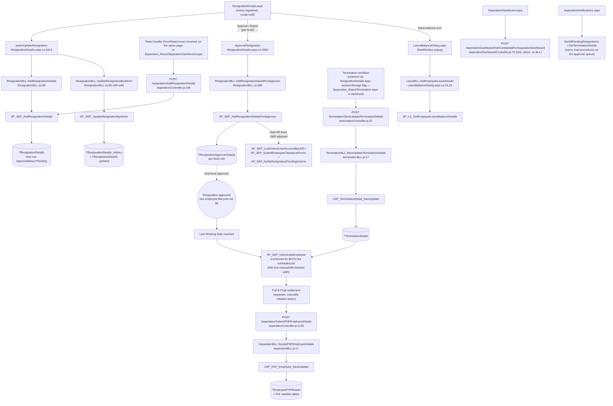
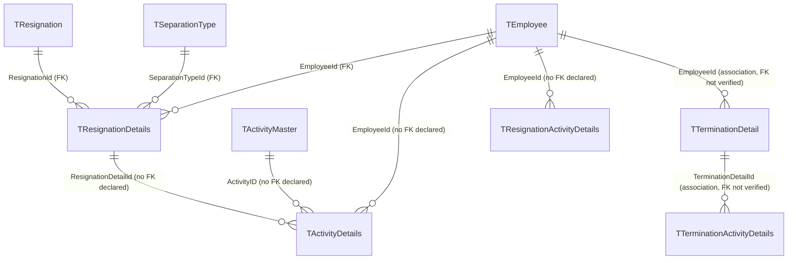

---
sources:
  - HRMS.Web/HRMS.Web/HRM/Separation/ResignationDetails.aspx.cs (SourceCode)
  - HRMS.Web/HRMS.Web/HRM/Separation/LeaveBalanceDialog.aspx.cs (SourceCode)
  - HRMS.Shared/HRMS.DataAccessLayer/Separation/ResignationDAL.cs (SourceCode)
  - HRMS.Shared/HRMS.BusinessLayer/Separation/ResignationBLL.cs (SourceCode)
  - HRMS.Shared/HRMS.BusinessLayer/LeaveAttendanceARWFH/LeaveBLL.cs (SourceCode)
  - HRMS.Shared/HRMS.DataAccessLayer/LeaveAttendanceARWFH/LeaveDAL.cs (SourceCode)
  - HRMS.Web/HRMS.Web/HRM/Separation_React/SeparationDashboard.aspx.cs (SourceCode)
  - HRMS.Web/HRMS.Web/HRM/Separation_React/SeparationNotifications.aspx.cs (SourceCode)
  - HRMS.Web/HRMS.Web/HRM/Separation_React/Termination.aspx.cs (SourceCode)
  - HRMS.Web/HRMS.Web/HRM/Separation_React/routes.js (SourceCode)
  - HRMS.CoreAPI/HRMS.Core.WebAPI.Node/Routes/routeIndex.js (SourceCode)
  - HRMS.CoreAPI/HRMS.Core.WebAPI.Node/Routes/separationRoutes.js (SourceCode)
  - HRMS.CoreAPI/HRMS.Core.WebAPI.Node/Controllers/separationController.js (SourceCode)
  - HRMS.CoreAPI/HRMS.Core.WebAPI.Node/Core/BusinessLogicLayer/separationBLL.js (SourceCode)
  - HRMS.CoreAPI/HRMS.Core.WebAPI.Node/Core/DataAccessLayer/separationDAL.js (SourceCode)
  - HRMS.CoreAPI/HRMS.Core.WebAPI.Node/Routes/TerminationRoutes.js (SourceCode)
  - HRMS.CoreAPI/HRMS.Core.WebAPI.Node/Controllers/terminationController.js (SourceCode)
  - HRMS.CoreAPI/HRMS.Core.WebAPI.Node/Core/BusinessLogicLayer/terminationBLL.js (SourceCode)
  - HRMS.CoreAPI/HRMS.Core.WebAPI.Node/Core/DataAccessLayer/terminationDAL.js (SourceCode)
  - HRMS.CoreAPI/HRMS.Core.WebAPI.Node/Routes/seperationDashboardRoutes.js (SourceCode)
  - HRMS.CoreAPI/HRMS.Core.WebAPI.Node/Controllers/seperationDashboardController.js (SourceCode)
  - llm-wiki/domain/employee-lifecycle.md (TDG HRMS DB)
  - llm-wiki/assumptions/open-questions.md (TDG HRMS DB)
  - HRMS-DATABASE/HRMS/STOREPROCEDURE/SP_SEP_AddResignationDetails.sql (TDG HRMS DB)
  - HRMS-DATABASE/HRMS/STOREPROCEDURE/SP_SEP_UpdateResignationByAdmin.sql (TDG HRMS DB)
  - HRMS-DATABASE/HRMS/STOREPROCEDURE/SP_SEP_GetResignationDetails.sql (TDG HRMS DB)
  - HRMS-DATABASE/HRMS/STOREPROCEDURE/SP_SEP_GetAllResignationDetails.sql (TDG HRMS DB)
  - HRMS-DATABASE/HRMS/STOREPROCEDURE/SP_SEP_AddResignationDetailsForApprover.sql (TDG HRMS DB)
  - HRMS-DATABASE/HRMS/STOREPROCEDURE/SP_SEP_GetApproverControls.sql (TDG HRMS DB)
  - HRMS-DATABASE/HRMS/STOREPROCEDURE/SP_SEP_GetApproverResignationDetails.sql (TDG HRMS DB)
  - HRMS-DATABASE/HRMS/STOREPROCEDURE/SP_SEP_CheckL2Manager.sql (TDG HRMS DB)
  - HRMS-DATABASE/HRMS/STOREPROCEDURE/SP_SEP_IsApprovedResignation.sql (TDG HRMS DB)
  - HRMS-DATABASE/HRMS/STOREPROCEDURE/SP_SEP_GetSeparationType.sql (TDG HRMS DB)
  - HRMS-DATABASE/HRMS/STOREPROCEDURE/SP_SEP_GetEmployeeClearanceForm.sql (TDG HRMS DB)
  - HRMS-DATABASE/HRMS/STOREPROCEDURE/SP_SEP_DeActivateEmployee.sql (TDG HRMS DB)
  - HRMS-DATABASE/HRMS/STOREPROCEDURE/USP_TerminationDetail_SaveUpdate.sql (TDG HRMS DB)
  - HRMS-DATABASE/HRMS/STOREPROCEDURE/USP_GetTerminationDetail_List.sql (TDG HRMS DB)
  - HRMS-DATABASE/HRMS/STOREPROCEDURE/USP_FNF_Employee_SaveUpdate.sql (TDG HRMS DB)
  - HRMS-DATABASE/HRMS/STOREPROCEDURE/SP_LA_GetEmployeeLeaveBalanceDetails.sql (TDG HRMS DB)
confidence: high — app-side call chain verified end-to-end with file:line citations across both the legacy WebForms path and the live React/Node path; DB-side detail for exit/deactivation is inherited from llm-wiki, Separation-specific procedures (approver chain, FnF) freshly derived from SP source here
last-analyzed: 2026-08-13
menu: Separation
---

# Separation

## Overview

An employee decides to leave the company — or HR decides the company is letting them go.
Either way, someone records a **resignation** (or, for an involuntary exit, a separate
**termination** record): a separation type and reason, the resignation date, notice period,
and a requested last working date. That record climbs a configurable multi-level approver
chain — each approver can adjust the recommended last working date, flag a notice-period
shortfall, suggest an internal replacement, or note rehire eligibility — until the final
(usually HR) level signs off.

Approval and the actual exit are **two separate events, not one**: once approved, the
employee keeps working until their agreed Last Working Date. Only then does account
deactivation run — a validation-gated write that checks roughly twenty other tables (open
leave requests, pending approvals, outstanding assets, unfinished PMS/CMS items, org-chart
manager relationships) before it's allowed to flip `TEmployee.IsActive`. If anything's still
open, deactivation is blocked and the pending items are surfaced back to HR. Separately, once
a resignation or termination record is closed, HR can kick off a **Full & Final (FnF)
settlement** to finalize dues owed to the departing employee. HR also has a standalone
**Separation Dashboard** (active separations by stage/type) and a **Notifications** inbox
(pending approvals, resignation pullback requests, exit-interview reminders).

**Who's involved:**

- **Employee** — records their own resignation (self-service, `?mode=self`).
- **Approver chain (manager levels + HR)** — reviews and decides at each configured level;
  which controls each level sees (add LWD, suggest replacement, etc.) is itself tenant-
  configurable.
- **HR** — can submit/edit on an employee's behalf, initiates terminations, runs FnF
  settlement, and is the final approval level that actually schedules deactivation.

This page connects that business flow to its **application call chain** (SourceCode) and
**database lifecycle** (TDG HRMS DB). For the DB-only depth on approval side-effects,
the deactivation validation gate, and the exit-table ER model, see
`llm-wiki/domain/employee-lifecycle.md` §5–6, which this page treats as canonical and does
not repeat.

## Workflow

## Entry points

> ⚠️ **Two live app-tier stacks, one dead versioned rewrite.** `ResignationDetails.aspx` is
> not purely legacy: its code-behind has `FromReact=true` branches throughout that decode
> parameters differently when the request originates from the React bundle, and the React
> frontend routes both its "Record Resignation" *and* "Termination" flows through this same
> URL (`Termination.aspx` under `Separation_React` is never actually reached —
> `routes.js`'s `APP_ROUTES` doesn't register it, and nothing else references it; the live
> termination UI is a `sessionStorage.requestedPage="termination"` flag read on
> `ResignationDetails.aspx`). Separately, the Node CoreAPI ships `_V2`/`_V3` controllers,
> BLL, DAL, and routes for both separation and termination — `routeIndex.js` mounts only the
> unsuffixed **V1** versions (`/separation`, `/termination`, `/seperationDashboard`); V2/V3
> are either unmounted entirely or (for the dashboard) mounted but never called by this
> frontend, and grepping the whole backend finds zero references to them outside their own
> source/tests. Treat V2/V3 as dead code, not an in-progress migration target.

| Entry point | Purpose | Live? |
|---|---|---|
| `HRM/Separation/ResignationDetails.aspx` (`?mode=self`) | Record / approve / reject a resignation; also the render target for the React "Termination" flow | Yes |
| `HRM/Separation/LeaveBalanceDialog.aspx` | Read-only leave-balance popup from the resignation form | Yes |
| `HRM/Separation_React/SeparationDashboard.aspx` | HR analytics dashboard (active separations by stage/type) | Yes |
| `HRM/Separation_React/SeparationNotifications.aspx` | Notifications/inbox: pending approvals, pullbacks, exit-interview reminders | Yes |
| `HRM/Separation_React/Termination.aspx` | Intended standalone termination page | No — not in `routes.js`'s `APP_ROUTES`, no confirmed caller |
| Node CoreAPI `/separation/*`, `/termination/*`, `/seperationDashboard/*` (V1) | Backing API for all the React views above | Yes |
| Node CoreAPI `separationController_V2/_V3`, `terminationController_V2/_V3` + their BLL/DAL/routes | Versioned rewrite | No — never mounted in `routeIndex.js` |
| Node CoreAPI `/api/lookup/separation-types`, `/separation-reasons`, `/separation-leave-details` | CQRS-style lookup endpoints | Live, but not called by this React frontend — built for a different consumer |

## Code → database call chain

| Step | Entry point | App code | Stored procedure |
|---|---|---|---|
| Submit new resignation (legacy) | `ResignationDetails.aspx.cs:4897` (`btnResignationSubmitNew_Click`) | `InsertResignationDetails("SUBMIT")` (:5340) → `actionUpdateResignation` (:5413) → `ResignationBLL.AddResignationDetails` (`ResignationBLL.cs:90`) → `ResignationDAL.AddResignationDetails` (`ResignationDAL.cs:190`) | `SP_SEP_AddResignationDetails` |
| Submit new resignation (React path, same procedure) | Node `POST /separation/AddResignationDetails` | `separationController.js:156` → `separationDAL.js:120,159` | `SP_SEP_AddResignationDetails` — same procedure, two independent app-tier callers |
| HR edit of an existing/pending record | `ResignationDetails.aspx.cs:5421` | `ResignationBLL.UpdateResignationByAdmin` (`ResignationBLL.cs:85`) → `ResignationDAL.UpdateResignationByAdmin` (`ResignationDAL.cs:172`) | `SP_SEP_UpdateResignationByAdmin` |
| Approve/reject a level (legacy) | `ResignationDetails.aspx.cs:4935/4941` → `ApproveResignation` (:4992) | `ResignationBLL.AddResignationDetailsForApprover` (`ResignationBLL.cs:389`) → `ResignationDAL.AddResignationDetailsForApprover` (`ResignationDAL.cs:1061`) | `SP_SEP_AddResignationDetailsForApprover` (also fires `SP_SEP_LockUnlockUserAccountByLWD`, `SP_SEP_SubmitEmployeeClearanceForms`, `SP_SEP_NotifyResignationPendingActions` at the final HR level) |
| Pending resignations grid | React `TeamResignationLayout`/`AllSeparationLayout` → `getAllPendingResignations()` | Node `GET /separation/GetAllResignationDetails` → `separationController.js:211` → `separationDAL.js:186,196` | `SP_SEP_GetAllResignationDetails` |
| Manual/HR-initiated employee deactivation | React `EmpDeactivationLayout` → `DeActivateEmployee()` | Node `POST /separation/DeActivateEmployee` → `separationController.js:810` → `separationDAL.js:830,857` (no BLL in this path) | `SP_SEP_DeActivateEmployee` |
| Save termination record | React `Termination` container (reached via `ResignationDetails.aspx`'s sessionStorage flag) → `TerminationHttpClient.saveTerminationDetails()` | Node `POST /termination/SaveUpdateTerminationDetails` → `terminationController.js:37` → `TerminationBLL.SaveUpdateTerminationDetails` (`terminationBLL.js:17`) → `terminationDAL.js:51` | `USP_TerminationDetail_SaveUpdate` |
| Termination list/status | `GetTerminationDetails()` | Node `GET /termination/GetTerminationDetails` → `terminationController.js:12` → `terminationDAL.js:24` | `USP_GetTerminationDetail_List` |
| FnF settlement submission | React `FnFInputContainer` → `submitFNFDetails()` | Node `POST /separation/SubmitFNFEmployeeDetails` → `separationController.js:1135` → `SeparationBLL.SumbitFNFEmployeeDetails` (`separationBLL.js:17`) → `separationDAL.js:1312` | `USP_FNF_Employee_SaveUpdate` |
| Dashboard cards | `SeparationDashboard.aspx` React bundle | `seperationDashboardController.js:79 GetCardsDataForSeparationDashboard` → DAL direct, no BLL | dashboard aggregate query (not traced line-by-line) |
| Leave-balance popup read | `LeaveBalanceDialog.aspx.cs:15,25` | `LeaveBLL.GetEmployeeLeaveDetails` (`LeaveBLL.cs:16`) → `LeaveDAL.GetEmployeeLeaveDetails` (`LeaveDAL.cs:15`) — reuses the Leave & Attendance module's BLL/DAL, not `ResignationBLL` | `SP_LA_GetEmployeeLeaveBalanceDetails` |

## API endpoints

> Routes below are relative to the Node CoreAPI's `/separation`, `/termination`, and
> `/seperationDashboard` mounts (`routeIndex.js:37,122,125`) — the same live V1 surface
> established in "Entry points" above. V2/V3 equivalents of some of these exist but are
> unmounted (see the callout above) and are not repeated here.

| Verb | Route | Parameters | Purpose | Source |
|---|---|---|---|---|
| `POST` | `separation/AddResignationDetails` | entire `req.body`, passed through unread; `LastModifyBy` injected server-side by middleware | Create/submit a new resignation record | `separationController.js:156-166` |
| `GET` | `separation/GetResignationDetails` | `employeeId` (query, required), `requestType` (query, required) | Fetch a single employee's resignation record, scoped by request type | `separationController.js:346-359` |
| `POST` | `separation/UpdateResignationByAdmin` | entire `req.body`; `LastModifyBy` injected by middleware | HR/admin edit of an existing resignation record | `separationController.js:361-371` |
| `GET` | `separation/GetAllResignationDetails` | `employeeId` (query, required), `employerId` (query, required), `Type` (query, required — `'A'` = all), `IsPendingOnly` (query, optional), `requestFrom` (query, optional — `'web'` adds a manager's-queue computation) | List resignation records — all, or pending with this manager | `separationController.js:211-267` |
| `GET` | `separation/GetApproverControls` | entire `req.query`, passed through unread | Resolve which approver-level UI controls are visible | `separationController.js:977-986` |
| `GET` | `separation/GetApproverResignationDetails` | entire `req.query`, passed through unread | Fetch one approver-level's stored decision | `separationController.js:988-997` |
| `POST` | `separation/AddResignationDetailsForApprover` | entire `req.body`; `CreatedBy`/`UpdatedBy` injected by middleware | Record an approver's decision at their level | `separationController.js:999-1008` |
| `POST` | `separation/DeActivateEmployee` | entire `req.body`; `LastModifyBy` injected by middleware | Manual/HR-initiated employee deactivation | `separationController.js:810-820` |
| `POST` | `separation/SubmitFNFEmployeeDetails` | `combinedFnFData` (body, array, required) — each item processed individually, expected to carry `FNFId` plus its FnF fields | Submit Full & Final settlement details for one or more employees in a single batch call | `separationController.js:1135-1169` |
| `POST` | `termination/SaveUpdateTerminationDetails` | entire `req.body`; `EmployerId` validated by middleware, `createdBy` injected by middleware | Create or update a termination record | `terminationController.js:37-44` |
| `GET` | `termination/GetTerminationDetails` | entire `req.query`, validated by `validateRequestData.validate('GetTerminationDetails')` middleware | Fetch termination detail record(s), enriched with evidence-document file paths | `terminationController.js:12-35` |
| `POST` | `seperationDashboard/GetCardsDataForSeparationDashboard` | `req.EID` (from JWT, used if present) or `LoginID` (body, fallback); remaining filter fields spread from `req.body` | Fetch summary card metrics for the separation dashboard | `seperationDashboardController.js:79-87` |

## Stored procedures & tables involved

> ✅ **Resolves an open question in `llm-wiki/assumptions/open-questions.md`**: that page
> lists three candidate procedures for the HR-initiated (manual) "deactivate employee" UI
> action and could confirm only the scheduled path from DB source alone. From the
> application side this is unambiguous — the React `EmpDeactivationLayout` (manual HR
> deactivation) calls Node `POST /separation/DeActivateEmployee` → `separationController.js:810`
> → `separationDAL.js:830,857`, which executes **`SP_SEP_DeActivateEmployee`** — the identical
> procedure already confirmed for the scheduled `SP_SEP_AutoDeactivateEmployee` path. The
> other two candidates (`SP_DeActivateEmployee`, `SP_SEP_DeActivateEmployeeWithAssets`) have
> no confirmed caller anywhere in either app-tier trace for this feature.

| Object | Path | Role |
|---|---|---|
| `SP_SEP_AddResignationDetails` | `HRMS-DATABASE/HRMS/STOREPROCEDURE/SP_SEP_AddResignationDetails.sql` | Inserts a new `TResignationDetails` row; resolves the tenant's default separation-type/workflow and derives the notice-period end date; called from both app-tier implementations |
| `SP_SEP_UpdateResignationByAdmin` | `.../SP_SEP_UpdateResignationByAdmin.sql` | HR-only edit of an existing record's dates/comments; snapshots the prior row to `TResignationDetails_History` first |
| `SP_SEP_GetResignationDetails` | `.../SP_SEP_GetResignationDetails.sql` | Reads an employee's current resignation record plus its pending `TRequestWorkflows` row |
| `SP_SEP_GetAllResignationDetails` | `.../SP_SEP_GetAllResignationDetails.sql` | Backs the "pending resignations" grid; joins `TEmployee`, `TUsers`, `TLeaveRequestDays`, `TRequestWorkflows`, `TResignationDetails` |
| `SP_SEP_AddResignationDetailsForApprover` | `.../SP_SEP_AddResignationDetailsForApprover.sql` | Per-level approver decision (recommended LWD, notice-period shortfall, replacement/rehire flags); upserts `TResignationApproverDetails` (history-snapshotted on update) and, at the final HR level with an adjusted LWD, chains into `SP_SEP_DeleteScheduleInterview`, `SP_SEP_LockUnlockUserAccountByLWD`, `SP_SEP_SubmitEmployeeClearanceForms`, `SP_SEP_NotifyResignationPendingActions` |
| `SP_SEP_GetApproverControls` | `.../SP_SEP_GetApproverControls.sql` | Resolves which approver-level UI controls are visible, from `TResignationConfigurationData` role lists matched against `TWorkflowDetails`/`TOrgChart`/`TEmployeeInfo` |
| `SP_SEP_GetApproverResignationDetails` | `.../SP_SEP_GetApproverResignationDetails.sql` | Reads one approver-level's stored decision from `TResignationApproverDetails` |
| `SP_SEP_CheckL2Manager` | `.../SP_SEP_CheckL2Manager.sql` | Checks `TOrgChart` for a direct-report relationship — gates some approver actions |
| `SP_SEP_IsApprovedResignation` | `.../SP_SEP_IsApprovedResignation.sql` | Latest-record approval-status lookup against `TResignationDetails` |
| `SP_SEP_GetSeparationType` | `.../SP_SEP_GetSeparationType.sql` | Per-tenant `TSeparationType` master list — same procedure serves both employer-scoped and employee-scoped lookups |
| `SP_SEP_GetEmployeeClearanceForm` | `.../SP_SEP_GetEmployeeClearanceForm.sql` | Reads the employee clearance checklist (`TActivityDetails`, `TTerminationActivityDetails`, `TSEP_SetupAutoClearance`, `TEmployeeInfo`) |
| `SP_SEP_DeActivateEmployee` | `.../SP_SEP_DeActivateEmployee.sql` | The account-deactivation write, gated by a ~20-table validation pass — full detail in `llm-wiki/domain/employee-lifecycle.md` §6a. Confirmed here as the same procedure for both the scheduled job and this manual/HR path (see callout above) |
| `USP_TerminationDetail_SaveUpdate` | `.../USP_TerminationDetail_SaveUpdate.sql` | Creates/updates `TTerminationDetail`, snapshotting history and firing WhatsApp notification |
| `USP_GetTerminationDetail_List` | `.../USP_GetTerminationDetail_List.sql` | Reads `TTerminationDetail` joined to `TCMSEmployeeConfirmation` for the termination list/status view |
| `USP_FNF_Employee_SaveUpdate` | `.../USP_FNF_Employee_SaveUpdate.sql` | Full & Final settlement: writes `TEmployeeFNFMaster`, `TEmployeeFNFEvidence`, `TFNFStatusHistory`, `TEmployeeFNFMasterData`, `TFNFSeeAllUpdatesLog`, `TEmployeeFNFSettlementEvidence`; also raises a generic `TRequestWorkflows` approval row and email/WhatsApp notifications |
| `SP_LA_GetEmployeeLeaveBalanceDetails` | `.../SP_LA_GetEmployeeLeaveBalanceDetails.sql` | Leave & Attendance module procedure, reused (not Separation-owned) for the leave-balance popup |
| `TResignation`, `TResignationDetails`, `TSeparationType`, `TResignationActivityDetails`, `TActivityDetails`, `TActivityMaster`, `TTerminationDetail`, `TTerminationActivityDetails` | `HRMS-DATABASE/HRMS/TABLES/` | Core exit-lifecycle tables — full FK/no-FK detail already in `llm-wiki/domain/employee-lifecycle.md` §6b, reused verbatim below |
| `TResignationApproverDetails`, `TResignationApproverDetails_History`, `TResignationDetails_History` | `HRMS-DATABASE/HRMS/DDL/70703/`, `.../DDL/118198/` (no current `TABLES/*.sql` found) | Per-approver-level decisions and their audit history — not covered by the existing llm-wiki page |
| `TEmployeeFNFMaster` + FnF satellite tables | `HRMS-DATABASE/HRMS/DDL/94713/` (no current `TABLES/*.sql` found) | Full & Final settlement records — not covered by the existing llm-wiki page |
| `TResignationConfigurationData` | `HRMS-DATABASE/HRMS/DDL/*/` (multiple incremental DDL scripts, no current `TABLES/*.sql` found) | Per-tenant approver-control visibility configuration |

Full per-procedure detail for the approval side-effects and the deactivation validation gate
is documented once in `llm-wiki/domain/employee-lifecycle.md` — not duplicated here.

## Table relationships

Reused verbatim from `llm-wiki/domain/employee-lifecycle.md` §6b — see that page for the
"only 3 FKs actually declared" caveat behind these edges.

`TResignationApproverDetails` (child of `TResignationDetails` via `ResignationDetailId`) and
the FnF tables (child of `TEmployee`/`TResignationDetails` via `EmployeeId`) are not shown
above — no canonical `TABLES/*.sql` file exists for them in this repo to verify FK
declarations against (see Known gaps).

## Known gaps

- `TResignationApproverDetails`, `TResignationApproverDetails_History`,
  `TResignationDetails_History`, `TEmployeeFNFMaster` and its satellite tables, and
  `TResignationConfigurationData` have no canonical `HRMS/TABLES/*.sql` file in this repo —
  only incremental `HRMS/DDL/<PBI-number>/*.sql` migration scripts were found. Their FK
  status could not be verified the way `llm-wiki/domain/employee-lifecycle.md` §6b verified
  the core exit tables, so they're described in prose above rather than added to the ER
  diagram.
- `SP_SEP_DeleteScheduleInterview`, `SP_SEP_LockUnlockUserAccountByLWD`,
  `SP_SEP_SubmitEmployeeClearanceForms`, and `SP_SEP_NotifyResignationPendingActions` (all
  chained from `SP_SEP_AddResignationDetailsForApprover`'s final-HR-level branch) were not
  individually opened/traced in this pass — noted as side-effects only.
- The dashboard's aggregate query behind `GetCardsDataForSeparationDashboard`
  (`seperationDashboardController.js:79`, controller → DAL direct, no BLL) was not traced
  down to a specific stored procedure name in this pass.
- `SEP_SEP_GetHRCommentsFlagForResignation` (used by the legacy WebForms path to gate HR
  comment visibility) has a typo'd double-`SEP_` prefix in the actual database object name —
  confirmed against the file itself, not a documentation error.
- Cross-tenant/employer scoping of these procedures was not re-checked here — see
  `llm-wiki/assumptions/open-questions.md` for existing tenancy caveats on this domain.
- The exact API version served by the still-live `/api/lookup/separation-types` etc. lookup
  endpoints' consumer was not identified — flagged as unknown rather than assumed unused.
