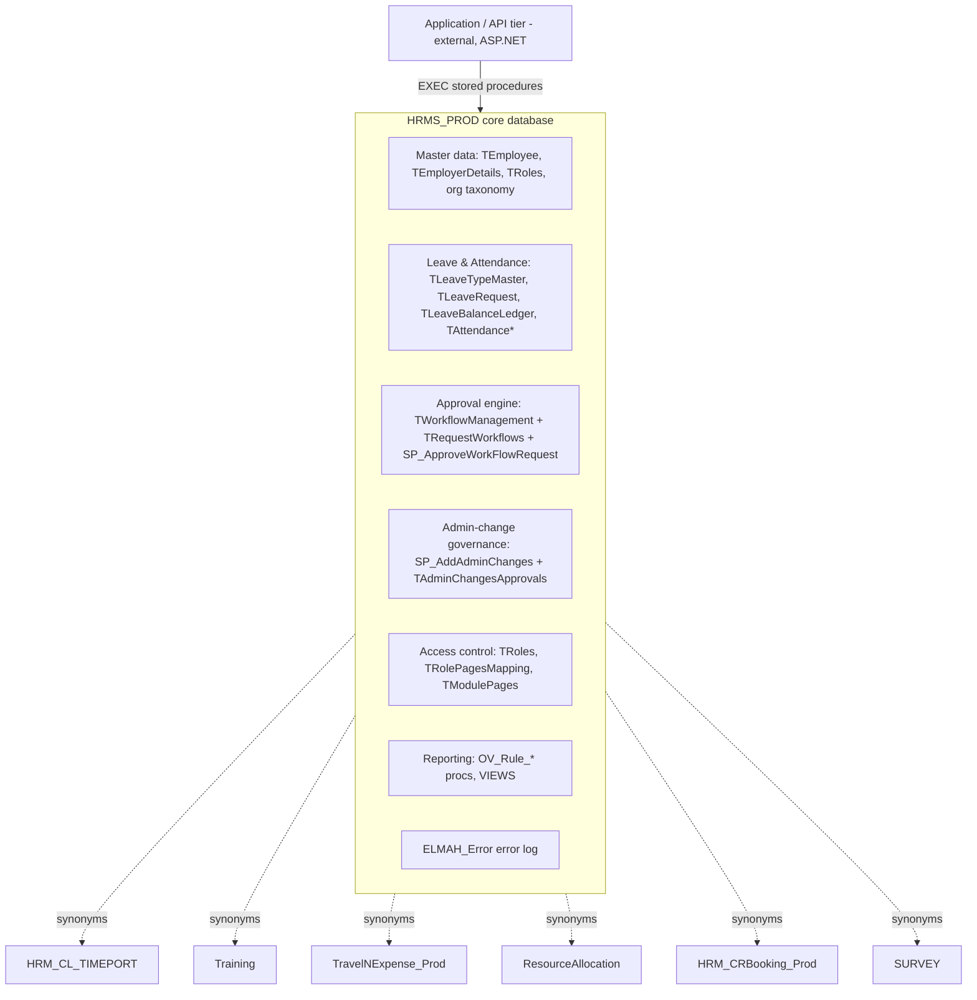

---
sources:
  - HRMS-DATABASE/HRMS/TABLES/TEmployer Details.sql
  - HRMS-DATABASE/HRMS/TABLES/TWorkflowManagement.sql
  - HRMS-DATABASE/HRMS/STOREPROCEDURE/SP_ApproveWorkFlowRequest.sql
  - HRMS-DATABASE/HRMS/SYNONYMS
confidence: high
last-analyzed: 2026-06-26
---

# System Overview

A bird's-eye view of the HRMS database suite: its components, how a request
flows through it, and the technology it runs on.

## Tech stack

- **Microsoft SQL Server** (T-SQL). Object scripts are SSDT-style
  object-per-file exports; SP headers carry `USE [HRMS_PROD]`, `SET ANSI_NULLS ON`,
  `SET QUOTED_IDENTIFIER ON`.
- **Seven physical databases** (see `module-catalog.md`): one core (`HRMS_PROD`)
  plus six satellites, linked by **synonyms** (cross-database three-part names).
- **Logic-in-the-database**: ~5,000+ stored procedures and ~400+ functions hold
  the business rules. The application tier (not in this repo) is a thin caller.
- **Column-level encryption** for PII: sensitive `TEmployee` fields are stored as
  `VARBINARY(MAX)` `*_Encrypted` columns (`TEmployee.sql:3-7,33,42`).

## Components

## Responsibilities

- **Master data** is owned by the core and shared to satellites via synonyms.
- **The approval engine is the spine.** Most employee actions (leave, WFH,
  attendance regularization, resignation, comp-off, recruitment, confirmation)
  and most admin config changes do not take effect directly — they create a
  request that the engine routes through one or more approval levels.
- **Multi-tenancy** is row-level: `Employerid` scopes nearly every table; tenants
  form a tree via `ParentEmployerid`/`RootEmployerId`. See `tenancy-model.md`.

## Request flow (representative: an employee applies for leave)

1. App calls an apply-leave SP, which inserts a row into `TLeaveRequest`
   (`LeaveStatus` pending) and per-day rows into `TLeaveRequestDays`.
2. The engine looks up the workflow mapped to the leave page in
   `TWorkflowManagement` (by `MappedPages`/`ModuleId`, scoped by `Employerid`)
   and materializes one routing row per approval level into `TRequestWorkflows`
   with `ApproveStatus = 'P'`.
3. Each approver calls `SP_ApproveWorkFlowRequest(@RequestType='LeaveRequest',
   @RequestTransId, @EmployeeId, ...)`, which finds that manager's pending row
   (`ApproveStatus='P' AND IsApprove=0`), marks it approved, and advances to the
   next level (`SP_ApproveWorkFlowRequest.sql:83-90`).
4. On final approval the leave is set approved and `TLeaveBalanceLedger` is
   debited (opening/closing balance recorded per transaction).
5. Notifications and home-page items are emitted
   (`Fn_GetHomePageNotificationIdByRequestType`, `TEMAIL_NOTIFICATION*`).

> The application tier is the only entry point shown by the source (procedure
> calls + the `/HRM/Login.aspx` reference in `ELMAH_LogError`). The exact app
> framework/version is not in this repo — see `../assumptions/open-questions.md`.
