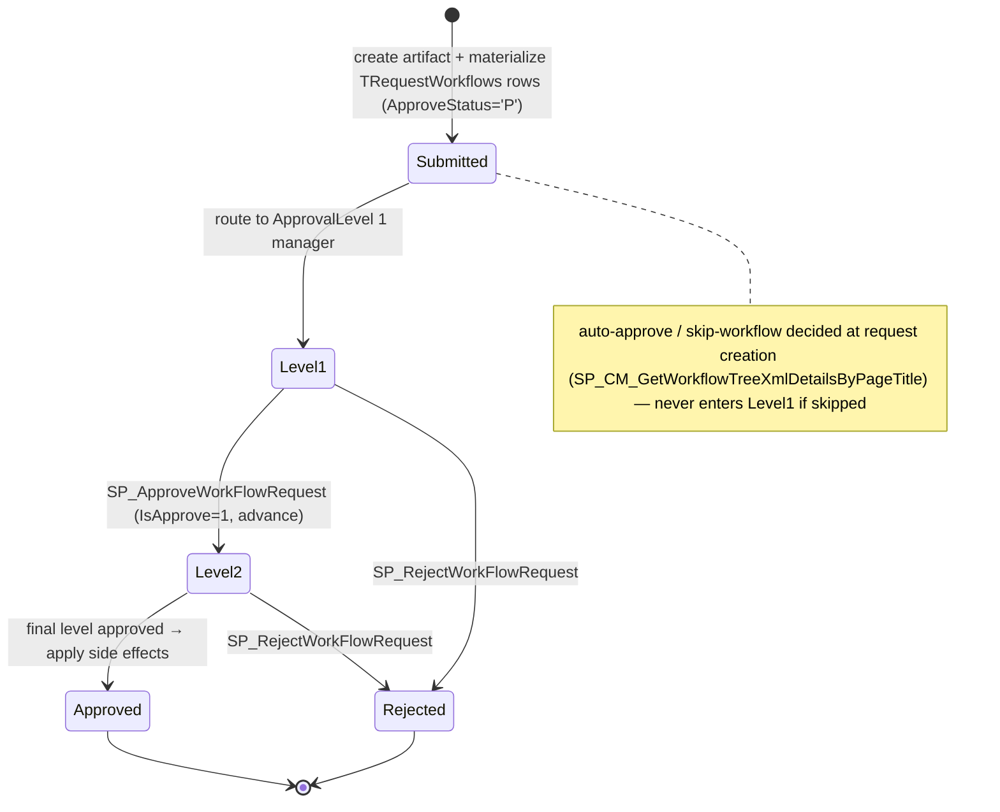

---
sources:
  - HRMS-DATABASE/HRMS/TABLES/TWorkflowManagement.sql
  - HRMS-DATABASE/HRMS/TABLES/TRequestWorkflows.sql
  - HRMS-DATABASE/HRMS/TABLES/THrmsModules.sql
  - HRMS-DATABASE/HRMS/TABLES/TModulePages.sql
  - HRMS-DATABASE/HRMS/TABLES/TAdminChangesApprovals.sql
  - HRMS-DATABASE/HRMS/TABLES/TAdminChangesApprovalDetails.sql
  - HRMS-DATABASE/HRMS/STOREPROCEDURE/SP_ApproveWorkFlowRequest.sql
  - HRMS-DATABASE/HRMS/STOREPROCEDURE/SP_RejectWorkFlowRequest.sql
  - HRMS-DATABASE/HRMS/STOREPROCEDURE/SP_AddNewLeaveTypeMaster.sql
  - HRMS-DATABASE/HRMS/STOREPROCEDURE/SP_CM_GetWorkflowTreeXmlDetailsByPageTitle.sql
  - HRMS-DATABASE/HRMS/STOREPROCEDURE/SP_AddAdminChanges.sql
  - HRMS-DATABASE/HRMS/STOREPROCEDURE/SP_CM_RequestReRoute.sql
confidence: high
last-analyzed: 2026-08-10
---

# Approval Workflow (the cross-cutting engine)

The single most important subsystem in the database: a configurable, multi-level
approval engine that routes nearly every state-changing request and most admin
config changes. Almost every other domain page funnels into this one.

## Definition vs instance

- **`TWorkflowManagement`** = the *definition*. A named workflow with
  `RoutingLevels` (how many approval levels), `WorkflowDefinitionTree`
  (`VARCHAR(MAX)` — the level/approver structure), `MappedPages` + `ModuleId`
  (which app page/module it governs), `Employerid` (tenant), and short-circuit
  flags `Isdefault`/`SkipWorkFlow`/`IsWorkflowPartial`/`IsEnableAutoApproved`
  (`TWorkflowManagement.sql:1-22`).
- **`TRequestWorkflows`** = a per-request *instance*: one row per approval level,
  carrying `RequestType`, `RequestTransid` (the originating artifact's PK),
  `ManagerId` (this level's approver), `ApprovalLevel`, `ApproveStatus CHAR(1)`
  (`'P'` pending), `IsApprove BIT`, plus reassignment columns
  (`TRequestWorkflows.sql:1-21`). Reassignment is performed by
  `SP_CM_RequestReRoute` (`:156-164`): it updates the single pending row for
  `(RequestTransid, RequestType)`, moving `ManagerId` to the new approver while
  recording the old one in `OldManagerId` and appending an audit string to
  `ReassignReason`.

## How a request is dispatched

`SP_ApproveWorkFlowRequest(@RequestType, @RequestTransId, @EmployeeId, @comments,
@ActualReleavingDate = NULL, @Employerid, @confirmationStatus = NULL,
@Noofdays = NULL, @AddNoticePeriodLeaves = NULL)` is the central dispatcher
(`SP_ApproveWorkFlowRequest.sql:27-38`):

1. Resolve the home-page notification id for the type:
   `Fn_GetHomePageNotificationIdByRequestType(@RequestType)` (`:80`).
2. Find the approver's current pending routing row:
   ```sql
   SELECT @wfId = WorkflowId, @ApprovalLevel = ApprovalLevel
   FROM TRequestWorkflows
   WHERE RequestTransid = @RequestTransId AND ManagerId = @EmployeeId
     AND RequestType = @RequestType AND ApproveStatus = 'P' AND IsApprove = 0
   ```
   (`:82-89`).
3. Branch on `@RequestType` (21 branches; owner-resolution chain at `:91-170`,
   side-effect chain at `:585-1206`) to apply the type-specific side effects,
   e.g. `LeaveRequest` (`:585`) sets `TLeaveRequest.LeaveStatus='Approved'` and
   debits `TLeaveBalanceLedger`; `ResignationDetails` (`:927`, plus an
   intermediate-approval touch at `:203-213`) updates `TResignationDetails`.
4. Advance to the next `ApprovalLevel` or finalize when the last level approves.

`SP_RejectWorkFlowRequest` (753 lines) is the symmetric reject path (header,
`:13`: "Reject Leave/WFH/Attendance Regularization") — same `TRequestWorkflows`
lookup and `Fn_GetHomePageNotificationIdByRequestType` call, then its own
`IF @RequestType = 'X'` chain applying reject-side effects.

## Request types

See `../reference/event-catalog.md` for the full enumerated list (21 values,
covering leave, WFH, attendance regularization, resignation/termination,
business card, confirmation, and recruitment). Each cancellation/pullback is its
own request type, so reversing an approved item is itself an approved request.

## Short-circuits

These are **not** checked inside `SP_ApproveWorkFlowRequest` — grepping the
procedure for `IsEnableAutoApproved`/`SkipWorkFlow`/`IsWorkflowPartial`/
`IsAutoApprove` returns zero matches. The decisions happen upstream, at
request-creation time:

- `SP_CM_GetWorkflowTreeXmlDetailsByPageTitle` — the shared helper that
  request-creation procs call to resolve which workflow applies (e.g.
  `USP_LA_ValidateLeaveRequest.sql:177`) — filters out partial-only workflows
  unless the caller opts in (`WM.IsWorkflowPartial = 0 OR @AllowPartialWorkflow
  = 0`, `:147`) and returns `SkipWorkFlow` (`:115`) to the caller. If
  `SkipWorkFlow` comes back true, the creating procedure never materializes
  pending `TRequestWorkflows` rows — the request lands in an approved state
  immediately, so it never reaches `SP_ApproveWorkFlowRequest` at all.
- `IsAutoApprove` (the per-row instance flag) is set by bulk/import paths —
  `SP_BulkInsertLeaveUploadRequest.sql`, `SP_BulkInsertARUploadRequest.sql`,
  `USP_Process_TLeaveRequestImport.sql`, `USP_Process_TARRequestImport.sql` —
  and consulted by `SP_UpdateAutoApprovalRejection.sql`, a separate
  auto-approval/rejection sweep, not the interactive approve/reject dispatchers.
- `IsEnableAutoApproved` (definition-level) only appears in
  `SP_AdminWM_CloneWorkflowConfiguration.sql` (used when cloning a workflow
  config for a new tenant) — it does not surface in any request-creation or
  approval code path found. Treat it as unconfirmed/possibly legacy rather
  than an active short-circuit; worth a follow-up if its purpose matters.
- If no workflow is mapped to the page, the action applies directly (see
  `SP_AddNewLeaveTypeMaster` below for the admin-change version of this check).

## Admin-change governance (config changes are approvable too)

Editing master data (e.g. creating a leave type) routes through the same engine
when a workflow is mapped to that page. The "mapped" check
(`SP_AddNewLeaveTypeMaster.sql:94-98`) is a direct lookup, not a call into the
approval engine:
```sql
SELECT @Lv_WorkflowId = WorkflowId FROM TWorkflowManagement
WHERE MappedPages = (SELECT ModulePageId FROM TModulePages
                     WHERE ModulePageName = 'CreateLeaveType')
  AND Employerid = @Employerid AND IsDelete = 0
```
If found, the procedure builds an XML payload (`:103-538`) and calls
`SP_AddAdminChanges` (`:541-543`) to record a pending change in
`TAdminChangesApprovals`, instead of writing the master row. With no mapped
workflow it writes `TLeaveTypeMaster` directly (`:546-638`).

## Table relationships

`TRequestWorkflows` is the hub, but it has **no declared PRIMARY KEY and no
FOREIGN KEY at all** (`TRequestWorkflows.sql`) — every edge below, including
its own link to `TWorkflowManagement.WorkflowId`, is application-enforced only.
`RequestTransid` polymorphically points at 14 different "artifact" tables
depending on `RequestType` (see `../reference/event-catalog.md` for the full
mapping), plus a 15th family for admin config-changes:

```mermaid
erDiagram
  THrmsModules ||--o{ TWorkflowManagement : "ModuleId (FK, TWorkflowManagement.sql:21)"
  TWorkflowManagement ||--o{ TRequestWorkflows : "WorkflowId (no FK — TRequestWorkflows has no FK/PK at all)"
  TRequestWorkflows }o--|| TLeaveRequest : "RequestTransid — LeaveRequest/LeaveCancellation/LeavePullback (polymorphic, no FK)"
  TRequestWorkflows }o--|| TOptionalHolidayRequest : "RequestTransid — OptionalHolidayRequest/-Cancellation (polymorphic, no FK)"
  TRequestWorkflows }o--|| TCompOffRequest : "RequestTransid — CompOffCreditRequest (polymorphic, no FK)"
  TRequestWorkflows }o--|| TAttendanceRegularization : "RequestTransid — AttendanceRegularize/ARCancellation (polymorphic, no FK)"
  TRequestWorkflows }o--|| TBusinessCards : "RequestTransid — BusinessCard (polymorphic, no FK)"
  TRequestWorkflows }o--|| TResignationDetails : "RequestTransid — ResignationDetails/ResignationPullback (polymorphic, no FK)"
  TRequestWorkflows }o--|| TActivityDetails : "RequestTransid — ResignationActivity (polymorphic, no FK)"
  TRequestWorkflows }o--|| TTerminationActivityDetails : "RequestTransid — TerminationActivity (polymorphic; target has no PK either)"
  TRequestWorkflows }o--|| TWorkFromHomeRequest : "RequestTransid — WorkFromHome/-Cancellation/-Pullback (polymorphic; target has no PK either)"
  TRequestWorkflows }o--|| TPMSEmployeeSelfAppraisal : "RequestTransid — SelfAssessment (polymorphic; target has no PK either)"
  TRequestWorkflows }o--|| TCMSEmployeeConfirmation : "RequestTransid — ConfirmationAssessment (polymorphic; target has no PK either)"
  TRequestWorkflows }o--|| TRRSDetails : "RequestTransid — RecruitmentManagement (polymorphic, no FK)"
  TRequestWorkflows }o--|| TRRSCandidateInterview : "RequestTransid — InterviewFeedback (polymorphic, no FK)"
  TRequestWorkflows }o--|| TRRSCandidate : "RequestTransid — InitiateHiring (polymorphic, no FK)"
  TRequestWorkflows }o--|| TAdminChangesApprovals : "RequestTransid — admin config-change types, approved by SP_ApproveAdminChangesRequest not this SP (polymorphic, no FK)"
  TAdminChangesApprovals ||--o{ TAdminChangesApprovalDetails : "ChangeRequestID (FK, TAdminChangesApprovalDetails.sql:11)"
```



The only two **declared** FKs in this whole engine are
`TWorkflowManagement.ModuleId → THrmsModules.ModuleId` and
`TAdminChangesApprovalDetails.ChangeRequestID → TAdminChangesApprovals.ChangeRequestID`.
Everything else — the workflow-to-routing-row link, and every artifact-table
link — is a naming-convention/`RequestType`-gated relationship with zero
schema enforcement. Four of the polymorphic targets
(`TWorkFromHomeRequest`, `TTerminationActivityDetails`,
`TPMSEmployeeSelfAppraisal`, `TCMSEmployeeConfirmation`) don't even have a
declared PK on the column being pointed at — see `../reference/event-catalog.md`
for the per-`RequestType` breakdown.

## Diagram


