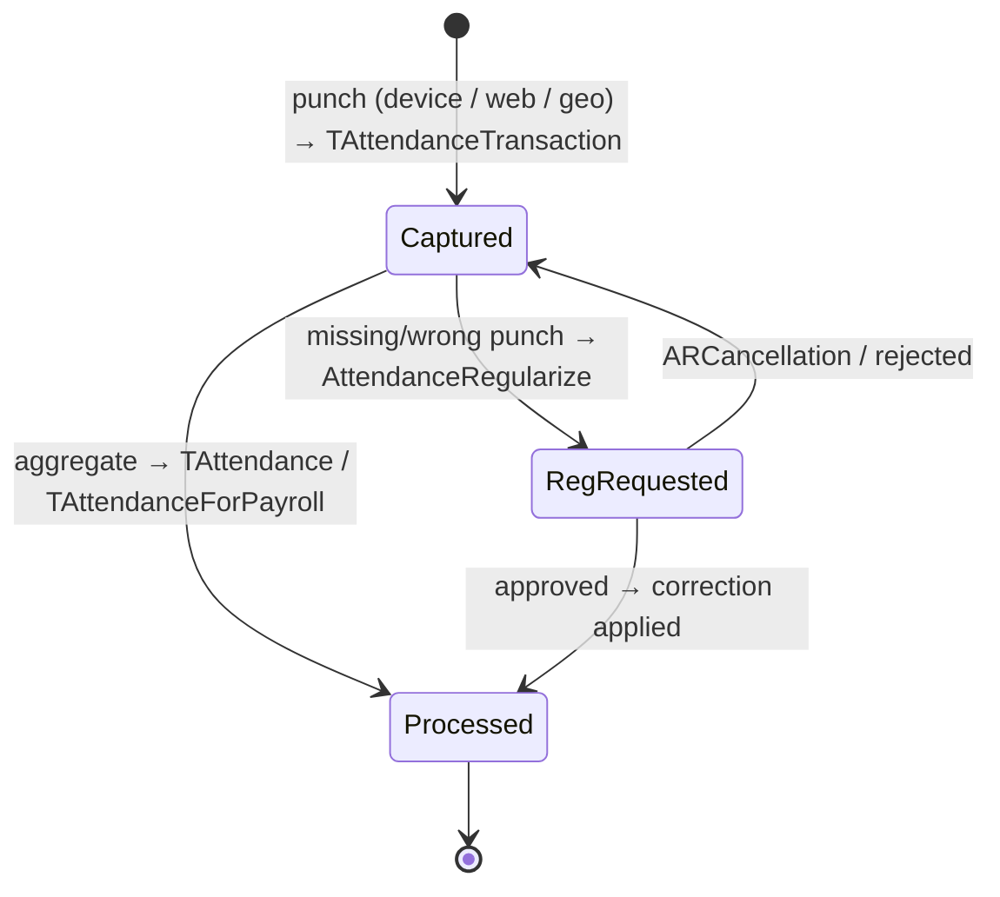

---
sources:
  - HRMS-DATABASE/HRMS/TABLES/TAttendanceTransaction.sql
  - HRMS-DATABASE/HRMS/TABLES/TEmployerDetails.sql
  - HRMS-DATABASE/HRMS/TABLES/TGeoTaggingDetails.sql
  - HRMS-DATABASE/HRMS/STOREPROCEDURE/SP_ApproveWorkFlowRequest.sql
confidence: medium
last-analyzed: 2026-06-26
---

# Attendance Lifecycle

How presence is captured, corrected, and consumed. Attendance feeds leave,
payroll, and reporting.

## Capture modes (per tenant)

`TEmployerDetails.AttendanceCaptureType VARCHAR(100)` selects how punches are
collected; `IsIPBasedAttendance BIT DEFAULT 1` restricts web punches to allowed
IPs (`TEmployerDetails.sql:16,35`). Geo-tagged attendance uses `TGeoTaggingDetails`,
`TGeoTaggingServiceUsage`, `TGeoTrackingConfig` (tag in/out — recent feature per
git history "Tag in/out in geoTagging").

## Sources of truth

- `TAttendanceTransaction` — raw punches; `TAttendanceTransaction_Log` history;
  `TAttendanceTransactionOtherSource` for non-device sources.
- `TAttendance` / `TAttendanceForPayroll` — derived/aggregated attendance.
- `TAttendanceConfiguration`, `TShiftAttendanceConfig` — rules tying shifts to
  attendance expectations.

The `TransactionSource` / OtherSource tables distinguish biometric, manual, geo,
and integration-fed records (provenance).

## Regularization (correcting attendance)

A missed or wrong punch is fixed by an **Attendance Regularization (AR)**
request, routed through the approval engine as `RequestType='AttendanceRegularize'`
with cancellation `ARCancellation` (`SP_ApproveWorkFlowRequest.sql:750,763`).
Records live in `TAttendanceRegularization` / `TAttendanceRegularizationDays`,
categorized by `TAttendanceRegularizeCategory`.

## Work-from-home

WFH is treated like attendance: `RequestType='WorkFromHome'` with `WFHCancellation`
and `WorkFromHomePullback` (`SP_ApproveWorkFlowRequest.sql:413,979,992,1035`).

## Flow

> Exact aggregation rules (shift matching, late-mark, absenteeism) live in
> attendance/OV_Rule procedures and were not extracted line-by-line; the
> `OV_Rule_LeaveAttendance_*` procs produce the late-mark/absenteeism/paid-leave
> report shapes. See `../assumptions/open-questions.md`.
