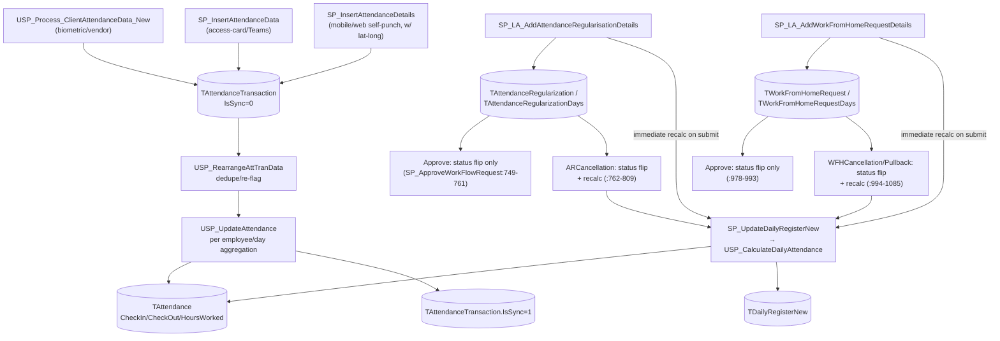
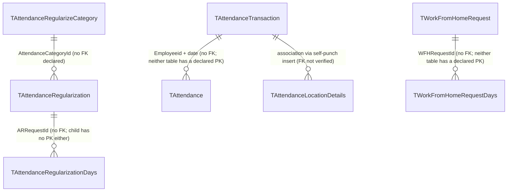

---
sources:
  - HRMS-DATABASE/HRMS/TABLES/TAttendanceTransaction.sql
  - HRMS-DATABASE/HRMS/TABLES/TAttendance.sql
  - HRMS-DATABASE/HRMS/TABLES/TAttendanceForPayroll.sql
  - HRMS-DATABASE/HRMS/TABLES/TAttendanceRegularization.sql
  - HRMS-DATABASE/HRMS/TABLES/TAttendanceRegularizationDays.sql
  - HRMS-DATABASE/HRMS/TABLES/TAttendanceRegularizeCategory.sql
  - HRMS-DATABASE/HRMS/TABLES/TGeoTaggingDetails.sql
  - HRMS-DATABASE/HRMS/TABLES/TGeoTrackingConfig.sql
  - HRMS-DATABASE/HRMS/TABLES/TWorkFromHomeRequest.sql
  - HRMS-DATABASE/HRMS/TABLES/TEmployerDetails.sql
  - HRMS-DATABASE/HRMS/STOREPROCEDURE/USP_Process_ClientAttendanceData_New.sql
  - HRMS-DATABASE/HRMS/STOREPROCEDURE/USP_UpdateAttendance.sql
  - HRMS-DATABASE/HRMS/STOREPROCEDURE/USP_CalculateDailyAttendance.sql
  - HRMS-DATABASE/HRMS/STOREPROCEDURE/SP_UpdateDailyRegisterNew.sql
  - HRMS-DATABASE/HRMS/STOREPROCEDURE/SP_LA_AddAttendanceRegularisationDetails.sql
  - HRMS-DATABASE/HRMS/STOREPROCEDURE/SP_LA_AddWorkFromHomeRequestDetails.sql
  - HRMS-DATABASE/HRMS/STOREPROCEDURE/SP_ApproveWorkFlowRequest.sql
confidence: medium (pipeline stages are individually high-confidence with line cites; TAttendanceForPayroll population path is an open gap)
last-analyzed: 2026-08-10
---

# Attendance Lifecycle

How presence is captured, corrected, and consumed. Attendance feeds leave,
payroll, and reporting.

## Capture modes (per tenant)

`TEmployerDetails.AttendanceCaptureType VARCHAR(100)` selects how punches are
collected; `IsIPBasedAttendance BIT DEFAULT 1` restricts web punches to allowed
IPs (`TEmployerDetails.sql:16,35`).

## Punch → aggregation pipeline

There is no single "aggregation procedure" — it's a 4-stage pipeline, each
stage handing off via an `IsSync`/date-range flag rather than a direct call
chain (except stage D, which is a real call chain):

**A. Ingestion → `TAttendanceTransaction`.** Three parallel entry points, one
per source: `USP_Process_ClientAttendanceData_New` (biometric/vendor device
data staged in `TAttendanceDataFromClient` where `IsSync=0`, `:60`),
`SP_InsertAttendanceData` (access-card/MS-Teams sources, logged via
`TClientAttendanceDataLog`), and `SP_InsertAttendanceDetails` (mobile/web
self-punch — the only entry point that carries `Latitude`/`Longitude`
directly into `TAttendanceTransaction`, `:334,346-347`, plus a companion
`TAttendanceLocationDetails` row). Each either inserts a valid punch into
`TAttendanceTransaction`, or — if `UFN_Check_IsValidAttendnaceRecords` fails —
into `TAttendanceTransactionOtherSource`.

**B. Sanitize.** `USP_RearrangeAttTranData` deletes bogus system-added rows
and re-flags `In_Out`/`TransDescription` on `TAttendanceTransaction`, marking
them `IsSync=0` for re-aggregation (`:135-175`).

**C. Aggregate → `TAttendance`.** `USP_UpdateAttendance` selects
`TAttendanceTransaction WHERE IsSync=0` per employee/day (`:70-86`), computes
CheckIn/CheckOut/HoursWorked/ShiftId from that day's punches (`:157-247`), and
either **INSERTs** (`:258`) or **UPDATEs** (`:301`) the `TAttendance` row, then
marks the source transactions `IsSync=1` (`:325-329`).

**D. Daily register (payroll-facing summary).** `SP_UpdateDailyRegisterNew` is
a thin wrapper (its entire body is one `EXEC`) that delegates to
`USP_CalculateDailyAttendance` (3012 lines) — the real engine, which folds in
approved/pending Attendance Regularization minutes (`TAttendanceRegularization`
and `TAttendanceRegularizationDays`, `:549-551`), WFH days
(`TWorkfromHomeRequestDays`, `:648`), and on-duty (`TEmployeeOnDuty`, `:803`),
then writes the computed day status back to **`TAttendance.AttendanceStatus`**
(`:2528` — the one place this procedure touches `TAttendance` itself) and
upserts `TDailyRegisterNew` (`:2414,2546`).

> ⚠️ **`TAttendanceForPayroll` has no confirmed writer.** The table is a real,
> persisted table (`TAttendanceForPayroll.sql`), but every procedure that
> appears to reference it (`USP_GetAttendanceForPayroll`,
> `SP_GetAttendaceReport_GUIBase`, `USP_FNF_GetEmployee_Payable_Days`, ...) is
> actually operating on a **local temp table** `#TAttendanceForPayroll` it
> creates inline — not the persisted `dbo.TAttendanceForPayroll`. No
> `INSERT`/`UPDATE` against the real table was found anywhere in
> `STOREPROCEDURE/`. Population path (SSIS? legacy/unused?) is unconfirmed —
> see `../assumptions/open-questions.md`.

## Regularization (correcting attendance)

A missed or wrong punch is fixed by an **Attendance Regularization (AR)**
request, `RequestType='AttendanceRegularize'` (cancellation `ARCancellation`).
Created by `SP_LA_AddAttendanceRegularisationDetails` (day-based and
time-based variants), which inserts `TAttendanceRegularization` +
`TAttendanceRegularizationDays`, materializes a `TRequestWorkflows` row, and —
notably — **calls `SP_UpdateDailyRegisterNew` immediately at submission time**
(`:244`), not just on approval.

Approval (`SP_ApproveWorkFlowRequest.sql:749-761`) only flips status columns
(`TAttendanceRegularization.Requeststatus='Approved'`,
`TAttendanceRegularizationDays.ARStatus='C'`) — it does **not** re-trigger the
daily-register recalc, since day-based requests were already recalculated at
submission. `ARCancellation` (`:762-809`) does trigger a recalc: it either
`DELETE`s the future `TDailyRegisterNew` rows directly (`:790-801`) or calls
`SP_UpdateDailyRegisterNew` for past/current dates (`:802-808`).

## Work-from-home

WFH is treated like attendance: `RequestType='WorkFromHome'` with
`WFHCancellation` and `WorkFromHomePullback`. Created by
`SP_LA_AddWorkFromHomeRequestDetails`, which inserts `TWorkFromHomeRequest` +
`TWorkFromHomeRequestDays` and — same pattern as AR — calls
`SP_UpdateDailyRegisterNew` at submission time (`:163`).

Approval (`SP_ApproveWorkFlowRequest.sql:978-993`) flips
`TWorkFromHomeRequest.Requeststatus='Approved'` /
`TWorkFromHomeRequestDays.RequestStatus='C'` and calls
`usp_ProcessWFHDeskMode`; `WFHCancellation` (`:994-1039`) and
`WorkFromHomePullback` (`:1040-1085`) both recalc the daily register the same
way `ARCancellation` does (delete future rows, or re-run
`SP_UpdateDailyRegisterNew` for past/current dates).

## Geo-tagging — a separate subsystem, not part of the punch pipeline

`TGeoTaggingDetails`, `TGeoTaggingServiceUsage`, and `TGeoTrackingConfig` are
**not connected to `TAttendanceTransaction`** by any code path found —
despite the naming, this is not "geo-tagged attendance." `TGeoTrackingConfig`
rows are read by `SP_Geo_InsertTrackingData`/`SP_Geo_InsertTrackingDataBulk`
to produce continuous background location pings into a different table,
`TMobileTracking`. The actual punch-level coordinates live on
`TAttendanceTransaction.Latitude`/`Longitude` and a companion
`TAttendanceLocationDetails` table, populated only by the mobile/web
self-punch path (`SP_InsertAttendanceDetails`, see stage A above). Treat
geo-tagging (site/project check-in tagging + service-usage tracking) and
punch geo-coordinates as two unrelated features until further evidence
surfaces.

## Workflow

> Exact aggregation edge cases (shift matching, late-mark, absenteeism) live in
> attendance/OV_Rule procedures and were not extracted line-by-line; the
> `OV_Rule_LeaveAttendance_*` procs produce the late-mark/absenteeism/paid-leave
> report shapes. See `../assumptions/open-questions.md`.

## Table relationships

**Every one of the 9 core attendance tables checked declares zero foreign
keys** — verified against their `CREATE TABLE` scripts
(`TAttendanceTransaction`, `TAttendance`, `TAttendanceForPayroll`,
`TAttendanceRegularization`, `TAttendanceRegularizationDays`,
`TAttendanceRegularizeCategory`, `TGeoTaggingDetails`, `TGeoTrackingConfig`,
`TWorkFromHomeRequest`). Several — `TAttendanceTransaction`, `TAttendance`,
`TAttendanceForPayroll`, `TAttendanceRegularizationDays`,
`TWorkFromHomeRequest` — don't even declare a primary key; they rely on
`IDENTITY` columns plus non-clustered indexes only. `TGeoTaggingDetails`
stores `EmployeeId`/`EmployerId` as `nvarchar(150)`, not `int`, so it isn't
even convention-matched to `TEmployee.EmployeeId`/`TEmployerDetails.Employerid`
by type. `TAttendance`/`TAttendanceTransaction` also carry `AFTER
INSERT`/`UPDATE` triggers (`TRG_UpdateAttendanceCalDate`,
`TRG_RearrangeAttendanceTransactionData` — the latter currently `DISABLE
TRIGGER`d) that join by `Employeeid` convention, not a declared FK.
