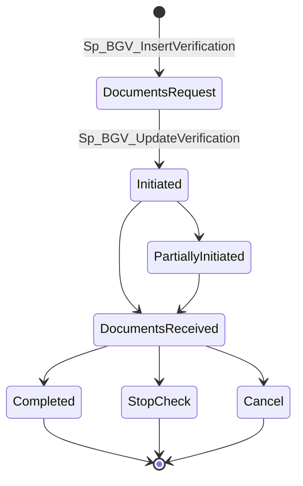

---
sources:
  - HRMS-DATABASE/HRMS/TABLES/TBGVVerificationRequest.sql
  - HRMS-DATABASE/HRMS/TABLES/TBGVVerificationReport.sql
  - HRMS-DATABASE/HRMS/TABLES/TBGVCategory.sql
  - HRMS-DATABASE/HRMS/TABLES/TBGVRequestCategory.sql
  - HRMS-DATABASE/HRMS/TABLES/TBGVStatusLOOKUP.sql
  - HRMS-DATABASE/HRMS/TABLES/TBGVVendor.sql
  - HRMS-DATABASE/HRMS/TABLES/TBGVDocumentsRequest.sql
  - HRMS-DATABASE/HRMS/STOREPROCEDURE/Sp_BGV_InsertVerification.sql
  - HRMS-DATABASE/HRMS/STOREPROCEDURE/Sp_BGV_UpdateVerification.sql
  - HRMS-DATABASE/HRMS/STOREPROCEDURE/SP_BGV_GetEmployeeBGVDetails.sql
confidence: medium
last-analyzed: 2026-07-02
---

# Background Verification (BGV)

A parallel onboarding/employment check. Unlike leave or resignation, BGV does
**not** route through the central approval engine
(`TWorkflowManagement`/`TRequestWorkflows` — see `approval-workflow.md`); it
has its own status lifecycle driven directly by `TBGVStatusLOOKUP`.

## Two verification types

- **Pre-employment** (`IsPreEmpVerType='Y'`) — verifying a candidate before/at
  hiring.
- **Post-employment** (`IsPreEmpVerType='N'`) — "On Board BGV," run on an
  already-hired employee.

## Data model

| Table | Role |
|---|---|
| `TBGVVerificationRequest` | One row per verification case: employee, name/email (encrypted via `Fn_EncryptData`/`Fn_DecryptData`, plus SQL Server Dynamic Data Masking on the plaintext columns — `partial()`/`email()`), status, link validity window, vendor, key dates (`DocRequestDate`, `DocReceivedate`, `DocInitiationDate`, `CompletionDate`) |
| `TBGVRequestCategory` | Which check categories (education, criminal, employment history, etc.) apply to this request, each with its own `categoryStatus` |
| `TBGVCategory` | Tenant-configurable list of verification categories |
| `TBGVVendor` | Third-party verification vendors (tenant-scoped) |
| `TBGVDocumentsRequest` / `TBGVVerificationReport` | Document requests and uploaded verification reports, linked to `TDocuments` |
| `TBGVStatusLOOKUP` | Status codes (per tenant). Names recovered from SP logic (not from seed data, which isn't in this repo — see `../assumptions/open-questions.md`): `Documents Request` → `Initiated`/`Partially Initiated` → `Documents Received` → `Completed` / `Stop Check` / `Cancel` |

## Flow

1. **`Sp_BGV_InsertVerification`** creates the request, defaults status to
   `'Documents Request'` (looked up from `TBGVStatuslookup` for `Employerid=0`),
   stores the requested categories in `TBGVRequestCategory`, and emails HR via
   `SP_SendEmail` using the `PreEmpBackgroundVerification` or
   `PostEmpBackgroundVerification` template depending on `IsPreEmpVerType`.
2. **`Sp_BGV_UpdateVerification`** drives status transitions and is
   date-sequence-validated: e.g. moving to `Documents Received` requires the
   change date ≥ `DocRequestDate`; moving to `Completed`/`Stop Check`/`Cancel`
   requires it ≥ `DocInitiationDate`/the prior date. Any out-of-order date is
   rejected with `@ErrorCode=1` and a message, not a hard SQL error — callers
   must check the returned error code.
3. A separate branch of the same SP just extends the verification link's
   validity (`@IsExtended='Y'`) — it updates `LinkValidTill`/`PreLinkValidTill`
   and sends a `PreEmpBGVExtend`/`PostEmpBGVExtend` notification instead of
   touching status.
4. Vendor assignment has its own date guards: `VendorInitiateDate` must be ≥
   the document-received date, and `VendorRptRecievedDate` must be ≥
   `VendorInitiateDate`.
5. On completion, the result is stored in `VerResultID`. `TBGVStatusLOOKUP`
   IDs `402`/`500`/`502` are hardcoded in `SP_BGV_GetEmployeeBGVDetails` as the
   "completed" set — these are tenant-configured magic numbers, not named
   anywhere in the schema.
6. **`SP_BGV_GetEmployeeBGVDetails`** is the read side: per employee, returns
   each verification's current status, completed result, vendor name, business
   unit, and the list of uploaded report filenames (via `TBGVVerificationReport`
   → `TDocuments`).

## Admin configuration

`SP_AdminMstr_{Add,Upd,Del,Get}BGVCategory` provide tenant-scoped CRUD over
`TBGVCategory`. Vendor CRUD was not traced in the same depth — see open
questions.

> Recruitment (RRS) and PMS scoring internals are still not extracted in
> depth — see `../assumptions/open-questions.md`. The full `TBGVStatusLOOKUP`
> data (all `Lookup_ID` → `Lookup_Text` rows per tenant) is not in this repo;
> only the subset of status names referenced in stored-procedure logic is
> documented above.
