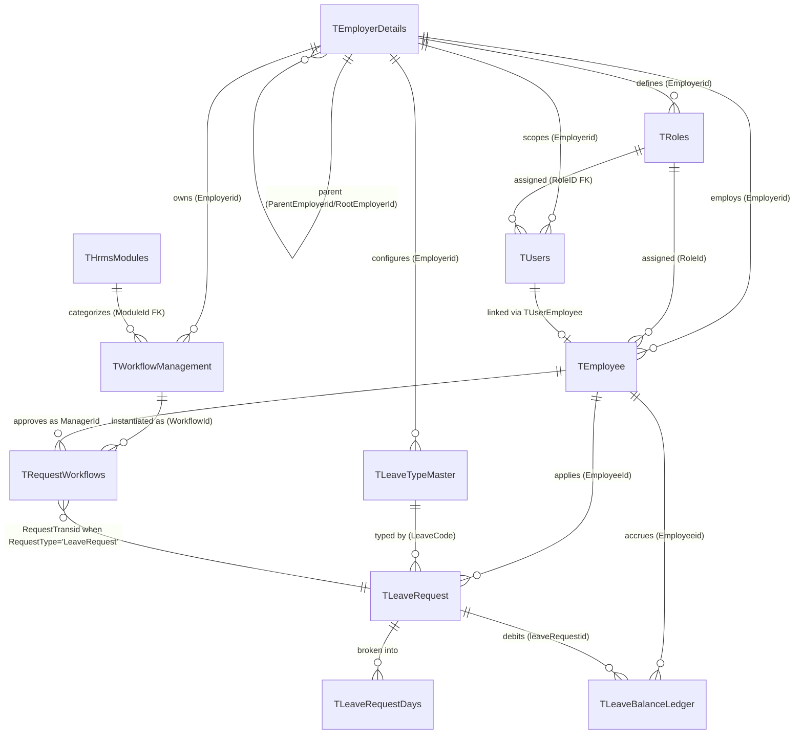

---
sources:
  - HRMS-DATABASE/HRMS/TABLES/TEmployee.sql
  - HRMS-DATABASE/HRMS/TABLES/TEmployerDetails.sql
  - HRMS-DATABASE/HRMS/TABLES/TUsers.sql
  - HRMS-DATABASE/HRMS/TABLES/TLeaveTypeMaster.sql
  - HRMS-DATABASE/HRMS/TABLES/TLeaveRequest.sql
  - HRMS-DATABASE/HRMS/TABLES/TRequestWorkflows.sql
  - HRMS-DATABASE/HRMS/TABLES/TWorkflowManagement.sql
confidence: medium
last-analyzed: 2026-06-26
---

# Concept Map

Entity relationships and cardinalities for the core HRMS entities. Edges are
derived from columns and the few declared FKs; most relationships are
**by-convention** (`*Id` columns) rather than enforced FKs (see invariants).

## Key cardinalities & keys

| Relationship | Cardinality | Key | Enforced? |
|---|---|---|---|
| Employer → Employee | 1 : N | `TEmployee.Employerid` | by-convention |
| Employer → Employer (group) | 1 : N (tree) | `ParentEmployerid`/`RootEmployerId` | self-FK on `Employerid` only |
| Role → User | 1 : N | `TUsers.RoleID` → `TRoles.RoleID` | **FK** (`TUsers.sql:24`) |
| User ↔ Employee | linked | via `TUserEmployee` | by-convention |
| LeaveType → LeaveRequest | 1 : N | `LeaveCode` (+ `Employerid`) | by-convention |
| LeaveRequest → balance ledger | 1 : N | `TLeaveBalanceLedger.leaveRequestid` | by-convention |
| Workflow → routing rows | 1 : N | `TRequestWorkflows.WorkflowId` | by-convention |
| Module → Workflow | 1 : N | `TWorkflowManagement.ModuleId` → `THrmsModules` | **FK** (`TWorkflowManagement.sql:21`) |

The generic link `TRequestWorkflows.(RequestType, RequestTransid)` points at the
originating artifact's PK across many tables (polymorphic; not an FK).
`TLeaveTypeMaster` uses a **composite PK `(LeaveCode, Employerid)`** so leave
codes are unique per tenant, not globally.
