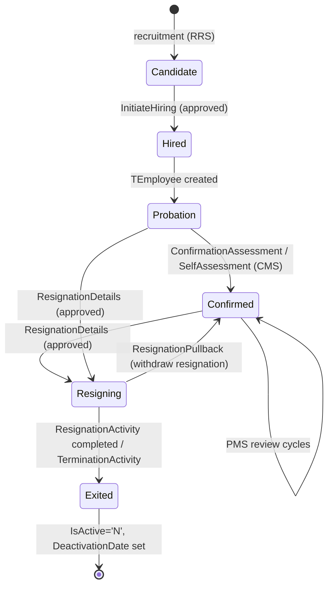
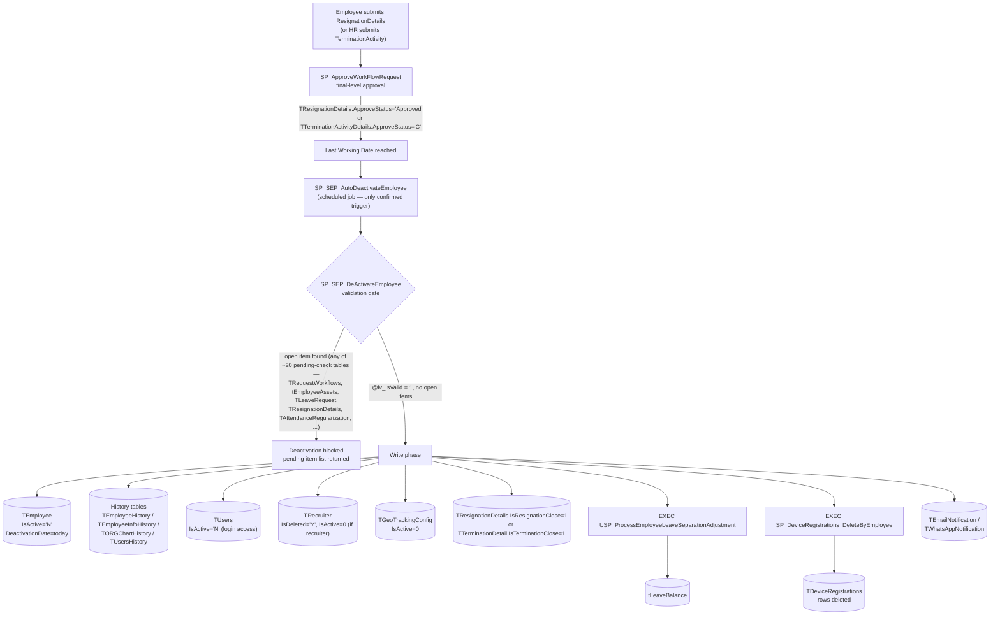
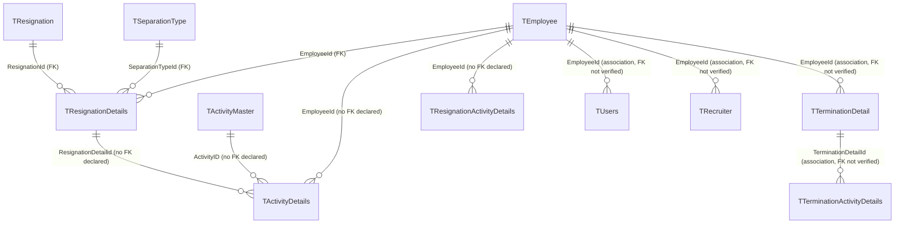

---
sources:
  - HRMS-DATABASE/HRMS/TABLES/TEmployee.sql
  - HRMS-DATABASE/HRMS/TABLES/TResignation.sql
  - HRMS-DATABASE/HRMS/TABLES/TResignationDetails.sql
  - HRMS-DATABASE/HRMS/TABLES/TResignationActivityDetails.sql
  - HRMS-DATABASE/HRMS/TABLES/TActivityDetails.sql
  - HRMS-DATABASE/HRMS/TABLES/TActivityMaster.sql
  - HRMS-DATABASE/HRMS/TABLES/TEmployerDetails.sql
  - HRMS-DATABASE/HRMS/STOREPROCEDURE/SP_ApproveWorkFlowRequest.sql
  - HRMS-DATABASE/HRMS/STOREPROCEDURE/SP_SEP_DeActivateEmployee.sql
  - HRMS-DATABASE/HRMS/STOREPROCEDURE/SP_SEP_AutoDeactivateEmployee.sql
confidence: medium (section 6 sub-sections are individually high-confidence — see inline citations)
last-analyzed: 2026-08-10
---

# Employee Lifecycle

The stages an employee passes through, from recruitment to exit, and the
approvable events that mark each transition. Each event is a `RequestType` in the
approval engine (see `approval-workflow.md`).

## Stages

## 1. Recruitment (RRS)

Request types `RecruitmentManagement`, `InterviewFeedback`, `InitiateHiring`
drive candidate processing. `TEmployee.CandidateId`/`CandidateSourceId` link a
hired employee back to the candidate record (`TEmployee.sql:43,53`). Internals
of the RRS flow were not extracted in depth (open question).

## 2. Onboarding / active employment

A hired candidate becomes a `TEmployee` (PII encrypted; `IsActive='Y'`). Satellite
`TEmployee*` tables capture bank, contact, family, assets, documents.

## 3. Confirmation (CMS — probation → confirmed)

Governed by tenant flags on `TEmployerDetails`: `IsAutomaticConfirmation`,
`ConfirmationDueDays`, `AutoConfInitiationDueDays`,
`IsAutomaticConfirmationLetter`, `IsConfSelfAssesmentRequired`
(`TEmployerDetails.sql:75,83,86-91`). Approvable via `SelfAssessment` /
`ConfirmationAssessment`. `TEmployee.IsAllowedForInitiateConfirmation` gates it
(`TEmployee.sql:63`).

## 4. Performance (PMS)

Tenant flags `IsReviewFrequencyEnabled`, `IsPMSReviewerEnabled`,
`CalculateFinalRatingAsAverage`, `IsNormalizedRatingsFinalRatings`,
`PerformanceDueDays` (`TEmployerDetails.sql:62,66,69,79,85`) configure appraisal
cycles. Scoring logic lives in PMS procedures (not extracted in depth).

## 5. Resignation / termination (exit)

- `TResignation` = separation-type master (per tenant); `TResignationDetails`,
  `TResignationActivityDetails` track an exit instance.
- Approvable request types: `ResignationDetails`, `ResignationActivity`,
  `TerminationActivity`, and `ResignationPullback` (withdraw)
  (`SP_ApproveWorkFlowRequest.sql:125,133,928,959`).
- `SP_ApproveWorkFlowRequest` accepts `@ActualReleavingDate` and
  `@AddNoticePeriodLeaves` for the exit path (`:33,38`).

## 6. Deactivation & data retention

Exit sets `TEmployee.IsActive='N'` and `DeactivationDate`. PII can later be
erased per tenant policy: `IsPersonalFieldsDeleted`/`PersonalFieldsDeletedDate`
on the employee (`TEmployee.sql:46-47`), driven by `IsDeletePersonalFields`/
`PersonalFieldsDeleteDuration` on the employer (`TEmployerDetails.sql:30-31`).
Background verification (BGV) is a parallel onboarding check (`TBGV*` tables).
See `background-verification.md` for the full flow.

Approval and deactivation are **two decoupled steps**, not one transaction.
`SP_ApproveWorkFlowRequest` only closes the resignation/termination *request*;
the actual `TEmployee` write happens later, in a separate procedure, gated by
a validation pass across ~20 tables.

### 6a. Workflow: what happens when an employee is deactivated

Sources: `SP_ApproveWorkFlowRequest.sql:927-977` (resignation/termination/activity
approval side-effects), `SP_SEP_AutoDeactivateEmployee.sql:192` (only confirmed
caller of the deactivation SP), `SP_SEP_DeActivateEmployee.sql:109-1091`
(validation gate + write phase, line numbers below).

**Validation gate (read-only, blocks if any hit).** `SP_SEP_DeActivateEmployee`
checks ~20 categories before allowing deactivation: pending approvals in
`TRequestWorkflows` (joined across leave, WFH, attendance regularization,
overtime, comp-off, locum/PH claims, leave encashment, business cards),
`tEmployeeAssets` (asset still registered — the SP does **not** deallocate it,
only blocks), open `TResignationDetails`/`TActivityDetails` items, pending PMS
self-assessment/goal-setting, pending CMS confirmation, active
`tRoleEmployeeMapping`, and whether the employee is still someone's manager in
`TORGChart` (`SP_SEP_DeActivateEmployee.sql:109-590`). Any hit is collected into
`@lv_PendingActions` and the write phase is skipped (`:594-597`).

**Write phase** (only when the gate passes, `:598-1032`): snapshots to history
tables, then `TEmployee.IsActive='N'`/`DeactivationDate` (`:672-679`),
`TUsers.IsActive='N'` (`:822-826`, login), `TRecruiter` (`:828-833`, if the
employee was a recruiter), `TGeoTrackingConfig.IsActive=0` (`:683-687`), then
one of two mutually exclusive branches: a **termination** branch closing
`TTerminationDetail.IsTerminationClose=1` (`:899-914`) or a **resignation**
branch closing `TResignationDetails.IsResignationClose=1` (`:940-956`) which
also delegates leave-balance adjustment to
`USP_ProcessEmployeeLeaveSeparationAdjustment` (`:975-976`, gated on a tenant
setting) and fires email/WhatsApp notifications. Finally
`SP_DeviceRegistrations_DeleteByEmployee` clears `TDeviceRegistrations`
(`:1025-1028`).

> ⚠️ A separate `DISABLE` transaction type in the same SP (`:1033-1073`) only
> touches `TUsers`/`TRecruiter` — it does **not** set `TEmployee.IsActive`/
> `DeactivationDate`. "Disable" ≠ "Deactivate" despite sharing one procedure.
> Also `SP_SEP_DeActivateEmployeeWithAssets` does not reference any asset table
> despite its name — treat it as misleadingly named or stale, not verified as
> the asset-cleanup path. Which procedure the manual/HR-initiated UI action
> calls (vs. the confirmed scheduled path) is unverified — see
> `../assumptions/open-questions.md`.

### 6b. Table relationships (exit-related tables)

Only 3 FKs are actually declared among the exit tables — all on
`TResignationDetails` (`TResignationDetails.sql:48-51`):
`EmployeeId → TEmployee.EmployeeId`, `ResignationId → TResignation.ResignationId`,
`SeparationTypeId → TSeparationType.SeparationTypeId`. `TResignation`,
`TResignationActivityDetails`, `TActivityDetails`, and `TActivityMaster` each
declare **zero foreign keys** (verified against their `CREATE TABLE` scripts) —
their `EmployeeId`/`ActivityID`/`ResignationDetailid` columns are related only
by naming convention, consistent with the general FK gap already noted in
`../assumptions/open-questions.md`. `TTerminationDetail`/`TTerminationActivityDetails`/
`TUsers`/`TRecruiter` FK status was not checked in this pass — shown as
unverified associations, not confirmed absence.

> Recruitment (RRS) and PMS scoring internals are not extracted in depth —
> see `../assumptions/open-questions.md`.
