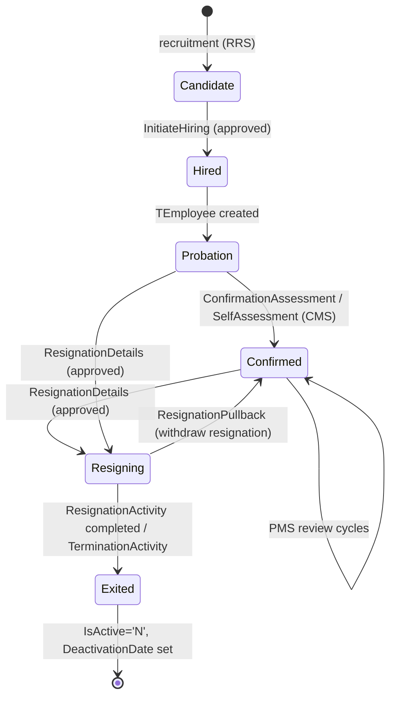

---
sources:
  - HRMS-DATABASE/HRMS/TABLES/TEmployee.sql
  - HRMS-DATABASE/HRMS/TABLES/TResignation.sql
  - HRMS-DATABASE/HRMS/TABLES/TEmployerDetails.sql
  - HRMS-DATABASE/HRMS/STOREPROCEDURE/SP_ApproveWorkFlowRequest.sql
confidence: medium
last-analyzed: 2026-06-26
---

# Employee Lifecycle

The stages an employee passes through, from recruitment to exit, and the
approvable events that mark each transition. Each event is a `RequestType` in the
approval engine (see `approval-workflow.md`).

## Stages

## 1. Recruitment (RRS)

Request types `RecruitmentManagement`, `InterviewFeedback`, `InitiateHiring`
drive candidate processing. `TEmployee.CandidateId`/`CandidateSourceId` link a
hired employee back to the candidate record (`TEmployee.sql:43,53`). Internals
of the RRS flow were not extracted in depth (open question).

## 2. Onboarding / active employment

A hired candidate becomes a `TEmployee` (PII encrypted; `IsActive='Y'`). Satellite
`TEmployee*` tables capture bank, contact, family, assets, documents.

## 3. Confirmation (CMS — probation → confirmed)

Governed by tenant flags on `TEmployerDetails`: `IsAutomaticConfirmation`,
`ConfirmationDueDays`, `AutoConfInitiationDueDays`,
`IsAutomaticConfirmationLetter`, `IsConfSelfAssesmentRequired`
(`TEmployerDetails.sql:75,83,86-91`). Approvable via `SelfAssessment` /
`ConfirmationAssessment`. `TEmployee.IsAllowedForInitiateConfirmation` gates it
(`TEmployee.sql:63`).

## 4. Performance (PMS)

Tenant flags `IsReviewFrequencyEnabled`, `IsPMSReviewerEnabled`,
`CalculateFinalRatingAsAverage`, `IsNormalizedRatingsFinalRatings`,
`PerformanceDueDays` (`TEmployerDetails.sql:62,66,69,79,85`) configure appraisal
cycles. Scoring logic lives in PMS procedures (not extracted in depth).

## 5. Resignation / termination (exit)

- `TResignation` = separation-type master (per tenant); `TResignationDetails`,
  `TResignationActivityDetails` track an exit instance.
- Approvable request types: `ResignationDetails`, `ResignationActivity`,
  `TerminationActivity`, and `ResignationPullback` (withdraw)
  (`SP_ApproveWorkFlowRequest.sql:125,133,928,959`).
- `SP_ApproveWorkFlowRequest` accepts `@ActualReleavingDate` and
  `@AddNoticePeriodLeaves` for the exit path (`:33,38`).

## 6. Deactivation & data retention

Exit sets `TEmployee.IsActive='N'` and `DeactivationDate`. PII can later be
erased per tenant policy: `IsPersonalFieldsDeleted`/`PersonalFieldsDeletedDate`
on the employee (`TEmployee.sql:46-47`), driven by `IsDeletePersonalFields`/
`PersonalFieldsDeleteDuration` on the employer (`TEmployerDetails.sql:30-31`).
Background verification (BGV) is a parallel onboarding check (`TBGV*` tables).
See `background-verification.md` for the full flow.

> Recruitment (RRS) and PMS scoring internals are not extracted in depth —
> see `../assumptions/open-questions.md`.
