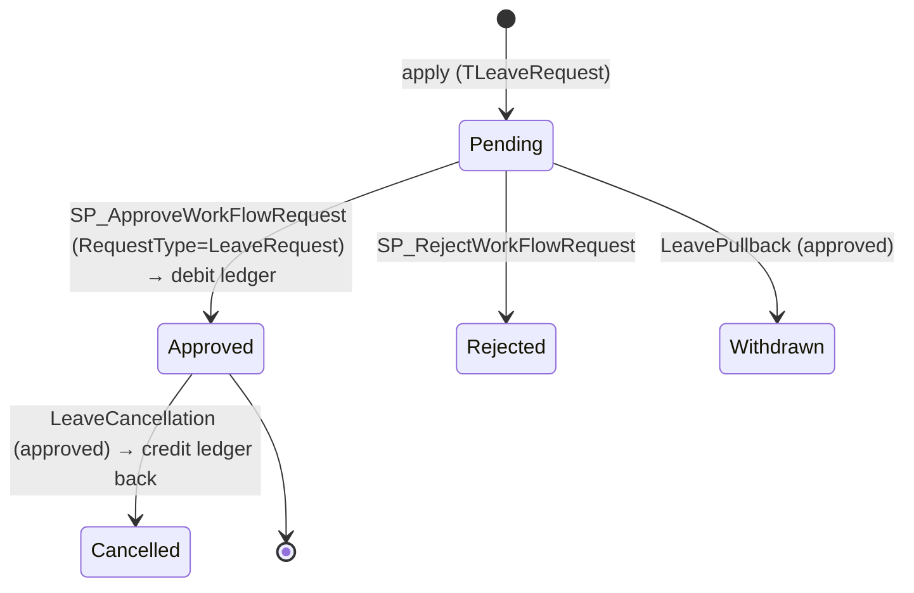

---
sources:
  - HRMS-DATABASE/HRMS/TABLES/TLeaveTypeMaster.sql
  - HRMS-DATABASE/HRMS/TABLES/TLeaveRequest.sql
  - HRMS-DATABASE/HRMS/TABLES/TLeaveBalanceLedger.sql
  - HRMS-DATABASE/HRMS/STOREPROCEDURE/SP_ApproveLeave.sql
  - HRMS-DATABASE/HRMS/STOREPROCEDURE/SP_CancelLeaveApplication.sql
  - HRMS-DATABASE/HRMS/STOREPROCEDURE/SP_AdminLM_TruncateLeave.sql
confidence: medium
last-analyzed: 2026-06-26
---

# Leave Lifecycle

The configuration, application, approval, and balance accounting of leave — the
most fully-featured domain in the HRMS.

## 1. Configure a leave type (`TLeaveTypeMaster`)

A leave type is a rich policy object keyed `(LeaveCode CHAR(4), Employerid)`.
Notable rule columns (`TLeaveTypeMaster.sql`):

- **Eligibility/limits**: `Gender`, `MaxDaysToApply`/`MinDaysToApply`,
  `WaitingPeriod`, `MaximumApplications`/`MaximumApplicationPeriod`,
  `AllowDaysPerMonth`, `AllowPastDaysApplication` (`:6,13-18`).
- **Day handling**: `AllowHalfDay`, `HalfDayRule TIME(7)`/`FullDayRule TIME(7)`,
  `InterveningHolidays`/`InterveningWeeklyOff`, prefix/suffix holiday & weekly-off
  flags (`:9-23,46-47`).
- **Cancellation/pullback**: `AllowCancellation`, `AllowPullback`,
  `Pastdatepullback`/`Futuredatepullback` + day limits (`:7-8,51-58`).
- **Accounting**: `LossOfPay`, `IsEncashable`+encashment limits, `CreditRule
  CHAR(1) DEFAULT 'D'`, `CurrentYearNegativeBalanceAllowed` (`:25-33,49`).
- **Year boundary**: `CarryForwardDaysLimit`, `LeaveTruncation`/`TruncationMonth`,
  `ReInitialiseBalanceEveryYear`/`ReInitializationMonth` (`:31-41`).
- **Comp-off / PTO**: `IsLeaveTypeCompOff`, `RequestCompOffCredit`,
  comp-off expiry columns, `IsLeaveTypePTO` (`:43-44,48,59-62`).

Creating a type may route for admin approval (see `approval-workflow.md`).
Targeting columns scope a type to BU/Location/Grade/EmployeeStatus via
`TLeaveBusinessUnit`/`TLeaveLocation`/`TLeaveGrade`/`TLeaveEmployeeStatus`, and
incompatible types via `TLeaveClubWith` (`SP_AddNewLeaveTypeMaster.sql:491-535`).

## 2. Apply (`TLeaveRequest` + `TLeaveRequestDays`)

An application inserts `TLeaveRequest` (`TransId`, `LeaveCode`, `EmployeeId`,
`Fromdate`/`Todate`, half-day flags, `Noofdays DECIMAL(5,2)`, `LeaveStatus`
pending) with per-day rows in `TLeaveRequestDays`. `AppliedBy` may differ from
`EmployeeId` (apply-on-behalf).

## 3. Approve / reject

Routed through the central engine as `RequestType='LeaveRequest'`. On final
approval the leave is set approved and the balance is debited
(`SP_ApproveLeave.sql:48` sets `LeaveStatus='Approved'`). Cancellation
(`LeaveCancellation`) and pullback (`LeavePullback`) are separate approvable
request types.

## 4. Balance accounting (`TLeaveBalanceLedger`)

Append-only ledger per `(Employeeid, LeaveCode, Employerid)`: each transaction
records `NoofDays`, `TransactionType CHAR(1)`, `TransactionSource`,
`openingbalance`/`closingbalance`, and (for debits) `leaveRequestid`. Expiry is
tracked via `ExpiryDate`/`NoofDaysToExpire` (`TLeaveBalanceLedger.sql:1-16`).

## 5. Year-end jobs

`SP_AdminLM_TruncateLeave` (+ `_EmailAlert`) truncates/forfeits balances per
`TruncationMonth`; `SP_AddLeavesRollOver` carries forward up to
`CarryForwardDaysLimit`. These operate on pending/cancelled leave by
`LeaveStatus` codes (`SP_AdminLM_TruncateLeave.sql:147,156` use `'C'`/`'P'`).

## State diagram

> ⚠️ `LeaveStatus` value encoding is inconsistent across procedures (full words
> vs `'P'`/`'C'`/`'B'`). See `../glossary/terminology.md` and
> `../assumptions/open-questions.md`. Line cites for `SP_ApproveLeave` /
> `SP_CancelLeaveApplication` are from `Grep`; verify exact bodies before relying
> on the precise credit-back logic.
