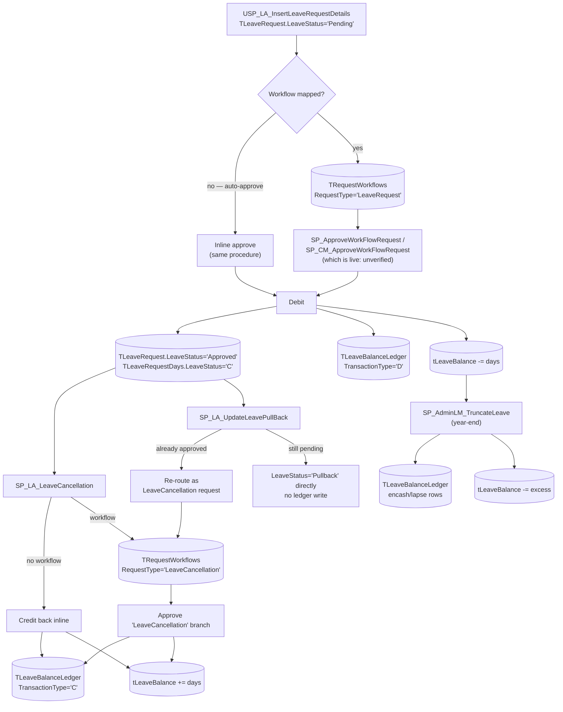
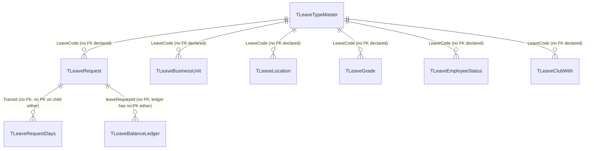

---
sources:
  - HRMS-DATABASE/HRMS/TABLES/TLeaveTypeMaster.sql
  - HRMS-DATABASE/HRMS/TABLES/TLeaveRequest.sql
  - HRMS-DATABASE/HRMS/TABLES/TLeaveRequestDays.sql
  - HRMS-DATABASE/HRMS/TABLES/TLeaveBalanceLedger.sql
  - HRMS-DATABASE/HRMS/TABLES/TLeaveBusinessUnit.sql
  - HRMS-DATABASE/HRMS/TABLES/TLeaveLocation.sql
  - HRMS-DATABASE/HRMS/TABLES/TLeaveGrade.sql
  - HRMS-DATABASE/HRMS/TABLES/TLeaveEmployeeStatus.sql
  - HRMS-DATABASE/HRMS/TABLES/TLeaveClubWith.sql
  - HRMS-DATABASE/HRMS/STOREPROCEDURE/USP_LA_InsertLeaveRequestDetails.sql
  - HRMS-DATABASE/HRMS/STOREPROCEDURE/SP_ApproveWorkFlowRequest.sql
  - HRMS-DATABASE/HRMS/STOREPROCEDURE/SP_CM_ApproveWorkFlowRequest.sql
  - HRMS-DATABASE/HRMS/STOREPROCEDURE/SP_LA_LeaveCancellation.sql
  - HRMS-DATABASE/HRMS/STOREPROCEDURE/SP_LA_UpdateLeavePullBack.sql
  - HRMS-DATABASE/HRMS/STOREPROCEDURE/SP_AdminLM_TruncateLeave.sql
  - HRMS-DATABASE/HRMS/STOREPROCEDURE/SP_ApproveLeave.sql
confidence: medium (current-model sections are high-confidence with line cites; two open ambiguities flagged inline and in open-questions.md)
last-analyzed: 2026-08-10
---

# Leave Lifecycle

The configuration, application, approval, and balance accounting of leave — the
most fully-featured domain in the HRMS.

> ⚠️ **Correction to a previous version of this page**: `SP_ApproveLeave.sql`,
> `SP_CreateLeaveApplication.sql`, `SP_CancelLeaveApplication.sql`, and
> `SP_AddLeavesRollOver.sql`/`SP_InsertLeaveRollOver.sql` all operate on a
> **different, legacy data model** (`TEmployeeLeaveHistory`/`TEmployeeLeaves`)
> — they never touch `TLeaveRequest`, `TLeaveRequestDays`, `tLeaveBalance`, or
> `TLeaveBalanceLedger`. No caller of any of these five procedures was found
> anywhere in `STOREPROCEDURE/`. Treat them as dead/superseded code, not the
> live leave engine. The sections below describe the current model instead.

## 1. Configure a leave type (`TLeaveTypeMaster`)

A leave type is a rich policy object keyed `(LeaveCode CHAR(4), Employerid)`.
Notable rule columns (`TLeaveTypeMaster.sql`):

- **Eligibility/limits**: `Gender`, `MaxDaysToApply`/`MinDaysToApply`,
  `WaitingPeriod`, `MaximumApplications`/`MaximumApplicationPeriod`,
  `AllowDaysPerMonth`, `AllowPastDaysApplication` (`:6,13-18`).
- **Day handling**: `AllowHalfDay`, `HalfDayRule TIME(7)`/`FullDayRule TIME(7)`,
  `InterveningHolidays`/`InterveningWeeklyOff`, prefix/suffix holiday & weekly-off
  flags (`:9-23,46-47`).
- **Cancellation/pullback**: `AllowCancellation`, `AllowPullback`,
  `Pastdatepullback`/`Futuredatepullback` + day limits (`:7-8,51-58`).
- **Accounting**: `LossOfPay`, `IsEncashable`+encashment limits, `CreditRule
  CHAR(1) DEFAULT 'D'`, `CurrentYearNegativeBalanceAllowed` (`:25-33,49`).
- **Year boundary**: `CarryForwardDaysLimit`, `LeaveTruncation`/`TruncationMonth`,
  `ReInitialiseBalanceEveryYear`/`ReInitializationMonth` (`:31-41`).
- **Comp-off / PTO**: `IsLeaveTypeCompOff`, `RequestCompOffCredit`,
  comp-off expiry columns, `IsLeaveTypePTO` (`:43-44,48,59-62`).

Creating a type may route for admin approval (see `approval-workflow.md`).
Targeting columns scope a type to BU/Location/Grade/EmployeeStatus via
`TLeaveBusinessUnit`/`TLeaveLocation`/`TLeaveGrade`/`TLeaveEmployeeStatus`, and
incompatible types via `TLeaveClubWith` (`SP_AddNewLeaveTypeMaster.sql:491-535`).

> ⚠️ The `TABLES/*.sql` export for the leave tables appears **stale**: several
> currently-active procedures write columns not present in these `CREATE
> TABLE` scripts (e.g. `TLeaveRequest.CustomStatusInformation`/
> `InterveningLeaveRequestIDs`/`LeaveTransactionId`,
> `TLeaveBalanceLedger.EffectiveDate` — see §6). Treat column lists derived
> from stored-procedure usage as more current than the DDL export. See
> `../assumptions/open-questions.md`.

## 2. Apply (`USP_LA_InsertLeaveRequestDetails.sql`)

The active creation procedure (three older sibling variants —
`SP_InsertLeaveRequestDetails.sql`, `SP_LA_InsertLeaveRequestDetails.sql`,
`SP_LA_InsertLeaveRequestDetails_dp.sql` — exist too; which one the app tier
actually calls is unconfirmed, so treat `USP_LA_...` as the strongest current
candidate on file-convention evidence, not a certainty):

1. Reads `TLeaveTypeMaster` (`:102`, policy/auto-approval config) and
   `TWorkflowDetails` (`:110`, workflow role).
2. Inserts `TLeaveRequest` (`:114/124`, `LeaveStatus='Pending'`) and per-day
   `TLeaveRequestDays` rows (`:182/212`, `LeaveStatus='P'`).
3. Inserts an audit row into `TLeaveRequestStatusHistory` (`:332`).
4. Branches on whether a workflow/approver applies (`:354`):
   - **No workflow → auto-approve** (`:355-442`): sets
     `TLeaveRequest.LeaveStatus='Approved'` (`:373`),
     `TLeaveRequestDays.LeaveStatus='C'` (`:380`), inserts per-day debit rows
     into `TLeaveBalanceLedger` (`:385-411`), and debits `tLeaveBalance`
     (`:413`) — all inline, in the same procedure.
   - **Workflow required** (`:443-558`): materializes `TRequestWorkflows` rows
     via `EXEC SP_CM_GetDataforRequestWorkFlows` (`:446`) and fires
     email/WhatsApp notifications. Balance is **not** touched here — deferred
     to approval time.

## 3. Approve

Routed through the central engine as `RequestType='LeaveRequest'`
(`../approval-workflow.md`). **Two procedures both implement this branch**,
and which one is actually invoked by the application could not be confirmed
from SQL source alone — flagged as an open question:

- `SP_ApproveWorkFlowRequest.sql:585-647` (plain `CREATE PROCEDURE`, no `USE`
  header) — debits with a **single lump-sum** `TLeaveBalanceLedger` insert per
  approval (`:610-635`).
- `SP_CM_ApproveWorkFlowRequest.sql:4172-4311` (`USE [HRM-CL-Prod]`,
  `CREATE OR ALTER` — the same convention as the confirmed-current creation/
  pullback procs) — debits with **one `TLeaveBalanceLedger` row per leave
  day** (`:4224-4252`, a `DayRows` CTE over `TLeaveRequestDays`) and calls
  `SP_UpdateDailyRegisterNew` (`:4298-4311`) to sync attendance. On file
  convention this looks like the stronger current candidate.

Both update `TLeaveRequest.LeaveStatus='Approved'` and
`TLeaveRequestDays.LeaveStatus='C'`, then debit `tLeaveBalance`.

## 4. Cancel

`LeaveCancellation` is a separate approvable request type, initiated by
**`SP_LA_LeaveCancellation.sql`** (not `SP_CancelLeaveApplication.sql`, which
is the legacy/dead procedure noted above):

- **No workflow needed** (`:78-161`): directly sets
  `TLeaveRequest.LeaveStatus='Cancelled'` (`:97-105`), credits back
  `TLeaveBalanceLedger` (`TransactionType='C'`, `:107-118`), credits
  `tLeaveBalance` (`:120-125`), sets `TLeaveRequestDays.LeaveStatus='B'`
  (`:129-132`).
- **Workflow needed** (`:164-196`): materializes a `TRequestWorkflows` row
  (`RequestType='LeaveCancellation'`) — the actual credit-back happens later,
  in the approval procedures' `'LeaveCancellation'` branch
  (`SP_ApproveWorkFlowRequest.sql:810-901`, same credit pattern).

## 5. Pullback

`SP_LA_UpdateLeavePullBack.sql` is the live pullback initiator; it branches on
whether the leave was already approved:

- **Already approved** (`:120-329`): marks the last `TRequestWorkflows`
  approval row `ApproveStatus='B'` (`:160-167`), then **re-routes through a
  new `LeaveCancellation` workflow request** (`:211-228`) — the balance
  credit-back happens in the cancellation approval path (§4), not here.
- **Still pending** (`:330-746`): sets `TLeaveRequest.LeaveStatus='Pullback'`
  (`:333-340`) and `TLeaveRequestDays.LeaveStatus='B'` (`:383-386`) directly —
  no ledger write, since a pending request was never debited.

> `SP_ApproveWorkFlowRequest.sql` also has its own `'LeavePullback'` branch
> (`:903-918`), but no code writing a `TRequestWorkflows` row with
> `RequestType='LeavePullback'` was found — since `SP_LA_UpdateLeavePullBack`
> handles pullback directly rather than through that request type, this
> branch may be vestigial. Unverified — see `../assumptions/open-questions.md`.

## 6. Balance accounting

Two distinct tables, easy to conflate:

- **`tLeaveBalance`** — the live, mutable balance (`empid`, `leavetype`,
  `balancedays`, `Employerid`; no FK declared). This is what every debit/credit
  actually decrements or increments.
- **`TLeaveBalanceLedger`** — an append-only audit trail (`NoofDays`,
  `TransactionType CHAR(1)`, `TransactionSource`, `openingbalance`/
  `closingbalance`, `leaveRequestid`; no PK or FK declared). Recorded
  alongside every `tLeaveBalance` change, not read back to compute balance.

There is **no single "post to ledger" procedure** — every lifecycle procedure
(apply/auto-approve, both approval candidates, cancel, pullback, year-end
truncation) independently computes opening/closing balance and inserts its
own ledger row inline, duplicated across at least 5 places
(`USP_LA_InsertLeaveRequestDetails.sql`, `SP_ApproveWorkFlowRequest.sql`,
`SP_CM_ApproveWorkFlowRequest.sql`, `SP_LA_LeaveCancellation.sql`,
`SP_LA_UpdateLeavePullBack.sql`).

## 7. Year-end jobs

**`SP_AdminLM_TruncateLeave.sql`** is the real lapse/encash/carry-forward job
(`SP_AddLeavesRollOver.sql`/`SP_InsertLeaveRollOver.sql` are the dead legacy
pair noted at the top of this page — they write only to `TEmployeeLeaves`,
never to `tLeaveBalance`/`TLeaveBalanceLedger`, and have no confirmed caller):

1. Resolves per-employee applicable leave codes and policy via
   `USP_LA_GetApplicableLeave_TruncateLeave` and `TLeaveLapseCarryForwardConfig`
   (`:54-130`).
2. Computes effective balance from `tLeaveBalance` plus future-approved,
   pending, and pullback-in-flight day counts (`:321-346`).
3. `@lv_ExcessLeaves = effective balance - CarryForwardDaysLimit` (`:363`);
   splits into encash/lapse per `ExcessLeaveHandlingType` (`:366-397`) and
   inserts up to two `TLeaveBalanceLedger` rows (`:407-464`), then debits
   `tLeaveBalance` (`:467-475`).

> ⚠️ Line `:403`'s comment claims the encash row uses `TransactionType='E'`,
> but the literal value actually inserted (`:424`) is `'D'` — the same code as
> the lapse row, distinguished only by `TransactionSource` text. Verified
> discrepancy between comment and code; intent unconfirmed.

## 8a. Workflow

## 8b. Table relationships

**Every relationship in this domain is application-enforced, not
schema-enforced** — all 9 tables checked (`TLeaveRequest`,
`TLeaveRequestDays`, `TLeaveBalanceLedger`, `TLeaveTypeMaster`,
`TLeaveBusinessUnit`, `TLeaveLocation`, `TLeaveGrade`, `TLeaveEmployeeStatus`,
`TLeaveClubWith`) declare **zero foreign keys**, verified against their
`CREATE TABLE` scripts. `TLeaveRequestDays` and `TLeaveBalanceLedger` don't
even declare a primary key.

> ⚠️ `LeaveStatus` value encoding is inconsistent across procedures (full
> words vs `'P'`/`'C'`/`'B'`). See `../glossary/terminology.md` and
> `../assumptions/open-questions.md`.
