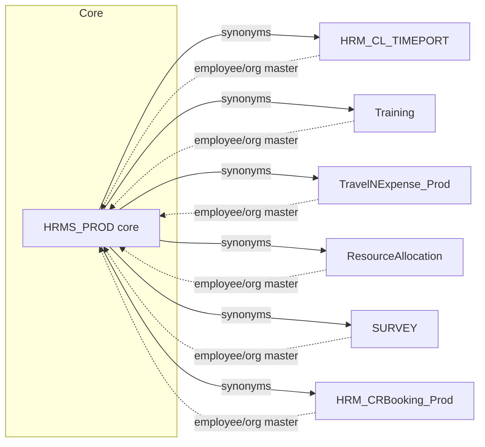

---
sources:
  - HRMS-DATABASE/HRMS/SYNONYMS
  - HRMS-DATABASE/*/SYNONYMS
confidence: high
last-analyzed: 2026-06-26
---

# Module Dependency Graph

Inter-database dependency edges for the HRMS suite. Each "module" is a physically
separate SQL Server database; cross-database access is wired through **SYNONYMS**
(three-part-named objects `[TargetDb].[dbo].[Object]`), which is the concrete seam
between modules. The core `HRMS` database is the hub: satellite modules read HRMS
master data, and HRMS surfaces satellite tables back through its own synonyms.

## Physical databases (synonym targets observed)

From `HRMS/SYNONYMS/*.sql` `CREATE SYNONYM ... FOR [Db].[dbo].[Object]`:

| Logical module | Database name(s) seen | Synonyms from HRMS → it |
|---|---|---|
| Time / Timesheet | `HRM_CL_TIMEPORT` | 19 |
| Training | `Training` (`Training_Dev`) | 18 |
| Travel & Expense | `TravelNExpense_Prod` (`TRAVELNExpense_Prod`, `TRAVELNExpense_PROD`) | ~8 |
| Resource Allocation | `ResourceAllocation` (`Resourceallocation`, `RESOURCEAllocation`) | ~6 |
| Survey | `SURVEY` (`Survey`) | ~4 |
| Conference Room Booking | `HRM_CRBooking_Prod` | 3 |
| Core | `HRMS_PROD` (the `USE [HRMS_PROD]` target in SP headers) | n/a (self) |

> ⚠️ Database names appear with **inconsistent casing** across synonym scripts
> (`Training` vs `Training_Dev`, `TravelNExpense_Prod` vs `TRAVELNExpense_PROD`,
> `ResourceAllocation` vs `RESOURCEAllocation`). SQL Server identifiers are
> case-insensitive on most collations, but this signals scripts generated from
> different environments. See `../assumptions/open-questions.md`.

## Dependency edges (Mermaid)

Solid edges = HRMS synonyms pointing into a satellite DB (verified in
`HRMS/SYNONYMS`). Dashed edges = satellite modules consuming HRMS employee/org
master data; each satellite has its own `SYNONYMS/` folder (e.g.
`HRMS/SYNONYMS/TEMAIL_NOTIFICATION_TRAINING → [Training].[dbo].[TEMAIL_NOTIFICATION]`,
`HRMS/SYNONYMS/TExpense → [TRAVELNExpense_Prod].[dbo].[TExpense]`) — verify the
exact reverse edges per satellite before relying on direction.

## Hub characterization

`HRMS_PROD` is the unambiguous hub: it owns the employee, employer (tenant),
role, org-taxonomy, and the cross-cutting approval engine (`TWorkflowManagement`,
`TRequestWorkflows`), and it is the only database with synonyms into *all six*
satellites. Satellites are leaf modules that depend on HRMS master data but not
on each other (no satellite→satellite synonyms observed in `HRMS/SYNONYMS`;
not exhaustively verified across satellite synonym folders).
